# Usecase: US-MBR-CS-002 — 휴면 해제

## Flowchart

> 단순 직렬 흐름. 분기·게이트웨이는 `00_INDEX.md` BPMN 다이어그램 참조.

```mermaid
graph LR
    Start((시작))
    PR_MBR_CS_002_01[로그인<br/>PR-MBR-CS-002-01]
    Start --> PR_MBR_CS_002_01
    PR_MBR_CS_002_02[휴면 여부 확인<br/>PR-MBR-CS-002-02]
    PR_MBR_CS_002_01 --> PR_MBR_CS_002_02
    PR_MBR_CS_002_03[본인인증<br/>PR-MBR-CS-002-03]
    PR_MBR_CS_002_02 --> PR_MBR_CS_002_03
    PR_MBR_CS_002_04[약관 동의<br/>PR-MBR-CS-002-04]
    PR_MBR_CS_002_03 --> PR_MBR_CS_002_04
    PR_MBR_CS_002_05[휴면 해제 처리<br/>PR-MBR-CS-002-05]
    PR_MBR_CS_002_04 --> PR_MBR_CS_002_05
    PR_MBR_CS_002_06[휴면 해제 처리 결과 안내<br/>PR-MBR-CS-002-06]
    PR_MBR_CS_002_05 --> PR_MBR_CS_002_06
    End((종료))
    PR_MBR_CS_002_06 --> End
```



## Process: PR-MBR-CS-002-01 — 로그인 {#process-PR-MBR-CS-002-01}

```yaml
프로세스_ID: PR-MBR-CS-002-01
프로세스명: 로그인
설명: 휴면 계정 진입을 위해 고객이 로그인을 시도한다.
관련_기능: [FN-MBR-COM-001, FN-MBR-DORM-001]
```

| 항목 | 내용 |
| --- | --- |
| 액터 | 고객 |
| 진입 조건 | 휴면 계정으로 서비스 이용 시도 |
| 종료 조건 | 휴면 계정 진입 및 로그인 시도 완료 |
| 선행 프로세스 | - |
| 후행 프로세스 | 휴면 여부 확인 |

### Function: FN-MBR-COM-001

```yaml
기능_ID: FN-MBR-COM-001
기능명: 회원 식별 및 상태 조회
설명: 고객 식별정보를 기준으로 기존 회원 상태를 조회한다.
관련_정책_그룹: [PG-MBR-STAT-001, PG-MBR-JOIN-001, PG-MBR-ROUTE-001, PG-MBR-LOGIN-001, PG-MBR-DORM-001, PG-MBR-REJOIN-001]
```

| 항목 | 내용 |
| --- | --- |
| 입력 정보 | CI/DI, 회원ID, 로그인 세션ID, 채널, 요청일시 |
| 세부 기능 구성 | 회원 식별정보 확인 회원 상태 조회 가입·휴면·탈퇴·재가입 상태 판정 다음 가능 업무 반환 |
| 출력 정보 | 회원상태코드, 가입여부, 휴면여부, 탈퇴여부, 재가입 제한 여부, 다음 가능 업무 |
| 처리 흐름 | (상태) 식별정보 존재 → (액션) 회원 상태와 이력 조회 → (결과) 현재 상태 반환 (상태) 식별정보 없음 → (액션) 미가입으로 분류 → (결과) 가입 가능 상태 반환 (상태) 상태 조회 불가 → (액션) 오류 이력 저장 → (결과) 재시도 안내 |
| 실패/예외 케이스 | 식별정보 불일치: 본인인증 재수행 조회 시스템 오류: 재시도 안내 중복 요청: 최초 요청 기준 응답 |

#### Policy Group: PG-MBR-STAT-001

```yaml
정책_ID: PG-MBR-STAT-001
정책명: 회원 상태 조회 정책
설명: 고객의 회원 상태를 조회하고 정상, 휴면, 탈퇴, 가입 제한 등으로 해석하는 기준을 정의하는 정책 그룹이다.
```

| Policy Item ID | 정책 항목명 | 정책 항목 |
| --- | --- | --- |
| `POL-MBR-STAT-001-01` | 상태 코드 | - 미가입, 정상, 휴면, 탈퇴, 가입제한 |
| `POL-MBR-STAT-001-02` | 상태 조회 기준 식별정보 | - CI, DI, 고객ID |
| `POL-MBR-STAT-001-03` | 상태 조회 수행 시스템 | - BSS |
| `POL-MBR-STAT-001-04` | 정상 상태 후속 처리 | - 업무 계속 진행 |
| `POL-MBR-STAT-001-05` | 휴면 상태 후속 처리 | - 휴면 해제 프로세스 이동 |
| `POL-MBR-STAT-001-06` | 탈퇴 상태 후속 처리 | - 재가입 가능 여부 확인 |
| `POL-MBR-STAT-001-07` | 가입제한 상태 후속 처리 | - 가입 불가 안내 |
| `POL-MBR-STAT-001-08` | 미가입 상태 후속 처리 | - 신규 가입 가능 여부 확인 |
| `POL-MBR-STAT-001-09` | 상태 불일치 처리 | - BSS 기준 적용 |
| `POL-MBR-STAT-001-10` | 조회 실패 처리 | - 업무 중단 및 오류 안내 |
| `POL-MBR-STAT-001-11` | 상태 조회 이력 저장 여부 | - 저장 |
| `POL-MBR-STAT-001-12` | 상태 조회 이력 저장 항목 | - 고객ID, CI 해시, 조회 일시, 조회 채널, 조회 결과 코드 |

#### Policy Group: PG-MBR-JOIN-001

```yaml
정책_ID: PG-MBR-JOIN-001
정책명: 신규가입 가능 여부 판정 정책
설명: 인증된 고객이 신규 회원으로 가입 가능한지 판정하는 기준을 정의하는 정책 그룹이다.
```

| Policy Item ID | 정책 항목명 | 정책 항목 |
| --- | --- | --- |
| `POL-MBR-JOIN-001-01` | 신규가입 가능 고객 상태 | - 미가입 |
| `POL-MBR-JOIN-001-02` | 기존 정상 회원 처리 | - 로그인 유도 |
| `POL-MBR-JOIN-001-03` | 기존 휴면 회원 처리 | - 휴면 해제 유도 |
| `POL-MBR-JOIN-001-04` | 기존 탈퇴 회원 처리 | - 재가입 가능 여부 확인 |
| `POL-MBR-JOIN-001-05` | 가입 제한 고객 처리 | - 가입 불가 |
| `POL-MBR-JOIN-001-06` | 중복 CI 판정 기준 | - 동일 CI 기존 계정 존재 |
| `POL-MBR-JOIN-001-07` | 가입 가능 판정 시스템 | - BSS |
| `POL-MBR-JOIN-001-08` | 가입 가능 판정 시점 | - 본인인증 완료 후 |
| `POL-MBR-JOIN-001-09` | 가입 불가 안내 항목 | - 가입 불가 사유, 후속 처리 경로 |
| `POL-MBR-JOIN-001-10` | 판정 실패 처리 | - 업무 중단 및 재시도 안내 |
| `POL-MBR-JOIN-001-11` | 가입 제한 사유 코드 | - DUPLICATE_CI, DORMANT_MEMBER, LEAVE_PENDING, REJOIN_LIMITED, BLOCKED_MEMBER |
| `POL-MBR-JOIN-001-12` | 신규 가입 재시도 허용 여부 | - 허용 |

#### Policy Group: PG-MBR-ROUTE-001

```yaml
정책_ID: PG-MBR-ROUTE-001
정책명: 회원 경로 분기 정책
설명: 회원 상태와 가입 가능 여부에 따라 로그인, 휴면 해제, 재가입, 가입 중단 등 후속 경로를 결정하는 정책 그룹이다.
```

| Policy Item ID | 정책 항목명 | 정책 항목 |
| --- | --- | --- |
| `POL-MBR-ROUTE-001-01` | 미가입 상태 이동 경로 | - 개인정보 입력 |
| `POL-MBR-ROUTE-001-02` | 정상 회원 이동 경로 | - 로그인 |
| `POL-MBR-ROUTE-001-03` | 휴면 회원 이동 경로 | - 휴면 해제 |
| `POL-MBR-ROUTE-001-04` | 탈퇴 회원 이동 경로 | - 재가입 가능 여부 확인 |
| `POL-MBR-ROUTE-001-05` | 가입제한 회원 이동 경로 | - 가입 불가 안내 |
| `POL-MBR-ROUTE-001-06` | 상태 조회 실패 이동 경로 | - 오류 안내 |
| `POL-MBR-ROUTE-001-07` | 고객 선택 가능 분기 | - 로그인, 회원 가입, 재가입 |
| `POL-MBR-ROUTE-001-08` | 자동 분기 기준 | - 상태 코드 |
| `POL-MBR-ROUTE-001-09` | 분기 처리 시스템 | - 채널, BSS |
| `POL-MBR-ROUTE-001-10` | 분기 이력 저장 여부 | - 저장 |
| `POL-MBR-ROUTE-001-11` | 분기 이력 저장 항목 | - 고객ID, 상태 코드, 분기 경로, 처리 일시 |

#### Policy Group: PG-MBR-LOGIN-001

```yaml
정책_ID: PG-MBR-LOGIN-001
정책명: 로그인 및 휴면 진입 판정 정책
설명: 로그인 시도 시 계정 상태를 확인하고 휴면 해제 프로세스로 진입시킬 조건을 정의하는 정책 그룹이다.
```

| Policy Item ID | 정책 항목명 | 정책 항목 |
| --- | --- | --- |
| `POL-MBR-LOGIN-001-01` | 로그인 가능 상태 | - 정상 |
| `POL-MBR-LOGIN-001-02` | 휴면 진입 상태 | - 휴면 |
| `POL-MBR-LOGIN-001-03` | 탈퇴 상태 로그인 처리 | - 재가입 안내 |
| `POL-MBR-LOGIN-001-04` | 가입제한 상태 로그인 처리 | - 로그인 불가 안내 |
| `POL-MBR-LOGIN-001-05` | 로그인 실패 처리 | - 로그인 실패 안내 |
| `POL-MBR-LOGIN-001-06` | 휴면 안내 노출 조건 | - 회원 상태 휴면 |
| `POL-MBR-LOGIN-001-07` | 휴면 해제 이동 경로 | - 휴면 해제 프로세스 |
| `POL-MBR-LOGIN-001-08` | 로그인 상태 조회 기준 | - 고객ID, CI |
| `POL-MBR-LOGIN-001-09` | 로그인 결과 저장 여부 | - 저장 |
| `POL-MBR-LOGIN-001-10` | 로그인 이력 저장 항목 | - 고객ID, 로그인 일시, 로그인 채널, 결과 코드 |
| `POL-MBR-LOGIN-001-11` | 로그인 실패 재시도 횟수 | - 5회 |
| `POL-MBR-LOGIN-001-12` | 휴면 진입 안내 문구 | - 휴면 상태입니다. 본인인증 후 다시 이용할 수 있습니다. |

#### Policy Group: PG-MBR-DORM-001

```yaml
정책_ID: PG-MBR-DORM-001
정책명: 휴면 해제 가능 여부 판정 정책
설명: 휴면 회원이 셀프 채널에서 휴면 해제를 진행할 수 있는지 판정하는 기준을 정의하는 정책 그룹이다.
```

| Policy Item ID | 정책 항목명 | 정책 항목 |
| --- | --- | --- |
| `POL-MBR-DORM-001-01` | 휴면 해제 가능 상태 | - 휴면 |
| `POL-MBR-DORM-001-02` | 휴면 해제 불가 상태 | - 탈퇴, 가입제한 |
| `POL-MBR-DORM-001-03` | 본인확인 필요 여부 | - 필수 |
| `POL-MBR-DORM-001-04` | 약관 재동의 필요 여부 | - 개정된 필수 약관 존재 시 필수 |
| `POL-MBR-DORM-001-05` | 휴면 해제 가능 채널 | - 앱, 모바일웹, PC웹 |
| `POL-MBR-DORM-001-06` | 휴면 해제 제한 조건 | - 본인인증 실패, 가입제한 상태, BSS 상태 조회 실패 |
| `POL-MBR-DORM-001-07` | 해제 불가 안내 항목 | - 해제 불가 사유, 후속 문의 경로 |
| `POL-MBR-DORM-001-08` | 휴면 해제 판정 시스템 | - BSS |
| `POL-MBR-DORM-001-09` | 판정 시점 | - 로그인 후 휴면 상태 확인 시 |
| `POL-MBR-DORM-001-10` | 판정 실패 처리 | - 업무 중단 및 오류 안내 |
| `POL-MBR-DORM-001-11` | 해제 가능 여부 이력 저장 여부 | - 저장 |
| `POL-MBR-DORM-001-12` | 해제 가능 여부 이력 저장 항목 | - 고객ID, 상태 코드, 판정 결과, 판정 일시 |

#### Policy Group: PG-MBR-REJOIN-001

```yaml
정책_ID: PG-MBR-REJOIN-001
정책명: 계정 복원 가능 여부 판정 정책
설명: 기존 가입 이력과 탈퇴 상태를 기준으로 계정 복원 가능 여부를 판정하는 정책 그룹이다.
```

| Policy Item ID | 정책 항목명 | 정책 항목 |
| --- | --- | --- |
| `POL-MBR-REJOIN-001-01` | 복원 가능 상태 | - 탈퇴 철회 가능 상태 |
| `POL-MBR-REJOIN-001-02` | 복원 불가 상태 | - 탈퇴 확정, 가입제한 |
| `POL-MBR-REJOIN-001-03` | 복원 가능 기간 | - 탈퇴 요청일로부터 7일 |
| `POL-MBR-REJOIN-001-04` | 복원 대상 데이터 | - 회원 계정, 기본 프로필, 약관 동의 이력, 알림 설정 |
| `POL-MBR-REJOIN-001-05` | 복원 제외 데이터 | - 탈퇴 시 즉시 삭제 대상 데이터 |
| `POL-MBR-REJOIN-001-06` | 복원 판정 기준 식별자 | - CI |
| `POL-MBR-REJOIN-001-07` | 복원 판정 수행 시스템 | - BSS |
| `POL-MBR-REJOIN-001-08` | 복원 불가 처리 | - 재가입 프로세스 진행 |
| `POL-MBR-REJOIN-001-09` | 판정 실패 처리 | - 업무 중단 및 오류 안내 |
| `POL-MBR-REJOIN-001-10` | 판정 이력 저장 항목 | - CI, 회원ID, 판정 결과, 판정 일시, 처리 채널 |

### Function: FN-MBR-DORM-001

```yaml
기능_ID: FN-MBR-DORM-001
기능명: 휴면 회원 감지 및 안내
설명: 로그인 시도 중 휴면 회원 여부를 감지하고 휴면 해제 플로우로 안내한다.
관련_정책_그룹: [PG-MBR-LOGIN-001]
```

| 항목 | 내용 |
| --- | --- |
| 입력 정보 | 로그인ID, CI/DI, 세션ID, 접근채널 |
| 세부 기능 구성 | 로그인 시도 확인 휴면 상태 감지 휴면 해제 필요 안내 휴면 해제 플로우 연결 |
| 출력 정보 | 휴면여부, 휴면전환일, 해제필요여부, 안내 메시지, 다음 이동 경로 |
| 처리 흐름 | (상태) 로그인 계정이 휴면 상태 → (액션) 휴면 상태를 감지 → (결과) 휴면 해제 안내 노출 (상태) 미휴면 정상 회원 → (액션) 일반 로그인 처리 → (결과) 홈 이동 (상태) 상태 확인 실패 → (액션) 재조회 또는 오류 안내 → (결과) 로그인 보류 |
| 실패/예외 케이스 | 계정 미존재: 가입 또는 아이디 찾기 안내 상태 조회 실패: 재시도 안내 비정상 상태: 고객센터 또는 오류 안내 |

#### Policy Group: PG-MBR-LOGIN-001

```yaml
정책_ID: PG-MBR-LOGIN-001
정책명: 로그인 및 휴면 진입 판정 정책
설명: 로그인 시도 시 계정 상태를 확인하고 휴면 해제 프로세스로 진입시킬 조건을 정의하는 정책 그룹이다.
```

| Policy Item ID | 정책 항목명 | 정책 항목 |
| --- | --- | --- |
| `POL-MBR-LOGIN-001-01` | 로그인 가능 상태 | - 정상 |
| `POL-MBR-LOGIN-001-02` | 휴면 진입 상태 | - 휴면 |
| `POL-MBR-LOGIN-001-03` | 탈퇴 상태 로그인 처리 | - 재가입 안내 |
| `POL-MBR-LOGIN-001-04` | 가입제한 상태 로그인 처리 | - 로그인 불가 안내 |
| `POL-MBR-LOGIN-001-05` | 로그인 실패 처리 | - 로그인 실패 안내 |
| `POL-MBR-LOGIN-001-06` | 휴면 안내 노출 조건 | - 회원 상태 휴면 |
| `POL-MBR-LOGIN-001-07` | 휴면 해제 이동 경로 | - 휴면 해제 프로세스 |
| `POL-MBR-LOGIN-001-08` | 로그인 상태 조회 기준 | - 고객ID, CI |
| `POL-MBR-LOGIN-001-09` | 로그인 결과 저장 여부 | - 저장 |
| `POL-MBR-LOGIN-001-10` | 로그인 이력 저장 항목 | - 고객ID, 로그인 일시, 로그인 채널, 결과 코드 |
| `POL-MBR-LOGIN-001-11` | 로그인 실패 재시도 횟수 | - 5회 |
| `POL-MBR-LOGIN-001-12` | 휴면 진입 안내 문구 | - 휴면 상태입니다. 본인인증 후 다시 이용할 수 있습니다. |

## Process: PR-MBR-CS-002-02 — 휴면 여부 확인 {#process-PR-MBR-CS-002-02}

```yaml
프로세스_ID: PR-MBR-CS-002-02
프로세스명: 휴면 여부 확인
설명: 대상 계정의 휴면 상태 여부를 확인한다.
관련_기능: [FN-MBR-COM-001, FN-MBR-DORM-002]
```

| 항목 | 내용 |
| --- | --- |
| 액터 | BSS |
| 진입 조건 | 로그인 시도 완료 |
| 종료 조건 | 휴면 상태 여부 및 해제 필요 여부 확인 완료 |
| 선행 프로세스 | 로그인 |
| 후행 프로세스 | 본인인증 |

### Function: FN-MBR-COM-001

```yaml
기능_ID: FN-MBR-COM-001
기능명: 회원 식별 및 상태 조회
설명: 고객 식별정보를 기준으로 기존 회원 상태를 조회한다.
관련_정책_그룹: [PG-MBR-STAT-001, PG-MBR-JOIN-001, PG-MBR-ROUTE-001, PG-MBR-LOGIN-001, PG-MBR-DORM-001, PG-MBR-REJOIN-001]
```

| 항목 | 내용 |
| --- | --- |
| 입력 정보 | CI/DI, 회원ID, 로그인 세션ID, 채널, 요청일시 |
| 세부 기능 구성 | 회원 식별정보 확인 회원 상태 조회 가입·휴면·탈퇴·재가입 상태 판정 다음 가능 업무 반환 |
| 출력 정보 | 회원상태코드, 가입여부, 휴면여부, 탈퇴여부, 재가입 제한 여부, 다음 가능 업무 |
| 처리 흐름 | (상태) 식별정보 존재 → (액션) 회원 상태와 이력 조회 → (결과) 현재 상태 반환 (상태) 식별정보 없음 → (액션) 미가입으로 분류 → (결과) 가입 가능 상태 반환 (상태) 상태 조회 불가 → (액션) 오류 이력 저장 → (결과) 재시도 안내 |
| 실패/예외 케이스 | 식별정보 불일치: 본인인증 재수행 조회 시스템 오류: 재시도 안내 중복 요청: 최초 요청 기준 응답 |

#### Policy Group: PG-MBR-STAT-001

```yaml
정책_ID: PG-MBR-STAT-001
정책명: 회원 상태 조회 정책
설명: 고객의 회원 상태를 조회하고 정상, 휴면, 탈퇴, 가입 제한 등으로 해석하는 기준을 정의하는 정책 그룹이다.
```

| Policy Item ID | 정책 항목명 | 정책 항목 |
| --- | --- | --- |
| `POL-MBR-STAT-001-01` | 상태 코드 | - 미가입, 정상, 휴면, 탈퇴, 가입제한 |
| `POL-MBR-STAT-001-02` | 상태 조회 기준 식별정보 | - CI, DI, 고객ID |
| `POL-MBR-STAT-001-03` | 상태 조회 수행 시스템 | - BSS |
| `POL-MBR-STAT-001-04` | 정상 상태 후속 처리 | - 업무 계속 진행 |
| `POL-MBR-STAT-001-05` | 휴면 상태 후속 처리 | - 휴면 해제 프로세스 이동 |
| `POL-MBR-STAT-001-06` | 탈퇴 상태 후속 처리 | - 재가입 가능 여부 확인 |
| `POL-MBR-STAT-001-07` | 가입제한 상태 후속 처리 | - 가입 불가 안내 |
| `POL-MBR-STAT-001-08` | 미가입 상태 후속 처리 | - 신규 가입 가능 여부 확인 |
| `POL-MBR-STAT-001-09` | 상태 불일치 처리 | - BSS 기준 적용 |
| `POL-MBR-STAT-001-10` | 조회 실패 처리 | - 업무 중단 및 오류 안내 |
| `POL-MBR-STAT-001-11` | 상태 조회 이력 저장 여부 | - 저장 |
| `POL-MBR-STAT-001-12` | 상태 조회 이력 저장 항목 | - 고객ID, CI 해시, 조회 일시, 조회 채널, 조회 결과 코드 |

#### Policy Group: PG-MBR-JOIN-001

```yaml
정책_ID: PG-MBR-JOIN-001
정책명: 신규가입 가능 여부 판정 정책
설명: 인증된 고객이 신규 회원으로 가입 가능한지 판정하는 기준을 정의하는 정책 그룹이다.
```

| Policy Item ID | 정책 항목명 | 정책 항목 |
| --- | --- | --- |
| `POL-MBR-JOIN-001-01` | 신규가입 가능 고객 상태 | - 미가입 |
| `POL-MBR-JOIN-001-02` | 기존 정상 회원 처리 | - 로그인 유도 |
| `POL-MBR-JOIN-001-03` | 기존 휴면 회원 처리 | - 휴면 해제 유도 |
| `POL-MBR-JOIN-001-04` | 기존 탈퇴 회원 처리 | - 재가입 가능 여부 확인 |
| `POL-MBR-JOIN-001-05` | 가입 제한 고객 처리 | - 가입 불가 |
| `POL-MBR-JOIN-001-06` | 중복 CI 판정 기준 | - 동일 CI 기존 계정 존재 |
| `POL-MBR-JOIN-001-07` | 가입 가능 판정 시스템 | - BSS |
| `POL-MBR-JOIN-001-08` | 가입 가능 판정 시점 | - 본인인증 완료 후 |
| `POL-MBR-JOIN-001-09` | 가입 불가 안내 항목 | - 가입 불가 사유, 후속 처리 경로 |
| `POL-MBR-JOIN-001-10` | 판정 실패 처리 | - 업무 중단 및 재시도 안내 |
| `POL-MBR-JOIN-001-11` | 가입 제한 사유 코드 | - DUPLICATE_CI, DORMANT_MEMBER, LEAVE_PENDING, REJOIN_LIMITED, BLOCKED_MEMBER |
| `POL-MBR-JOIN-001-12` | 신규 가입 재시도 허용 여부 | - 허용 |

#### Policy Group: PG-MBR-ROUTE-001

```yaml
정책_ID: PG-MBR-ROUTE-001
정책명: 회원 경로 분기 정책
설명: 회원 상태와 가입 가능 여부에 따라 로그인, 휴면 해제, 재가입, 가입 중단 등 후속 경로를 결정하는 정책 그룹이다.
```

| Policy Item ID | 정책 항목명 | 정책 항목 |
| --- | --- | --- |
| `POL-MBR-ROUTE-001-01` | 미가입 상태 이동 경로 | - 개인정보 입력 |
| `POL-MBR-ROUTE-001-02` | 정상 회원 이동 경로 | - 로그인 |
| `POL-MBR-ROUTE-001-03` | 휴면 회원 이동 경로 | - 휴면 해제 |
| `POL-MBR-ROUTE-001-04` | 탈퇴 회원 이동 경로 | - 재가입 가능 여부 확인 |
| `POL-MBR-ROUTE-001-05` | 가입제한 회원 이동 경로 | - 가입 불가 안내 |
| `POL-MBR-ROUTE-001-06` | 상태 조회 실패 이동 경로 | - 오류 안내 |
| `POL-MBR-ROUTE-001-07` | 고객 선택 가능 분기 | - 로그인, 회원 가입, 재가입 |
| `POL-MBR-ROUTE-001-08` | 자동 분기 기준 | - 상태 코드 |
| `POL-MBR-ROUTE-001-09` | 분기 처리 시스템 | - 채널, BSS |
| `POL-MBR-ROUTE-001-10` | 분기 이력 저장 여부 | - 저장 |
| `POL-MBR-ROUTE-001-11` | 분기 이력 저장 항목 | - 고객ID, 상태 코드, 분기 경로, 처리 일시 |

#### Policy Group: PG-MBR-LOGIN-001

```yaml
정책_ID: PG-MBR-LOGIN-001
정책명: 로그인 및 휴면 진입 판정 정책
설명: 로그인 시도 시 계정 상태를 확인하고 휴면 해제 프로세스로 진입시킬 조건을 정의하는 정책 그룹이다.
```

| Policy Item ID | 정책 항목명 | 정책 항목 |
| --- | --- | --- |
| `POL-MBR-LOGIN-001-01` | 로그인 가능 상태 | - 정상 |
| `POL-MBR-LOGIN-001-02` | 휴면 진입 상태 | - 휴면 |
| `POL-MBR-LOGIN-001-03` | 탈퇴 상태 로그인 처리 | - 재가입 안내 |
| `POL-MBR-LOGIN-001-04` | 가입제한 상태 로그인 처리 | - 로그인 불가 안내 |
| `POL-MBR-LOGIN-001-05` | 로그인 실패 처리 | - 로그인 실패 안내 |
| `POL-MBR-LOGIN-001-06` | 휴면 안내 노출 조건 | - 회원 상태 휴면 |
| `POL-MBR-LOGIN-001-07` | 휴면 해제 이동 경로 | - 휴면 해제 프로세스 |
| `POL-MBR-LOGIN-001-08` | 로그인 상태 조회 기준 | - 고객ID, CI |
| `POL-MBR-LOGIN-001-09` | 로그인 결과 저장 여부 | - 저장 |
| `POL-MBR-LOGIN-001-10` | 로그인 이력 저장 항목 | - 고객ID, 로그인 일시, 로그인 채널, 결과 코드 |
| `POL-MBR-LOGIN-001-11` | 로그인 실패 재시도 횟수 | - 5회 |
| `POL-MBR-LOGIN-001-12` | 휴면 진입 안내 문구 | - 휴면 상태입니다. 본인인증 후 다시 이용할 수 있습니다. |

#### Policy Group: PG-MBR-DORM-001

```yaml
정책_ID: PG-MBR-DORM-001
정책명: 휴면 해제 가능 여부 판정 정책
설명: 휴면 회원이 셀프 채널에서 휴면 해제를 진행할 수 있는지 판정하는 기준을 정의하는 정책 그룹이다.
```

| Policy Item ID | 정책 항목명 | 정책 항목 |
| --- | --- | --- |
| `POL-MBR-DORM-001-01` | 휴면 해제 가능 상태 | - 휴면 |
| `POL-MBR-DORM-001-02` | 휴면 해제 불가 상태 | - 탈퇴, 가입제한 |
| `POL-MBR-DORM-001-03` | 본인확인 필요 여부 | - 필수 |
| `POL-MBR-DORM-001-04` | 약관 재동의 필요 여부 | - 개정된 필수 약관 존재 시 필수 |
| `POL-MBR-DORM-001-05` | 휴면 해제 가능 채널 | - 앱, 모바일웹, PC웹 |
| `POL-MBR-DORM-001-06` | 휴면 해제 제한 조건 | - 본인인증 실패, 가입제한 상태, BSS 상태 조회 실패 |
| `POL-MBR-DORM-001-07` | 해제 불가 안내 항목 | - 해제 불가 사유, 후속 문의 경로 |
| `POL-MBR-DORM-001-08` | 휴면 해제 판정 시스템 | - BSS |
| `POL-MBR-DORM-001-09` | 판정 시점 | - 로그인 후 휴면 상태 확인 시 |
| `POL-MBR-DORM-001-10` | 판정 실패 처리 | - 업무 중단 및 오류 안내 |
| `POL-MBR-DORM-001-11` | 해제 가능 여부 이력 저장 여부 | - 저장 |
| `POL-MBR-DORM-001-12` | 해제 가능 여부 이력 저장 항목 | - 고객ID, 상태 코드, 판정 결과, 판정 일시 |

#### Policy Group: PG-MBR-REJOIN-001

```yaml
정책_ID: PG-MBR-REJOIN-001
정책명: 계정 복원 가능 여부 판정 정책
설명: 기존 가입 이력과 탈퇴 상태를 기준으로 계정 복원 가능 여부를 판정하는 정책 그룹이다.
```

| Policy Item ID | 정책 항목명 | 정책 항목 |
| --- | --- | --- |
| `POL-MBR-REJOIN-001-01` | 복원 가능 상태 | - 탈퇴 철회 가능 상태 |
| `POL-MBR-REJOIN-001-02` | 복원 불가 상태 | - 탈퇴 확정, 가입제한 |
| `POL-MBR-REJOIN-001-03` | 복원 가능 기간 | - 탈퇴 요청일로부터 7일 |
| `POL-MBR-REJOIN-001-04` | 복원 대상 데이터 | - 회원 계정, 기본 프로필, 약관 동의 이력, 알림 설정 |
| `POL-MBR-REJOIN-001-05` | 복원 제외 데이터 | - 탈퇴 시 즉시 삭제 대상 데이터 |
| `POL-MBR-REJOIN-001-06` | 복원 판정 기준 식별자 | - CI |
| `POL-MBR-REJOIN-001-07` | 복원 판정 수행 시스템 | - BSS |
| `POL-MBR-REJOIN-001-08` | 복원 불가 처리 | - 재가입 프로세스 진행 |
| `POL-MBR-REJOIN-001-09` | 판정 실패 처리 | - 업무 중단 및 오류 안내 |
| `POL-MBR-REJOIN-001-10` | 판정 이력 저장 항목 | - CI, 회원ID, 판정 결과, 판정 일시, 처리 채널 |

### Function: FN-MBR-DORM-002

```yaml
기능_ID: FN-MBR-DORM-002
기능명: 휴면 해제 가능 여부 판정
설명: 휴면 회원이 정상 회원으로 복귀할 수 있는지 조건을 판정한다.
관련_정책_그룹: [PG-MBR-STAT-001, PG-MBR-DORM-001]
```

| 항목 | 내용 |
| --- | --- |
| 입력 정보 | 회원ID, 휴면상태코드, 본인인증결과, 분리보관 데이터 존재 여부 |
| 세부 기능 구성 | 휴면 회원 상태 조회 본인인증 필요 여부 확인 재동의 필요 약관 확인 해제 가능 여부 반환 |
| 출력 정보 | 해제가능여부, 필요조치, 재동의필요여부, 제한사유 |
| 처리 흐름 | (상태) 본인인증 완료 및 데이터 복원 가능 → (액션) 해제 가능 판정 → (결과) 해제 처리 허용 (상태) 필수 재동의 대상 존재 → (액션) 약관 재동의 단계 요구 → (결과) 약관 동의로 이동 (상태) 복원 불가 또는 제한 상태 → (액션) 제한 사유 반환 → (결과) 해제 진행 제한 |
| 실패/예외 케이스 | 인증 미완료: 본인인증 단계 이동 재동의 미완료: 약관 단계 이동 복원 대상 데이터 오류: 처리 보류 |

#### Policy Group: PG-MBR-STAT-001

```yaml
정책_ID: PG-MBR-STAT-001
정책명: 회원 상태 조회 정책
설명: 고객의 회원 상태를 조회하고 정상, 휴면, 탈퇴, 가입 제한 등으로 해석하는 기준을 정의하는 정책 그룹이다.
```

| Policy Item ID | 정책 항목명 | 정책 항목 |
| --- | --- | --- |
| `POL-MBR-STAT-001-01` | 상태 코드 | - 미가입, 정상, 휴면, 탈퇴, 가입제한 |
| `POL-MBR-STAT-001-02` | 상태 조회 기준 식별정보 | - CI, DI, 고객ID |
| `POL-MBR-STAT-001-03` | 상태 조회 수행 시스템 | - BSS |
| `POL-MBR-STAT-001-04` | 정상 상태 후속 처리 | - 업무 계속 진행 |
| `POL-MBR-STAT-001-05` | 휴면 상태 후속 처리 | - 휴면 해제 프로세스 이동 |
| `POL-MBR-STAT-001-06` | 탈퇴 상태 후속 처리 | - 재가입 가능 여부 확인 |
| `POL-MBR-STAT-001-07` | 가입제한 상태 후속 처리 | - 가입 불가 안내 |
| `POL-MBR-STAT-001-08` | 미가입 상태 후속 처리 | - 신규 가입 가능 여부 확인 |
| `POL-MBR-STAT-001-09` | 상태 불일치 처리 | - BSS 기준 적용 |
| `POL-MBR-STAT-001-10` | 조회 실패 처리 | - 업무 중단 및 오류 안내 |
| `POL-MBR-STAT-001-11` | 상태 조회 이력 저장 여부 | - 저장 |
| `POL-MBR-STAT-001-12` | 상태 조회 이력 저장 항목 | - 고객ID, CI 해시, 조회 일시, 조회 채널, 조회 결과 코드 |

#### Policy Group: PG-MBR-DORM-001

```yaml
정책_ID: PG-MBR-DORM-001
정책명: 휴면 해제 가능 여부 판정 정책
설명: 휴면 회원이 셀프 채널에서 휴면 해제를 진행할 수 있는지 판정하는 기준을 정의하는 정책 그룹이다.
```

| Policy Item ID | 정책 항목명 | 정책 항목 |
| --- | --- | --- |
| `POL-MBR-DORM-001-01` | 휴면 해제 가능 상태 | - 휴면 |
| `POL-MBR-DORM-001-02` | 휴면 해제 불가 상태 | - 탈퇴, 가입제한 |
| `POL-MBR-DORM-001-03` | 본인확인 필요 여부 | - 필수 |
| `POL-MBR-DORM-001-04` | 약관 재동의 필요 여부 | - 개정된 필수 약관 존재 시 필수 |
| `POL-MBR-DORM-001-05` | 휴면 해제 가능 채널 | - 앱, 모바일웹, PC웹 |
| `POL-MBR-DORM-001-06` | 휴면 해제 제한 조건 | - 본인인증 실패, 가입제한 상태, BSS 상태 조회 실패 |
| `POL-MBR-DORM-001-07` | 해제 불가 안내 항목 | - 해제 불가 사유, 후속 문의 경로 |
| `POL-MBR-DORM-001-08` | 휴면 해제 판정 시스템 | - BSS |
| `POL-MBR-DORM-001-09` | 판정 시점 | - 로그인 후 휴면 상태 확인 시 |
| `POL-MBR-DORM-001-10` | 판정 실패 처리 | - 업무 중단 및 오류 안내 |
| `POL-MBR-DORM-001-11` | 해제 가능 여부 이력 저장 여부 | - 저장 |
| `POL-MBR-DORM-001-12` | 해제 가능 여부 이력 저장 항목 | - 고객ID, 상태 코드, 판정 결과, 판정 일시 |

## Process: PR-MBR-CS-002-03 — 본인인증 {#process-PR-MBR-CS-002-03}

```yaml
프로세스_ID: PR-MBR-CS-002-03
프로세스명: 본인인증
설명: 휴면 해제 전 본인 여부를 확인한다.
관련_기능: [FN-MBR-COM-002]
```

| 항목 | 내용 |
| --- | --- |
| 액터 | 고객, 외부 인증기관 |
| 진입 조건 | 휴면 계정으로 식별됨 |
| 종료 조건 | 본인인증 결과 수신 완료 |
| 선행 프로세스 | 휴면 여부 확인 |
| 후행 프로세스 | 약관 동의 |

### Function: FN-MBR-COM-002

```yaml
기능_ID: FN-MBR-COM-002
기능명: 본인인증 처리
설명: 가입자의 본인 여부를 확인하고 인증 결과를 수신한다.
관련_정책_그룹: [PG-MBR-AUTH-001, PG-MBR-AUTH-002, PG-MBR-AUTH-005, PG-MBR-AUTH-006]
```

| 항목 | 내용 |
| --- | --- |
| 입력 정보 | 업무구분, 인증수단, CI/DI, 휴대폰번호, 인증요청ID, 세션ID |
| 세부 기능 구성 | 인증수단 확인 인증 요청 생성 인증 결과 검증 인증 실패 횟수 관리 인증 이력 저장 |
| 출력 정보 | 인증결과, 인증수단, 인증완료시각, 인증세션ID, 실패횟수, 제한여부 |
| 처리 흐름 | (상태) 인증 요청 → (액션) 업무별 허용 인증수단 확인 후 인증기관 호출 → (결과) 인증 요청 생성 (상태) 인증 성공 → (액션) 인증 결과를 세션에 연결 → (결과) 다음 단계 허용 (상태) 인증 실패 → (액션) 실패 횟수 누적 → (결과) 재시도 또는 제한 처리 |
| 실패/예외 케이스 | 인증번호 만료: 재발급 안내 인증 실패 한도 초과: 재시도 제한 외부 인증기관 오류: 대체 수단 안내 |

#### Policy Group: PG-MBR-AUTH-001

```yaml
정책_ID: PG-MBR-AUTH-001
정책명: 본인인증 적용 정책
설명: 회원 업무별 본인인증 필수 여부, 적용 시점, 인증 재사용 가능 범위를 정의하는 정책 그룹이다.
```

| Policy Item ID | 정책 항목명 | 정책 항목 |
| --- | --- | --- |
| `POL-MBR-AUTH-001-01` | 회원 가입 본인인증 적용 여부 | - 필수 |
| `POL-MBR-AUTH-001-02` | 휴면 해제 본인인증 적용 여부 | - 필수 |
| `POL-MBR-AUTH-001-03` | 회원 탈퇴 본인인증 적용 여부 | - 필수 |
| `POL-MBR-AUTH-001-04` | 재가입 본인인증 적용 여부 | - 필수 |
| `POL-MBR-AUTH-001-05` | 본인인증 적용 시점 | - 회원 검증 전, 휴면 해제 처리 전, 탈퇴 최종 동의 전, 재가입 가능 여부 확인 전 |
| `POL-MBR-AUTH-001-06` | 동일 세션 인증 재사용 여부 | - 회원 가입: 허용, 휴면 해제: 허용, 재가입: 허용, 회원 탈퇴: 불가 |
| `POL-MBR-AUTH-001-07` | 인증 재사용 유효시간 | - 동일 세션 기준 10분 |
| `POL-MBR-AUTH-001-08` | 본인인증 생략 조건 | - 동일 세션 내 유효한 본인인증 결과가 있고 고위험 업무가 아닌 경우 |

#### Policy Group: PG-MBR-AUTH-002

```yaml
정책_ID: PG-MBR-AUTH-002
정책명: 인증수단 정책
설명: 업무별 허용 인증수단, 기본 인증수단, 대체 인증수단, 고객 유형별 제한을 정의하는 정책 그룹이다.
```

| Policy Item ID | 정책 항목명 | 정책 항목 |
| --- | --- | --- |
| `POL-MBR-AUTH-002-01` | 회원 가입 허용 인증수단 | - 휴대폰 본인인증, PASS 인증, 공동인증서 |
| `POL-MBR-AUTH-002-02` | 휴면 해제 허용 인증수단 | - 휴대폰 본인인증, PASS 인증, 공동인증서 |
| `POL-MBR-AUTH-002-03` | 회원 탈퇴 허용 인증수단 | - 휴대폰 본인인증, PASS 인증 |
| `POL-MBR-AUTH-002-04` | 재가입 허용 인증수단 | - 휴대폰 본인인증, PASS 인증, 공동인증서 |
| `POL-MBR-AUTH-002-05` | 기본 노출 인증수단 | - 휴대폰 본인인증 |
| `POL-MBR-AUTH-002-06` | 대체 인증수단 | - 공동인증서 |
| `POL-MBR-AUTH-002-07` | 미성년자 인증수단 | - 법정대리인 휴대폰 본인인증 |
| `POL-MBR-AUTH-002-08` | 외국인 인증수단 | - 휴대폰 본인인증, 외국인등록번호 기반 인증 |
| `POL-MBR-AUTH-002-09` | 인증수단 노출 순서 | - 휴대폰 본인인증 → PASS 인증 → 공동인증서 |

#### Policy Group: PG-MBR-AUTH-005

```yaml
정책_ID: PG-MBR-AUTH-005
정책명: 인증 실패 제한 정책
설명: 인증 실패 시 재시도 허용 범위, 입력 실패 제한, 잠금 기준을 정의하는 정책 그룹이다.
```

| Policy Item ID | 정책 항목명 | 정책 항목 |
| --- | --- | --- |
| `POL-MBR-AUTH-005-01` | 인증번호 입력 실패 허용 횟수 | - 동일 인증번호 기준 최대 5회 |
| `POL-MBR-AUTH-005-02` | 입력 실패 횟수 초기화 기준 | - 신규 인증번호 발급 시 초기화 |
| `POL-MBR-AUTH-005-03` | 인증 제한 시간 | - 10분 |
| `POL-MBR-AUTH-005-04` | 잠금 해제 조건 | - 제한 시간 경과 후 자동 해제 |
| `POL-MBR-AUTH-005-05` | 실패 횟수 포함 대상 | - 인증번호 불일치, 인증수단 검증 실패 |
| `POL-MBR-AUTH-005-06` | 실패 횟수 제외 대상 | - 외부 인증기관 장애, 네트워크 오류, 시스템 오류 |
| `POL-MBR-AUTH-005-07` | 실패 안내 문구 | - 인증에 실패했습니다. 입력 정보를 확인한 뒤 다시 시도해 주세요. |

#### Policy Group: PG-MBR-AUTH-006

```yaml
정책_ID: PG-MBR-AUTH-006
정책명: 인증 결과 판정 정책
설명: 외부 인증 결과를 성공, 실패, 취소, 오류로 판정하고 내부 결과 코드로 매핑하는 정책 그룹이다.
```

| Policy Item ID | 정책 항목명 | 정책 항목 |
| --- | --- | --- |
| `POL-MBR-AUTH-006-01` | 인증 성공 판정 기준 | - 외부 인증기관 성공 응답, CI 수신, 이름·생년월일 일치 |
| `POL-MBR-AUTH-006-02` | 인증 실패 판정 기준 | - 외부 인증기관 실패 응답, 인증번호 불일치, 필수 식별정보 불일치 |
| `POL-MBR-AUTH-006-03` | 인증 취소 판정 기준 | - 고객 취소, 브라우저 종료, 인증 세션 종료 |
| `POL-MBR-AUTH-006-04` | 인증 오류 판정 기준 | - 외부 인증기관 장애, 통신 오류, 시스템 오류 |
| `POL-MBR-AUTH-006-05` | 인증 시간초과 판정 기준 | - 인증 세션 유지시간 초과, 인증번호 유효시간 초과 |
| `POL-MBR-AUTH-006-06` | 내부 인증 결과 코드 | - SUCCESS, FAIL, CANCEL, ERROR, TIMEOUT |
| `POL-MBR-AUTH-006-07` | 외부 인증 결과 코드 매핑 | - 외부 성공=SUCCESS, 외부 실패=FAIL, 고객 취소=CANCEL, 기관 오류=ERROR, 시간초과=TIMEOUT |

## Process: PR-MBR-CS-002-04 — 약관 동의 {#process-PR-MBR-CS-002-04}

```yaml
프로세스_ID: PR-MBR-CS-002-04
프로세스명: 약관 동의
설명: 재동의가 필요한 약관 및 고지 내용을 확인하고 동의한다.
관련_기능: [FN-MBR-COM-003, FN-MBR-COM-004]
```

| 항목 | 내용 |
| --- | --- |
| 액터 | 고객 |
| 진입 조건 | 본인인증 성공 |
| 종료 조건 | 재동의 필요 약관 동의 완료 |
| 선행 프로세스 | 본인인증 |
| 후행 프로세스 | 휴면 해제 처리 |

### Function: FN-MBR-COM-003

```yaml
기능_ID: FN-MBR-COM-003
기능명: 약관 동의 처리
설명: 가입에 필요한 필수·선택 약관을 조회하고 동의 결과를 저장한다.
관련_정책_그룹: [PG-MBR-TERM-001, PG-MBR-TERM-003]
```

| 항목 | 내용 |
| --- | --- |
| 입력 정보 | 업무구분, 고객유형, 약관ID, 약관버전, 동의여부, 채널, 세션ID |
| 세부 기능 구성 | 약관 목록 조회 필수 약관 확인 선택 약관 동의 접수 약관 동의 저장 약관 동의 이력 생성 |
| 출력 정보 | 약관목록, 필수동의완료여부, 선택동의값, 동의이력ID, 다음 이동 경로 |
| 처리 흐름 | (상태) 약관 조회 요청 → (액션) 업무별 최신 약관 조회 → (결과) 약관 목록 제공 (상태) 필수 약관 동의 완료 → (액션) 동의값 검증·저장 → (결과) 다음 단계 허용 (상태) 필수 약관 미동의 → (액션) 미동의 항목 표시 → (결과) 진행 제한 |
| 실패/예외 케이스 | 약관 버전 불일치: 최신 약관 재동의 필수 미동의: 진행 불가 동의 저장 실패: 재시도 안내 |

#### Policy Group: PG-MBR-TERM-001

```yaml
정책_ID: PG-MBR-TERM-001
정책명: 약관 동의 적용 정책
설명: 회원 업무에서 고객에게 동의를 받아야 하는 약관의 적용 대상, 필수·선택 구분, 동의 조건을 정의하는 정책 그룹이다.
```

| Policy Item ID | 정책 항목명 | 정책 항목 |
| --- | --- | --- |
| `POL-MBR-TERM-001-01` | 회원 가입 필수 약관 | - 서비스 이용약관, 개인정보 수집·이용 동의 |
| `POL-MBR-TERM-001-02` | 회원 가입 선택 약관 | - 마케팅 정보 수신 동의, 맞춤형 혜택 제공 동의 |
| `POL-MBR-TERM-001-03` | 휴면 해제 재동의 대상 약관 | - 개정된 필수 약관, 개인정보 수집·이용 동의 |
| `POL-MBR-TERM-001-04` | 재가입 필수 약관 | - 서비스 이용약관, 개인정보 수집·이용 동의 |
| `POL-MBR-TERM-001-05` | 재가입 선택 약관 | - 마케팅 정보 수신 동의, 맞춤형 혜택 제공 동의 |
| `POL-MBR-TERM-001-06` | 필수 약관 미동의 처리 | - 다음 단계 진행 불가 |
| `POL-MBR-TERM-001-07` | 선택 약관 미동의 처리 | - 기본 업무 진행 가능 |
| `POL-MBR-TERM-001-08` | 전체 동의 적용 범위 | - 필수 약관, 선택 약관 |
| `POL-MBR-TERM-001-09` | 선택 약관 개별 해제 허용 여부 | - 허용 |
| `POL-MBR-TERM-001-10` | 약관 버전 적용 기준 | - 업무 진행 시점의 최신 버전 |
| `POL-MBR-TERM-001-11` | 약관 상세 노출 대상 | - 약관 전문, 핵심 요약, 개정 이력 |
| `POL-MBR-TERM-001-12` | 휴면 해제 선택 약관 재동의 여부 | - 필수 약관은 변경 시 재동의, 선택 약관은 고객 선택에 따라 재동의 |

#### Policy Group: PG-MBR-TERM-003

```yaml
정책_ID: PG-MBR-TERM-003
정책명: 약관 동의 이력 관리 정책
설명: 고객의 약관 동의 결과, 약관 버전, 동의 일시, 동의 채널, 보관 기준을 정의하는 정책 그룹이다.
```

| Policy Item ID | 정책 항목명 | 정책 항목 |
| --- | --- | --- |
| `POL-MBR-TERM-003-01` | 동의 이력 저장 항목 | - 고객ID, 약관ID, 약관버전, 동의 여부, 동의 일시, 동의 채널, IP, 세션ID |
| `POL-MBR-TERM-003-02` | 약관 버전 이력 저장 항목 | - 약관ID, 약관명, 버전, 시행일, 종료일 |
| `POL-MBR-TERM-003-03` | 동의 채널 | - 앱, 모바일웹, PC웹 |
| `POL-MBR-TERM-003-04` | 필수 약관 동의 이력 저장 여부 | - 저장 |
| `POL-MBR-TERM-003-05` | 선택 약관 동의 이력 저장 여부 | - 저장 |
| `POL-MBR-TERM-003-06` | 선택 약관 미동의 이력 저장 여부 | - 저장 |
| `POL-MBR-TERM-003-07` | 약관 동의 철회 가능 대상 | - 선택 약관 |
| `POL-MBR-TERM-003-08` | 약관 동의 철회 이력 저장 여부 | - 저장 |
| `POL-MBR-TERM-003-09` | 약관 동의 이력 보관 기간 | - 회원 탈퇴 후 5년 또는 관계 법령상 보관 기간 중 긴 기간 |
| `POL-MBR-TERM-003-10` | 약관 동의 이력 조회 권한 | - 회원 정책 담당자, 회원 시스템 운영자, 감사 권한자 |
| `POL-MBR-TERM-003-11` | 동의 이력 변경 허용 여부 | - 불가 |
| `POL-MBR-TERM-003-12` | 동의 이력 마스킹 대상 | - CI, DI, 휴대폰번호, IP |

### Function: FN-MBR-COM-004

```yaml
기능_ID: FN-MBR-COM-004
기능명: 법정대리인 동의 처리
설명: 미성년자 가입 시 법정대리인 인증과 동의를 처리한다.
관련_정책_그룹: [PG-MBR-TERM-002, PG-MBR-TERM-003]
```

| 항목 | 내용 |
| --- | --- |
| 입력 정보 | 고객 생년월일, 법정대리인 이름, 법정대리인 연락처, 동의 대상, 세션ID |
| 세부 기능 구성 | 미성년자 여부 확인 법정대리인 정보 접수 동의 요청 발송 동의 결과 확인 업무 세션 연결 |
| 출력 정보 | 동의필요여부, 동의요청ID, 동의상태, 동의완료시각, 다음 이동 경로 |
| 처리 흐름 | (상태) 고객이 미성년자 → (액션) 법정대리인 동의 요청 생성 → (결과) 동의 요청 발송 (상태) 법정대리인 동의 완료 → (액션) 동의 결과를 업무 세션에 연결 → (결과) 업무 진행 허용 (상태) 동의 미완료 → (액션) 대기 또는 재요청 → (결과) 업무 진행 보류 |
| 실패/예외 케이스 | 법정대리인 인증 실패: 정보 수정 안내 동의 유효시간 만료: 재요청 보호자 정보 불일치: 업무 진행 보류 |

#### Policy Group: PG-MBR-TERM-002

```yaml
정책_ID: PG-MBR-TERM-002
정책명: 법정대리인 동의 정책
설명: 미성년자 등 대리 동의가 필요한 고객의 동의 대상, 동의 방식, 동의 유효성을 정의하는 정책 그룹이다.
```

| Policy Item ID | 정책 항목명 | 정책 항목 |
| --- | --- | --- |
| `POL-MBR-TERM-002-01` | 법정대리인 동의 대상 고객 | - 만 14세 미만 고객 및 법정대리인 동의가 필요한 미성년 고객 |
| `POL-MBR-TERM-002-02` | 법정대리인 동의 대상 업무 | - 회원 가입, 재가입 |
| `POL-MBR-TERM-002-03` | 법정대리인 인증수단 | - 휴대폰 본인인증, PASS 인증 |
| `POL-MBR-TERM-002-04` | 법정대리인 동의 방식 | - 법정대리인 본인인증 후 전자 동의 |
| `POL-MBR-TERM-002-05` | 법정대리인 동의 유효시간 | - 요청 발송 후 24시간 |
| `POL-MBR-TERM-002-06` | 법정대리인 동의 미완료 처리 | - 다음 단계 진행 불가 |
| `POL-MBR-TERM-002-07` | 법정대리인 동의 증적 저장 여부 | - 저장 |
| `POL-MBR-TERM-002-08` | 법정대리인 동의 증적 저장 항목 | - 고객 CI 해시, 법정대리인 CI 해시, 법정대리인 이름, 법정대리인 휴대폰번호, 고객과의 관계, 동의 일시, 동의 채널 |
| `POL-MBR-TERM-002-09` | 법정대리인 동의 철회 가능 여부 | - 가입 또는 재가입 완료 전까지 철회 가능 |
| `POL-MBR-TERM-002-10` | 법정대리인 동의 결과 통지 대상 | - 고객, 법정대리인 |

#### Policy Group: PG-MBR-TERM-003

```yaml
정책_ID: PG-MBR-TERM-003
정책명: 약관 동의 이력 관리 정책
설명: 고객의 약관 동의 결과, 약관 버전, 동의 일시, 동의 채널, 보관 기준을 정의하는 정책 그룹이다.
```

| Policy Item ID | 정책 항목명 | 정책 항목 |
| --- | --- | --- |
| `POL-MBR-TERM-003-01` | 동의 이력 저장 항목 | - 고객ID, 약관ID, 약관버전, 동의 여부, 동의 일시, 동의 채널, IP, 세션ID |
| `POL-MBR-TERM-003-02` | 약관 버전 이력 저장 항목 | - 약관ID, 약관명, 버전, 시행일, 종료일 |
| `POL-MBR-TERM-003-03` | 동의 채널 | - 앱, 모바일웹, PC웹 |
| `POL-MBR-TERM-003-04` | 필수 약관 동의 이력 저장 여부 | - 저장 |
| `POL-MBR-TERM-003-05` | 선택 약관 동의 이력 저장 여부 | - 저장 |
| `POL-MBR-TERM-003-06` | 선택 약관 미동의 이력 저장 여부 | - 저장 |
| `POL-MBR-TERM-003-07` | 약관 동의 철회 가능 대상 | - 선택 약관 |
| `POL-MBR-TERM-003-08` | 약관 동의 철회 이력 저장 여부 | - 저장 |
| `POL-MBR-TERM-003-09` | 약관 동의 이력 보관 기간 | - 회원 탈퇴 후 5년 또는 관계 법령상 보관 기간 중 긴 기간 |
| `POL-MBR-TERM-003-10` | 약관 동의 이력 조회 권한 | - 회원 정책 담당자, 회원 시스템 운영자, 감사 권한자 |
| `POL-MBR-TERM-003-11` | 동의 이력 변경 허용 여부 | - 불가 |
| `POL-MBR-TERM-003-12` | 동의 이력 마스킹 대상 | - CI, DI, 휴대폰번호, IP |

## Process: PR-MBR-CS-002-05 — 휴면 해제 처리 {#process-PR-MBR-CS-002-05}

```yaml
프로세스_ID: PR-MBR-CS-002-05
프로세스명: 휴면 해제 처리
설명: 휴면 상태를 해제하고 정상 회원 상태로 복원한다.
관련_기능: [FN-MBR-DORM-003, FN-MBR-COM-006, FN-MBR-COM-005]
```

| 항목 | 내용 |
| --- | --- |
| 액터 | BSS |
| 진입 조건 | 약관 동의 완료 |
| 종료 조건 | 휴면 상태 해제 및 데이터 복원 처리 완료 |
| 선행 프로세스 | 약관 동의 |
| 후행 프로세스 | 휴면 해제 처리 결과 안내 |

### Function: FN-MBR-DORM-003

```yaml
기능_ID: FN-MBR-DORM-003
기능명: 휴면 해제 처리
설명: 휴면 상태를 정상 상태로 전환하고 분리보관 데이터를 복원한다.
관련_정책_그룹: [PG-MBR-DORM-002, PG-MBR-DORM-003, PG-MBR-SESS-002]
```

| 항목 | 내용 |
| --- | --- |
| 입력 정보 | 회원ID, 인증세션ID, 재동의이력ID, 해제요청시각 |
| 세부 기능 구성 | 본인인증 결과 확인 필수 약관 재동의 확인 휴면 상태 해제 정상 회원 상태 복원 |
| 출력 정보 | 회원상태코드, 해제완료시각, 복원범위, 로그인세션ID |
| 처리 흐름 | (상태) 해제 조건 충족 → (액션) 회원 상태를 정상으로 전환 → (결과) 정상 회원 상태 저장 (상태) 분리보관 데이터 존재 → (액션) 운영 데이터 영역으로 복원 → (결과) 서비스 이용 가능 상태 전환 (상태) 세션 복구 필요 → (액션) 로그인 세션 생성 → (결과) 목적지 화면 이동 |
| 실패/예외 케이스 | 상태 전환 실패: 휴면 상태 유지 데이터 복원 실패: 해제 보류 중복 해제 요청: 기존 결과 반환 |

#### Policy Group: PG-MBR-DORM-002

```yaml
정책_ID: PG-MBR-DORM-002
정책명: 휴면 상태 전환 정책
설명: 휴면 회원을 정상 회원 상태로 전환하는 조건과 상태값 반영 기준을 정의하는 정책 그룹이다.
```

| Policy Item ID | 정책 항목명 | 정책 항목 |
| --- | --- | --- |
| `POL-MBR-DORM-002-01` | 상태 전환 대상 상태 | - 휴면 |
| `POL-MBR-DORM-002-02` | 전환 후 상태 | - 정상 |
| `POL-MBR-DORM-002-03` | 상태 전환 조건 | - 본인인증 성공, 필수 약관 재동의 완료, 휴면 해제 가능 판정 통과 |
| `POL-MBR-DORM-002-04` | 상태 전환 처리 시스템 | - BSS |
| `POL-MBR-DORM-002-05` | 상태 전환 기준 시각 | - BSS 처리 완료 시각 |
| `POL-MBR-DORM-002-06` | 중복 요청 처리 | - 동일 세션 내 1회 처리 |
| `POL-MBR-DORM-002-07` | 상태 전환 실패 처리 | - 업무 중단 및 오류 안내 |
| `POL-MBR-DORM-002-08` | 상태 전환 이력 저장 여부 | - 저장 |
| `POL-MBR-DORM-002-09` | 상태 전환 이력 저장 항목 | - 고객ID, 이전 상태, 변경 상태, 처리 일시, 처리 채널, 처리 결과 코드 |
| `POL-MBR-DORM-002-10` | 상태 전환 알림 여부 | - 발송 |
| `POL-MBR-DORM-002-11` | 상태 전환 알림 채널 | - 앱 푸시, SMS |
| `POL-MBR-DORM-002-12` | 상태 전환 결과 코드 | - 성공, 실패, 오류 |

#### Policy Group: PG-MBR-DORM-003

```yaml
정책_ID: PG-MBR-DORM-003
정책명: 휴면 데이터 복원 정책
설명: 휴면 처리 중 분리 또는 제한된 데이터를 정상 이용 가능 상태로 복원하는 기준을 정의하는 정책 그룹이다.
```

| Policy Item ID | 정책 항목명 | 정책 항목 |
| --- | --- | --- |
| `POL-MBR-DORM-003-01` | 복원 대상 데이터 | - 회원 기본정보, 로그인 정보, 마케팅 수신 동의, 서비스 이용 설정 |
| `POL-MBR-DORM-003-02` | 복원 제외 데이터 | - 삭제 대상 개인정보, 법정 보관 만료 정보 |
| `POL-MBR-DORM-003-03` | 복원 선행 조건 | - 휴면 상태 전환 완료 |
| `POL-MBR-DORM-003-04` | 복원 처리 시스템 | - BSS |
| `POL-MBR-DORM-003-05` | 복원 처리 순서 | - 식별정보, 회원 기본정보, 수신 동의, 서비스 이용 설정 |
| `POL-MBR-DORM-003-06` | 복원 기준 시각 | - BSS 복원 완료 시각 |
| `POL-MBR-DORM-003-07` | 부분 복원 허용 여부 | - 미허용 |
| `POL-MBR-DORM-003-08` | 복원 실패 처리 | - 업무 중단 및 오류 안내 |
| `POL-MBR-DORM-003-09` | 복원 후 검증 항목 | - 회원 상태, 로그인 가능 여부, 필수 정보 존재 여부 |
| `POL-MBR-DORM-003-10` | 복원 이력 저장 여부 | - 저장 |
| `POL-MBR-DORM-003-11` | 복원 이력 저장 항목 | - 고객ID, 복원 대상, 복원 결과, 복원 일시, 처리 채널 |
| `POL-MBR-DORM-003-12` | 복원 결과 코드 | - 성공, 실패, 부분 실패, 오류 |

#### Policy Group: PG-MBR-SESS-002

```yaml
정책_ID: PG-MBR-SESS-002
정책명: 휴면 해제 세션 복구 정책
설명: 휴면 해제 완료 후 고객 세션을 복구하거나 재로그인하게 하는 기준을 정의하는 정책 그룹이다.
```

| Policy Item ID | 정책 항목명 | 정책 항목 |
| --- | --- | --- |
| `POL-MBR-SESS-002-01` | 세션 복구 조건 | - 휴면 상태 전환 완료, 데이터 복원 완료 |
| `POL-MBR-SESS-002-02` | 기존 로그인 세션 처리 | - 즉시 만료 |
| `POL-MBR-SESS-002-03` | 신규 로그인 세션 생성 여부 | - 생성 |
| `POL-MBR-SESS-002-04` | 재로그인 필요 여부 | - 미필수 |
| `POL-MBR-SESS-002-05` | 세션 유효시간 | - 24시간 |
| `POL-MBR-SESS-002-06` | 세션 복구 후 이동 경로 | - 홈 |
| `POL-MBR-SESS-002-07` | 세션 복구 실패 처리 | - 재로그인 유도 |
| `POL-MBR-SESS-002-08` | 세션 저장 항목 | - 고객ID, 세션ID, 생성 일시, 만료 일시, 채널 |
| `POL-MBR-SESS-002-09` | 세션 보안 검증 항목 | - 기기 식별값, 접속 IP, 토큰 유효성 |
| `POL-MBR-SESS-002-10` | 세션 복구 이력 저장 여부 | - 저장 |
| `POL-MBR-SESS-002-11` | 세션 복구 이력 저장 항목 | - 고객ID, 세션ID, 처리 일시, 처리 결과 코드 |
| `POL-MBR-SESS-002-12` | 세션 복구 결과 코드 | - 성공, 실패, 오류 |

### Function: FN-MBR-COM-006

```yaml
기능_ID: FN-MBR-COM-006
기능명: 세션 생성 및 전환
설명: 가입 완료 후 로그인 세션을 생성하거나 기존 세션을 전환한다.
관련_정책_그룹: [PG-MBR-ACCT-001, PG-MBR-PROF-001, PG-MBR-SESS-001, PG-MBR-DORM-002, PG-MBR-DORM-003, PG-MBR-SESS-002, PG-MBR-REJOIN-004, PG-MBR-REJOIN-005]
```

| 항목 | 내용 |
| --- | --- |
| 입력 정보 | 회원ID, 업무구분, 인증세션ID, 목적지URL, 채널 |
| 세부 기능 구성 | 세션 생성 조건 확인 업무 세션 생성 로그인 세션 전환 세션 만료·중복 기준 적용 |
| 출력 정보 | 로그인세션ID, 세션만료시각, 목적지URL, 자동로그인여부 |
| 처리 흐름 | (상태) 업무 완료 후 자동 로그인 허용 → (액션) 로그인 세션 생성 → (결과) 목적지 이동 (상태) 자동 로그인 불가 → (액션) 로그인 화면 안내 → (결과) 수동 로그인 유도 (상태) 기존 세션 존재 → (액션) 세션 상태 갱신 → (결과) 정상 이용 상태 유지 |
| 실패/예외 케이스 | 세션 생성 실패: 로그인 재시도 안내 인증 세션 만료: 본인인증 재수행 목적지 오류: 홈 이동 |

#### Policy Group: PG-MBR-ACCT-001

```yaml
정책_ID: PG-MBR-ACCT-001
정책명: 회원 계정 생성 정책
설명: 회원 계정 생성, 계정 식별자 부여, CI·DI 등 식별정보 저장 기준을 정의하는 정책 그룹이다.
```

| Policy Item ID | 정책 항목명 | 정책 항목 |
| --- | --- | --- |
| `POL-MBR-ACCT-001-01` | 계정 생성 조건 | - 약관 동의 완료, 본인인증 완료, 신규가입 가능 |
| `POL-MBR-ACCT-001-02` | 계정 식별자 생성 기준 | - BSS 발급 고객ID |
| `POL-MBR-ACCT-001-03` | CI 저장 여부 | - 저장 |
| `POL-MBR-ACCT-001-04` | DI 저장 여부 | - 저장 |
| `POL-MBR-ACCT-001-05` | 휴대폰번호 저장 여부 | - 저장 |
| `POL-MBR-ACCT-001-06` | 가입 채널 저장 값 | - 앱, 모바일웹, PC웹 |
| `POL-MBR-ACCT-001-07` | 중복 생성 방지 기준 | - CI 기준 1인 1계정 |
| `POL-MBR-ACCT-001-08` | 계정 생성 수행 시스템 | - BSS |
| `POL-MBR-ACCT-001-09` | 계정 생성 완료 상태 코드 | - 정상 |
| `POL-MBR-ACCT-001-10` | 계정 생성 실패 처리 | - 생성 취소 및 오류 안내 |
| `POL-MBR-ACCT-001-11` | 생성 이력 저장 항목 | - 고객ID, CI 해시, 가입 채널, 생성 일시, 처리 결과 코드 |
| `POL-MBR-ACCT-001-12` | 롤백 기준 | - 계정 생성 중 필수 저장 실패 |

#### Policy Group: PG-MBR-PROF-001

```yaml
정책_ID: PG-MBR-PROF-001
정책명: 기본 프로필 초기화 정책
설명: 가입 완료 시 생성할 기본 프로필과 초기 설정값을 정의하는 정책 그룹이다.
```

| Policy Item ID | 정책 항목명 | 정책 항목 |
| --- | --- | --- |
| `POL-MBR-PROF-001-01` | 초기 프로필 항목 | - 이름, 휴대폰번호, 이메일, 생년월일, 성별, 고객 유형 |
| `POL-MBR-PROF-001-02` | 기본 프로필 표시명 | - 고객 이름 |
| `POL-MBR-PROF-001-03` | 초기 수신 설정 기준 | - 약관 동의 결과 |
| `POL-MBR-PROF-001-04` | 마케팅 수신 초기값 | - 고객 동의값 |
| `POL-MBR-PROF-001-05` | 맞춤형 혜택 제공 초기값 | - 고객 동의값 |
| `POL-MBR-PROF-001-06` | 기본 연락처 | - 본인인증 휴대폰번호 |
| `POL-MBR-PROF-001-07` | 기본 이메일 | - 고객 입력 이메일 |
| `POL-MBR-PROF-001-08` | 초기 권한 상태 | - 일반 회원 |
| `POL-MBR-PROF-001-09` | 프로필 생성 수행 시스템 | - BSS |
| `POL-MBR-PROF-001-10` | 프로필 초기화 실패 처리 | - 가입 처리 중단 |
| `POL-MBR-PROF-001-11` | 프로필 변경 가능 항목 | - 이메일, 연락처, 마케팅 수신 설정 |
| `POL-MBR-PROF-001-12` | 프로필 변경 불가 항목 | - CI, DI |

#### Policy Group: PG-MBR-SESS-001

```yaml
정책_ID: PG-MBR-SESS-001
정책명: 가입 완료 세션 전환 정책
설명: 가입 완료 후 임시 세션을 종료하고 정회원 세션으로 전환하는 기준을 정의하는 정책 그룹이다.
```

| Policy Item ID | 정책 항목명 | 정책 항목 |
| --- | --- | --- |
| `POL-MBR-SESS-001-01` | 임시 세션 종료 시점 | - 가입 완료 즉시 |
| `POL-MBR-SESS-001-02` | 로그인 세션 생성 대상 | - 가입 완료 회원 |
| `POL-MBR-SESS-001-03` | 가입 완료 후 로그인 상태 | - 자동 로그인 |
| `POL-MBR-SESS-001-04` | 세션 유효시간 | - 24시간 |
| `POL-MBR-SESS-001-05` | 자동 로그인 적용 여부 | - 적용 |
| `POL-MBR-SESS-001-06` | 세션 생성 기준 정보 | - 고객ID, 인증 결과, 가입 완료 상태 |
| `POL-MBR-SESS-001-07` | 가입 완료 후 이동 경로 | - 가입 완료 화면 |
| `POL-MBR-SESS-001-08` | 세션 생성 실패 처리 | - 재로그인 유도 |
| `POL-MBR-SESS-001-09` | 임시 세션 데이터 삭제 대상 | - 인증 세션, 입력 임시저장 정보 |
| `POL-MBR-SESS-001-10` | 세션 전환 이력 저장 여부 | - 저장 |
| `POL-MBR-SESS-001-11` | 세션 전환 이력 저장 항목 | - 고객ID, 전환 일시, 전환 결과 코드, 채널 |

#### Policy Group: PG-MBR-DORM-002

```yaml
정책_ID: PG-MBR-DORM-002
정책명: 휴면 상태 전환 정책
설명: 휴면 회원을 정상 회원 상태로 전환하는 조건과 상태값 반영 기준을 정의하는 정책 그룹이다.
```

| Policy Item ID | 정책 항목명 | 정책 항목 |
| --- | --- | --- |
| `POL-MBR-DORM-002-01` | 상태 전환 대상 상태 | - 휴면 |
| `POL-MBR-DORM-002-02` | 전환 후 상태 | - 정상 |
| `POL-MBR-DORM-002-03` | 상태 전환 조건 | - 본인인증 성공, 필수 약관 재동의 완료, 휴면 해제 가능 판정 통과 |
| `POL-MBR-DORM-002-04` | 상태 전환 처리 시스템 | - BSS |
| `POL-MBR-DORM-002-05` | 상태 전환 기준 시각 | - BSS 처리 완료 시각 |
| `POL-MBR-DORM-002-06` | 중복 요청 처리 | - 동일 세션 내 1회 처리 |
| `POL-MBR-DORM-002-07` | 상태 전환 실패 처리 | - 업무 중단 및 오류 안내 |
| `POL-MBR-DORM-002-08` | 상태 전환 이력 저장 여부 | - 저장 |
| `POL-MBR-DORM-002-09` | 상태 전환 이력 저장 항목 | - 고객ID, 이전 상태, 변경 상태, 처리 일시, 처리 채널, 처리 결과 코드 |
| `POL-MBR-DORM-002-10` | 상태 전환 알림 여부 | - 발송 |
| `POL-MBR-DORM-002-11` | 상태 전환 알림 채널 | - 앱 푸시, SMS |
| `POL-MBR-DORM-002-12` | 상태 전환 결과 코드 | - 성공, 실패, 오류 |

#### Policy Group: PG-MBR-DORM-003

```yaml
정책_ID: PG-MBR-DORM-003
정책명: 휴면 데이터 복원 정책
설명: 휴면 처리 중 분리 또는 제한된 데이터를 정상 이용 가능 상태로 복원하는 기준을 정의하는 정책 그룹이다.
```

| Policy Item ID | 정책 항목명 | 정책 항목 |
| --- | --- | --- |
| `POL-MBR-DORM-003-01` | 복원 대상 데이터 | - 회원 기본정보, 로그인 정보, 마케팅 수신 동의, 서비스 이용 설정 |
| `POL-MBR-DORM-003-02` | 복원 제외 데이터 | - 삭제 대상 개인정보, 법정 보관 만료 정보 |
| `POL-MBR-DORM-003-03` | 복원 선행 조건 | - 휴면 상태 전환 완료 |
| `POL-MBR-DORM-003-04` | 복원 처리 시스템 | - BSS |
| `POL-MBR-DORM-003-05` | 복원 처리 순서 | - 식별정보, 회원 기본정보, 수신 동의, 서비스 이용 설정 |
| `POL-MBR-DORM-003-06` | 복원 기준 시각 | - BSS 복원 완료 시각 |
| `POL-MBR-DORM-003-07` | 부분 복원 허용 여부 | - 미허용 |
| `POL-MBR-DORM-003-08` | 복원 실패 처리 | - 업무 중단 및 오류 안내 |
| `POL-MBR-DORM-003-09` | 복원 후 검증 항목 | - 회원 상태, 로그인 가능 여부, 필수 정보 존재 여부 |
| `POL-MBR-DORM-003-10` | 복원 이력 저장 여부 | - 저장 |
| `POL-MBR-DORM-003-11` | 복원 이력 저장 항목 | - 고객ID, 복원 대상, 복원 결과, 복원 일시, 처리 채널 |
| `POL-MBR-DORM-003-12` | 복원 결과 코드 | - 성공, 실패, 부분 실패, 오류 |

#### Policy Group: PG-MBR-SESS-002

```yaml
정책_ID: PG-MBR-SESS-002
정책명: 휴면 해제 세션 복구 정책
설명: 휴면 해제 완료 후 고객 세션을 복구하거나 재로그인하게 하는 기준을 정의하는 정책 그룹이다.
```

| Policy Item ID | 정책 항목명 | 정책 항목 |
| --- | --- | --- |
| `POL-MBR-SESS-002-01` | 세션 복구 조건 | - 휴면 상태 전환 완료, 데이터 복원 완료 |
| `POL-MBR-SESS-002-02` | 기존 로그인 세션 처리 | - 즉시 만료 |
| `POL-MBR-SESS-002-03` | 신규 로그인 세션 생성 여부 | - 생성 |
| `POL-MBR-SESS-002-04` | 재로그인 필요 여부 | - 미필수 |
| `POL-MBR-SESS-002-05` | 세션 유효시간 | - 24시간 |
| `POL-MBR-SESS-002-06` | 세션 복구 후 이동 경로 | - 홈 |
| `POL-MBR-SESS-002-07` | 세션 복구 실패 처리 | - 재로그인 유도 |
| `POL-MBR-SESS-002-08` | 세션 저장 항목 | - 고객ID, 세션ID, 생성 일시, 만료 일시, 채널 |
| `POL-MBR-SESS-002-09` | 세션 보안 검증 항목 | - 기기 식별값, 접속 IP, 토큰 유효성 |
| `POL-MBR-SESS-002-10` | 세션 복구 이력 저장 여부 | - 저장 |
| `POL-MBR-SESS-002-11` | 세션 복구 이력 저장 항목 | - 고객ID, 세션ID, 처리 일시, 처리 결과 코드 |
| `POL-MBR-SESS-002-12` | 세션 복구 결과 코드 | - 성공, 실패, 오류 |

#### Policy Group: PG-MBR-REJOIN-004

```yaml
정책_ID: PG-MBR-REJOIN-004
정책명: 계정 복원 또는 신규 생성 정책
설명: 재가입 처리 시 기존 계정을 복원할지 신규 계정을 생성할지 결정하는 기준을 정의하는 정책 그룹이다.
```

| Policy Item ID | 정책 항목명 | 정책 항목 |
| --- | --- | --- |
| `POL-MBR-REJOIN-004-01` | 복원 처리 조건 | - 탈퇴 철회 가능 상태, 복원 가능 판정 통과 |
| `POL-MBR-REJOIN-004-02` | 신규 생성 조건 | - 탈퇴 확정, 재가입 가능 판정 통과 |
| `POL-MBR-REJOIN-004-03` | 기존 회원ID 재사용 여부 | - 탈퇴 철회 가능 상태에서는 재사용, 탈퇴 확정 후 재가입 시 재사용 불가 |
| `POL-MBR-REJOIN-004-04` | 신규 회원ID 발급 기준 | - 고객이 신규 입력한 아이디가 중복되지 않을 때 발급 |
| `POL-MBR-REJOIN-004-05` | CI/DI 연결 기준 | - CI, DI |
| `POL-MBR-REJOIN-004-06` | 기존 데이터 연결 대상 | - 본인인증 결과 항목, 고객 식별 이력, 법정 보관 대상 이력 |
| `POL-MBR-REJOIN-004-07` | 신규 생성 초기화 대상 | - 기본 프로필, 약관 동의 이력, 수신 설정 |
| `POL-MBR-REJOIN-004-08` | 실패 롤백 대상 | - 계정 생성, CI/DI 매핑, 프로필 생성 |
| `POL-MBR-REJOIN-004-09` | 중복 생성 방지 기준 | - 동일 CI 기준 1개 계정 |
| `POL-MBR-REJOIN-004-10` | 처리 수행 시스템 | - BSS |
| `POL-MBR-REJOIN-004-11` | 처리 결과 저장 항목 | - 고객ID, CI, 처리 유형, 처리 일시, 처리 결과 코드 |

#### Policy Group: PG-MBR-REJOIN-005

```yaml
정책_ID: PG-MBR-REJOIN-005
정책명: 재가입 완료 안내 및 통지 정책
설명: 재가입 완료 결과, 이용 가능 상태, 후속 안내, 통지 채널과 문구 기준을 정의하는 정책 그룹이다.
```

| Policy Item ID | 정책 항목명 | 정책 항목 |
| --- | --- | --- |
| `POL-MBR-REJOIN-005-01` | 완료 안내 항목 | - 재가입 완료 여부, 이용 가능 상태, 로그인 상태, 후속 안내 |
| `POL-MBR-REJOIN-005-02` | 통지 채널 | - 앱 푸시, SMS, 이메일 |
| `POL-MBR-REJOIN-005-03` | 기본 완료 화면 이동 | - 재가입 완료 화면 |
| `POL-MBR-REJOIN-005-04` | 후속 이동 경로 | - 홈 |
| `POL-MBR-REJOIN-005-05` | 이용 가능 상태 | - 정상 |
| `POL-MBR-REJOIN-005-06` | 알림 발송 시점 | - 재가입 완료 즉시 |
| `POL-MBR-REJOIN-005-07` | 알림 발송 실패 처리 | - 발송 실패 이력 저장 |
| `POL-MBR-REJOIN-005-08` | 재가입 이력 저장 여부 | - 저장 |
| `POL-MBR-REJOIN-005-09` | 재가입 이력 저장 항목 | - 고객ID, CI, 재가입 일시, 처리 채널, 처리 결과 코드 |
| `POL-MBR-REJOIN-005-10` | 안내 문구 | - 재가입이 완료되었습니다. 지금부터 정상적으로 서비스를 이용할 수 있습니다. |

### Function: FN-MBR-COM-005

```yaml
기능_ID: FN-MBR-COM-005
기능명: 처리 이력 및 알림 처리
설명: 가입 처리 결과를 이력화하고 고객에게 알림을 발송한다.
관련_정책_그룹: [PG-MBR-AUTH-007, PG-MBR-TERM-003]
```

| 항목 | 내용 |
| --- | --- |
| 입력 정보 | 업무구분, 처리결과, 회원ID, 연락처, 알림수단, 요청일시 |
| 세부 기능 구성 | 처리 이력 생성 알림 대상 확인 알림 템플릿 선택 알림 발송 발송 결과 저장 |
| 출력 정보 | 처리이력ID, 알림발송결과, 알림시각, 알림채널, 실패사유 |
| 처리 흐름 | (상태) 업무 처리 완료 → (액션) 처리 이력 저장 → (결과) 이력ID 생성 (상태) 알림 대상 → (액션) 업무별 알림 템플릿 발송 → (결과) 알림 발송 결과 저장 (상태) 알림 실패 → (액션) 재시도 또는 대체 채널 처리 → (결과) 실패 이력 저장 |
| 실패/예외 케이스 | 알림 발송 실패: 재시도 또는 대체 채널 발송 이력 저장 실패: 운영 오류 기록 중복 알림 요청: 동일 업무 중복 발송 제한 |

#### Policy Group: PG-MBR-AUTH-007

```yaml
정책_ID: PG-MBR-AUTH-007
정책명: 인증 이력 관리 정책
설명: 인증 시도와 인증 결과의 저장 항목, 보관 기간, 조회 권한, 마스킹 기준을 정의하는 정책 그룹이다.
```

| Policy Item ID | 정책 항목명 | 정책 항목 |
| --- | --- | --- |
| `POL-MBR-AUTH-007-01` | 인증 이력 저장 항목 | - 업무구분, 인증수단, 인증결과, 결과코드, 요청일시, 완료일시, 채널, 세션ID, CI 해시, IP |
| `POL-MBR-AUTH-007-02` | 인증 이력 보관 기간 | - 5년 |
| `POL-MBR-AUTH-007-03` | 인증 이력 조회 권한 | - 회원 정책 담당자, 인증 시스템 운영자, 감사 권한자 |
| `POL-MBR-AUTH-007-04` | 인증 이력 마스킹 대상 | - CI, DI, 휴대폰번호, 이름, 생년월일, IP |
| `POL-MBR-AUTH-007-05` | 인증번호 원문 로그 저장 여부 | - 저장 불가 |
| `POL-MBR-AUTH-007-06` | 감사 추적 항목 | - 조회자 ID, 조회일시, 조회사유, 변경 전 값, 변경 후 값 |
| `POL-MBR-AUTH-007-07` | 인증 실패 이력 저장 여부 | - 저장 |

#### Policy Group: PG-MBR-TERM-003

```yaml
정책_ID: PG-MBR-TERM-003
정책명: 약관 동의 이력 관리 정책
설명: 고객의 약관 동의 결과, 약관 버전, 동의 일시, 동의 채널, 보관 기준을 정의하는 정책 그룹이다.
```

| Policy Item ID | 정책 항목명 | 정책 항목 |
| --- | --- | --- |
| `POL-MBR-TERM-003-01` | 동의 이력 저장 항목 | - 고객ID, 약관ID, 약관버전, 동의 여부, 동의 일시, 동의 채널, IP, 세션ID |
| `POL-MBR-TERM-003-02` | 약관 버전 이력 저장 항목 | - 약관ID, 약관명, 버전, 시행일, 종료일 |
| `POL-MBR-TERM-003-03` | 동의 채널 | - 앱, 모바일웹, PC웹 |
| `POL-MBR-TERM-003-04` | 필수 약관 동의 이력 저장 여부 | - 저장 |
| `POL-MBR-TERM-003-05` | 선택 약관 동의 이력 저장 여부 | - 저장 |
| `POL-MBR-TERM-003-06` | 선택 약관 미동의 이력 저장 여부 | - 저장 |
| `POL-MBR-TERM-003-07` | 약관 동의 철회 가능 대상 | - 선택 약관 |
| `POL-MBR-TERM-003-08` | 약관 동의 철회 이력 저장 여부 | - 저장 |
| `POL-MBR-TERM-003-09` | 약관 동의 이력 보관 기간 | - 회원 탈퇴 후 5년 또는 관계 법령상 보관 기간 중 긴 기간 |
| `POL-MBR-TERM-003-10` | 약관 동의 이력 조회 권한 | - 회원 정책 담당자, 회원 시스템 운영자, 감사 권한자 |
| `POL-MBR-TERM-003-11` | 동의 이력 변경 허용 여부 | - 불가 |
| `POL-MBR-TERM-003-12` | 동의 이력 마스킹 대상 | - CI, DI, 휴대폰번호, IP |

## Process: PR-MBR-CS-002-06 — 휴면 해제 처리 결과 안내 {#process-PR-MBR-CS-002-06}

```yaml
프로세스_ID: PR-MBR-CS-002-06
프로세스명: 휴면 해제 처리 결과 안내
설명: 휴면 해제 완료 여부와 결과를 고객에게 안내한다.
관련_기능: [FN-MBR-DORM-004, FN-MBR-COM-005, FN-MBR-COM-008]
```

| 항목 | 내용 |
| --- | --- |
| 액터 | 고객, BSS |
| 진입 조건 | 휴면 해제 처리 완료 |
| 종료 조건 | 해제 결과 안내 및 후속 이동 완료 |
| 선행 프로세스 | 휴면 해제 처리 |
| 후행 프로세스 | - |

### Function: FN-MBR-DORM-004

```yaml
기능_ID: FN-MBR-DORM-004
기능명: 휴면 해제 완료 안내
설명: 휴면 해제 결과와 복원 범위, 후속 조치를 고객에게 안내한다.
관련_정책_그룹: [PG-MBR-DORM-004]
```

| 항목 | 내용 |
| --- | --- |
| 입력 정보 | 회원ID, 해제결과, 복원범위, 알림수단 |
| 세부 기능 구성 | 해제 결과 확인 완료 화면 제공 완료 알림 발송 로그인 또는 홈 이동 |
| 출력 정보 | 완료안내문구, 해제시각, 복원범위, 후속 액션, 알림결과 |
| 처리 흐름 | (상태) 해제 완료 → (액션) 완료 화면과 알림 발송 → (결과) 정상 이용 안내 (상태) 일부 정보 점검 필요 → (액션) 내정보 확인 액션 노출 → (결과) 후속 점검 유도 (상태) 알림 실패 → (액션) 실패 이력 저장 → (결과) 화면 안내 유지 |
| 실패/예외 케이스 | 알림 실패: 화면 안내 유지 복원 범위 없음: 기본 이용 가능 안내 결과 조회 실패: 해제 상태 재조회 |

#### Policy Group: PG-MBR-DORM-004

```yaml
정책_ID: PG-MBR-DORM-004
정책명: 휴면 해제 결과 안내 정책
설명: 휴면 해제 완료 결과와 후속 이용 가능 상태를 고객에게 안내하는 기준을 정의하는 정책 그룹이다.
```

| Policy Item ID | 정책 항목명 | 정책 항목 |
| --- | --- | --- |
| `POL-MBR-DORM-004-01` | 안내 대상 | - 휴면 해제 완료 고객 |
| `POL-MBR-DORM-004-02` | 안내 시점 | - 휴면 해제 완료 즉시 |
| `POL-MBR-DORM-004-03` | 안내 채널 | - 화면, 앱 푸시, SMS |
| `POL-MBR-DORM-004-04` | 화면 안내 항목 | - 정상 회원 전환 완료, 서비스 이용 가능 상태, 후속 이동 경로 |
| `POL-MBR-DORM-004-05` | 알림 발송 항목 | - 휴면 해제 완료 일시, 처리 채널 |
| `POL-MBR-DORM-004-06` | 안내 제외 조건 | - 고객 연락처 부재, 알림 수신 불가 상태 |
| `POL-MBR-DORM-004-07` | 완료 후 기본 이동 경로 | - 홈 |
| `POL-MBR-DORM-004-08` | 후속 권장 경로 | - 회원정보 확인, 마케팅 동의 관리 |
| `POL-MBR-DORM-004-09` | 결과 안내 이력 저장 여부 | - 저장 |
| `POL-MBR-DORM-004-10` | 결과 안내 이력 저장 항목 | - 고객ID, 안내 채널, 발송 일시, 발송 결과 코드 |
| `POL-MBR-DORM-004-11` | 발송 실패 처리 | - 화면 안내 유지 |
| `POL-MBR-DORM-004-12` | 결과 안내 문구 | - 휴면 해제가 완료되었습니다. 지금부터 정상적으로 서비스를 이용할 수 있습니다. |

### Function: FN-MBR-COM-005

```yaml
기능_ID: FN-MBR-COM-005
기능명: 처리 이력 및 알림 처리
설명: 가입 처리 결과를 이력화하고 고객에게 알림을 발송한다.
관련_정책_그룹: [PG-MBR-AUTH-007, PG-MBR-TERM-003]
```

| 항목 | 내용 |
| --- | --- |
| 입력 정보 | 업무구분, 처리결과, 회원ID, 연락처, 알림수단, 요청일시 |
| 세부 기능 구성 | 처리 이력 생성 알림 대상 확인 알림 템플릿 선택 알림 발송 발송 결과 저장 |
| 출력 정보 | 처리이력ID, 알림발송결과, 알림시각, 알림채널, 실패사유 |
| 처리 흐름 | (상태) 업무 처리 완료 → (액션) 처리 이력 저장 → (결과) 이력ID 생성 (상태) 알림 대상 → (액션) 업무별 알림 템플릿 발송 → (결과) 알림 발송 결과 저장 (상태) 알림 실패 → (액션) 재시도 또는 대체 채널 처리 → (결과) 실패 이력 저장 |
| 실패/예외 케이스 | 알림 발송 실패: 재시도 또는 대체 채널 발송 이력 저장 실패: 운영 오류 기록 중복 알림 요청: 동일 업무 중복 발송 제한 |

#### Policy Group: PG-MBR-AUTH-007

```yaml
정책_ID: PG-MBR-AUTH-007
정책명: 인증 이력 관리 정책
설명: 인증 시도와 인증 결과의 저장 항목, 보관 기간, 조회 권한, 마스킹 기준을 정의하는 정책 그룹이다.
```

| Policy Item ID | 정책 항목명 | 정책 항목 |
| --- | --- | --- |
| `POL-MBR-AUTH-007-01` | 인증 이력 저장 항목 | - 업무구분, 인증수단, 인증결과, 결과코드, 요청일시, 완료일시, 채널, 세션ID, CI 해시, IP |
| `POL-MBR-AUTH-007-02` | 인증 이력 보관 기간 | - 5년 |
| `POL-MBR-AUTH-007-03` | 인증 이력 조회 권한 | - 회원 정책 담당자, 인증 시스템 운영자, 감사 권한자 |
| `POL-MBR-AUTH-007-04` | 인증 이력 마스킹 대상 | - CI, DI, 휴대폰번호, 이름, 생년월일, IP |
| `POL-MBR-AUTH-007-05` | 인증번호 원문 로그 저장 여부 | - 저장 불가 |
| `POL-MBR-AUTH-007-06` | 감사 추적 항목 | - 조회자 ID, 조회일시, 조회사유, 변경 전 값, 변경 후 값 |
| `POL-MBR-AUTH-007-07` | 인증 실패 이력 저장 여부 | - 저장 |

#### Policy Group: PG-MBR-TERM-003

```yaml
정책_ID: PG-MBR-TERM-003
정책명: 약관 동의 이력 관리 정책
설명: 고객의 약관 동의 결과, 약관 버전, 동의 일시, 동의 채널, 보관 기준을 정의하는 정책 그룹이다.
```

| Policy Item ID | 정책 항목명 | 정책 항목 |
| --- | --- | --- |
| `POL-MBR-TERM-003-01` | 동의 이력 저장 항목 | - 고객ID, 약관ID, 약관버전, 동의 여부, 동의 일시, 동의 채널, IP, 세션ID |
| `POL-MBR-TERM-003-02` | 약관 버전 이력 저장 항목 | - 약관ID, 약관명, 버전, 시행일, 종료일 |
| `POL-MBR-TERM-003-03` | 동의 채널 | - 앱, 모바일웹, PC웹 |
| `POL-MBR-TERM-003-04` | 필수 약관 동의 이력 저장 여부 | - 저장 |
| `POL-MBR-TERM-003-05` | 선택 약관 동의 이력 저장 여부 | - 저장 |
| `POL-MBR-TERM-003-06` | 선택 약관 미동의 이력 저장 여부 | - 저장 |
| `POL-MBR-TERM-003-07` | 약관 동의 철회 가능 대상 | - 선택 약관 |
| `POL-MBR-TERM-003-08` | 약관 동의 철회 이력 저장 여부 | - 저장 |
| `POL-MBR-TERM-003-09` | 약관 동의 이력 보관 기간 | - 회원 탈퇴 후 5년 또는 관계 법령상 보관 기간 중 긴 기간 |
| `POL-MBR-TERM-003-10` | 약관 동의 이력 조회 권한 | - 회원 정책 담당자, 회원 시스템 운영자, 감사 권한자 |
| `POL-MBR-TERM-003-11` | 동의 이력 변경 허용 여부 | - 불가 |
| `POL-MBR-TERM-003-12` | 동의 이력 마스킹 대상 | - CI, DI, 휴대폰번호, IP |

### Function: FN-MBR-COM-008

```yaml
기능_ID: FN-MBR-COM-008
기능명: 업무 결과 재조회 및 이력 확인
설명: 고객이 탈퇴 처리 결과와 이력을 재확인할 수 있게 한다.
관련_정책_그룹: [PG-MBR-DORM-004, PG-MBR-LEAVE-012, PG-MBR-REJOIN-004, PG-MBR-REJOIN-005]
```

| 항목 | 내용 |
| --- | --- |
| 입력 정보 | 회원ID 또는 인증정보, 업무구분, 조회기간, 채널 |
| 세부 기능 구성 | 업무 처리 결과 조회 처리 이력 조회 알림 발송 이력 조회 고객 표시용 결과 반환 |
| 출력 정보 | 처리상태, 처리일시, 업무구분, 이력ID, 상세보기 가능 여부 |
| 처리 흐름 | (상태) 고객이 처리 결과 조회 → (액션) 업무별 처리 이력 조회 → (결과) 최근 처리 결과 제공 (상태) 탈퇴 회원 조회 → (액션) 허용 범위 내 이력 확인 → (결과) 제한된 결과 안내 (상태) 조회 권한 없음 → (액션) 본인인증 요구 → (결과) 조회 보류 |
| 실패/예외 케이스 | 조회 권한 없음: 본인인증 요청 이력 없음: 결과 없음 안내 조회 시스템 오류: 재시도 안내 |

#### Policy Group: PG-MBR-DORM-004

```yaml
정책_ID: PG-MBR-DORM-004
정책명: 휴면 해제 결과 안내 정책
설명: 휴면 해제 완료 결과와 후속 이용 가능 상태를 고객에게 안내하는 기준을 정의하는 정책 그룹이다.
```

| Policy Item ID | 정책 항목명 | 정책 항목 |
| --- | --- | --- |
| `POL-MBR-DORM-004-01` | 안내 대상 | - 휴면 해제 완료 고객 |
| `POL-MBR-DORM-004-02` | 안내 시점 | - 휴면 해제 완료 즉시 |
| `POL-MBR-DORM-004-03` | 안내 채널 | - 화면, 앱 푸시, SMS |
| `POL-MBR-DORM-004-04` | 화면 안내 항목 | - 정상 회원 전환 완료, 서비스 이용 가능 상태, 후속 이동 경로 |
| `POL-MBR-DORM-004-05` | 알림 발송 항목 | - 휴면 해제 완료 일시, 처리 채널 |
| `POL-MBR-DORM-004-06` | 안내 제외 조건 | - 고객 연락처 부재, 알림 수신 불가 상태 |
| `POL-MBR-DORM-004-07` | 완료 후 기본 이동 경로 | - 홈 |
| `POL-MBR-DORM-004-08` | 후속 권장 경로 | - 회원정보 확인, 마케팅 동의 관리 |
| `POL-MBR-DORM-004-09` | 결과 안내 이력 저장 여부 | - 저장 |
| `POL-MBR-DORM-004-10` | 결과 안내 이력 저장 항목 | - 고객ID, 안내 채널, 발송 일시, 발송 결과 코드 |
| `POL-MBR-DORM-004-11` | 발송 실패 처리 | - 화면 안내 유지 |
| `POL-MBR-DORM-004-12` | 결과 안내 문구 | - 휴면 해제가 완료되었습니다. 지금부터 정상적으로 서비스를 이용할 수 있습니다. |

#### Policy Group: PG-MBR-LEAVE-012

```yaml
정책_ID: PG-MBR-LEAVE-012
정책명: 탈퇴 결과 안내 정책
설명: 탈퇴 처리 결과, 유예 기간, 데이터 보관 기준, 후속 문의 경로를 고객에게 안내하는 기준을 정의하는 정책 그룹이다.
```

| Policy Item ID | 정책 항목명 | 정책 항목 |
| --- | --- | --- |
| `POL-MBR-LEAVE-012-01` | 안내 대상 | - 탈퇴 요청 완료 고객, 탈퇴 확정 고객 |
| `POL-MBR-LEAVE-012-02` | 안내 시점 | - 탈퇴 요청 완료 즉시, 유예 종료 시 |
| `POL-MBR-LEAVE-012-03` | 안내 채널 | - 화면, 앱 푸시, SMS |
| `POL-MBR-LEAVE-012-04` | 결과 안내 항목 | - 탈퇴 요청 완료, 유예 기간, 철회 경로, 데이터 보관·파기 기준, 재가입 기준, 후속 문의 경로 |
| `POL-MBR-LEAVE-012-05` | 유예 기간 안내 | - 7일 |
| `POL-MBR-LEAVE-012-06` | 데이터 보관 안내 항목 | - 법정 보관 대상, 파기 대상, 보관 기간 |
| `POL-MBR-LEAVE-012-07` | 후속 문의 경로 | - 고객센터, 1:1 문의 |
| `POL-MBR-LEAVE-012-08` | 발송 제외 조건 | - 고객 연락처 부재, 알림 수신 불가 상태 |
| `POL-MBR-LEAVE-012-09` | 발송 실패 처리 | - 화면 안내 유지 |
| `POL-MBR-LEAVE-012-10` | 결과 안내 이력 저장 여부 | - 저장 |
| `POL-MBR-LEAVE-012-11` | 결과 안내 이력 저장 항목 | - 고객ID, 안내 유형, 안내 채널, 발송 일시, 발송 결과 코드 |
| `POL-MBR-LEAVE-012-12` | 결과 안내 문구 | - 회원 탈퇴 요청이 완료되었습니다. 유예 기간 내에는 철회할 수 있습니다. |

#### Policy Group: PG-MBR-REJOIN-004

```yaml
정책_ID: PG-MBR-REJOIN-004
정책명: 계정 복원 또는 신규 생성 정책
설명: 재가입 처리 시 기존 계정을 복원할지 신규 계정을 생성할지 결정하는 기준을 정의하는 정책 그룹이다.
```

| Policy Item ID | 정책 항목명 | 정책 항목 |
| --- | --- | --- |
| `POL-MBR-REJOIN-004-01` | 복원 처리 조건 | - 탈퇴 철회 가능 상태, 복원 가능 판정 통과 |
| `POL-MBR-REJOIN-004-02` | 신규 생성 조건 | - 탈퇴 확정, 재가입 가능 판정 통과 |
| `POL-MBR-REJOIN-004-03` | 기존 회원ID 재사용 여부 | - 탈퇴 철회 가능 상태에서는 재사용, 탈퇴 확정 후 재가입 시 재사용 불가 |
| `POL-MBR-REJOIN-004-04` | 신규 회원ID 발급 기준 | - 고객이 신규 입력한 아이디가 중복되지 않을 때 발급 |
| `POL-MBR-REJOIN-004-05` | CI/DI 연결 기준 | - CI, DI |
| `POL-MBR-REJOIN-004-06` | 기존 데이터 연결 대상 | - 본인인증 결과 항목, 고객 식별 이력, 법정 보관 대상 이력 |
| `POL-MBR-REJOIN-004-07` | 신규 생성 초기화 대상 | - 기본 프로필, 약관 동의 이력, 수신 설정 |
| `POL-MBR-REJOIN-004-08` | 실패 롤백 대상 | - 계정 생성, CI/DI 매핑, 프로필 생성 |
| `POL-MBR-REJOIN-004-09` | 중복 생성 방지 기준 | - 동일 CI 기준 1개 계정 |
| `POL-MBR-REJOIN-004-10` | 처리 수행 시스템 | - BSS |
| `POL-MBR-REJOIN-004-11` | 처리 결과 저장 항목 | - 고객ID, CI, 처리 유형, 처리 일시, 처리 결과 코드 |

#### Policy Group: PG-MBR-REJOIN-005

```yaml
정책_ID: PG-MBR-REJOIN-005
정책명: 재가입 완료 안내 및 통지 정책
설명: 재가입 완료 결과, 이용 가능 상태, 후속 안내, 통지 채널과 문구 기준을 정의하는 정책 그룹이다.
```

| Policy Item ID | 정책 항목명 | 정책 항목 |
| --- | --- | --- |
| `POL-MBR-REJOIN-005-01` | 완료 안내 항목 | - 재가입 완료 여부, 이용 가능 상태, 로그인 상태, 후속 안내 |
| `POL-MBR-REJOIN-005-02` | 통지 채널 | - 앱 푸시, SMS, 이메일 |
| `POL-MBR-REJOIN-005-03` | 기본 완료 화면 이동 | - 재가입 완료 화면 |
| `POL-MBR-REJOIN-005-04` | 후속 이동 경로 | - 홈 |
| `POL-MBR-REJOIN-005-05` | 이용 가능 상태 | - 정상 |
| `POL-MBR-REJOIN-005-06` | 알림 발송 시점 | - 재가입 완료 즉시 |
| `POL-MBR-REJOIN-005-07` | 알림 발송 실패 처리 | - 발송 실패 이력 저장 |
| `POL-MBR-REJOIN-005-08` | 재가입 이력 저장 여부 | - 저장 |
| `POL-MBR-REJOIN-005-09` | 재가입 이력 저장 항목 | - 고객ID, CI, 재가입 일시, 처리 채널, 처리 결과 코드 |
| `POL-MBR-REJOIN-005-10` | 안내 문구 | - 재가입이 완료되었습니다. 지금부터 정상적으로 서비스를 이용할 수 있습니다. |

---

## Cross-refs (this UC)

- 정의된 ID: `FN-MBR-COM-001`, `FN-MBR-COM-002`, `FN-MBR-COM-003`, `FN-MBR-COM-004`, `FN-MBR-COM-005`, `FN-MBR-COM-006`, `FN-MBR-COM-008`, `FN-MBR-DORM-001`, `FN-MBR-DORM-002`, `FN-MBR-DORM-003`, `FN-MBR-DORM-004`, `PG-MBR-ACCT-001`, `PG-MBR-AUTH-001`, `PG-MBR-AUTH-002`, `PG-MBR-AUTH-005`, `PG-MBR-AUTH-006`, `PG-MBR-AUTH-007`, `PG-MBR-DORM-001`, `PG-MBR-DORM-002`, `PG-MBR-DORM-003`, `PG-MBR-DORM-004`, `PG-MBR-JOIN-001`, `PG-MBR-LEAVE-012`, `PG-MBR-LOGIN-001`, `PG-MBR-PROF-001`, `PG-MBR-REJOIN-001`, `PG-MBR-REJOIN-004`, `PG-MBR-REJOIN-005`, `PG-MBR-ROUTE-001`, `PG-MBR-SESS-001`, `PG-MBR-SESS-002`, `PG-MBR-STAT-001`, `PG-MBR-TERM-001`, `PG-MBR-TERM-002`, `PG-MBR-TERM-003`, `POL-MBR-ACCT-001-01`, `POL-MBR-ACCT-001-02`, `POL-MBR-ACCT-001-03`, `POL-MBR-ACCT-001-04`, `POL-MBR-ACCT-001-05`, `POL-MBR-ACCT-001-06`, `POL-MBR-ACCT-001-07`, `POL-MBR-ACCT-001-08`, `POL-MBR-ACCT-001-09`, `POL-MBR-ACCT-001-10`, `POL-MBR-ACCT-001-11`, `POL-MBR-ACCT-001-12`, `POL-MBR-AUTH-001-01`, `POL-MBR-AUTH-001-02`, `POL-MBR-AUTH-001-03`, `POL-MBR-AUTH-001-04`, `POL-MBR-AUTH-001-05`, `POL-MBR-AUTH-001-06`, `POL-MBR-AUTH-001-07`, `POL-MBR-AUTH-001-08`, `POL-MBR-AUTH-002-01`, `POL-MBR-AUTH-002-02`, `POL-MBR-AUTH-002-03`, `POL-MBR-AUTH-002-04`, `POL-MBR-AUTH-002-05`, `POL-MBR-AUTH-002-06`, `POL-MBR-AUTH-002-07`, `POL-MBR-AUTH-002-08`, `POL-MBR-AUTH-002-09`, `POL-MBR-AUTH-005-01`, `POL-MBR-AUTH-005-02`, `POL-MBR-AUTH-005-03`, `POL-MBR-AUTH-005-04`, `POL-MBR-AUTH-005-05`, `POL-MBR-AUTH-005-06`, `POL-MBR-AUTH-005-07`, `POL-MBR-AUTH-006-01`, `POL-MBR-AUTH-006-02`, `POL-MBR-AUTH-006-03`, `POL-MBR-AUTH-006-04`, `POL-MBR-AUTH-006-05`, `POL-MBR-AUTH-006-06`, `POL-MBR-AUTH-006-07`, `POL-MBR-AUTH-007-01`, `POL-MBR-AUTH-007-02`, `POL-MBR-AUTH-007-03`, `POL-MBR-AUTH-007-04`, `POL-MBR-AUTH-007-05`, `POL-MBR-AUTH-007-06`, `POL-MBR-AUTH-007-07`, `POL-MBR-DORM-001-01`, `POL-MBR-DORM-001-02`, `POL-MBR-DORM-001-03`, `POL-MBR-DORM-001-04`, `POL-MBR-DORM-001-05`, `POL-MBR-DORM-001-06`, `POL-MBR-DORM-001-07`, `POL-MBR-DORM-001-08`, `POL-MBR-DORM-001-09`, `POL-MBR-DORM-001-10`, `POL-MBR-DORM-001-11`, `POL-MBR-DORM-001-12`, `POL-MBR-DORM-002-01`, `POL-MBR-DORM-002-02`, `POL-MBR-DORM-002-03`, `POL-MBR-DORM-002-04`, `POL-MBR-DORM-002-05`, `POL-MBR-DORM-002-06`, `POL-MBR-DORM-002-07`, `POL-MBR-DORM-002-08`, `POL-MBR-DORM-002-09`, `POL-MBR-DORM-002-10`, `POL-MBR-DORM-002-11`, `POL-MBR-DORM-002-12`, `POL-MBR-DORM-003-01`, `POL-MBR-DORM-003-02`, `POL-MBR-DORM-003-03`, `POL-MBR-DORM-003-04`, `POL-MBR-DORM-003-05`, `POL-MBR-DORM-003-06`, `POL-MBR-DORM-003-07`, `POL-MBR-DORM-003-08`, `POL-MBR-DORM-003-09`, `POL-MBR-DORM-003-10`, `POL-MBR-DORM-003-11`, `POL-MBR-DORM-003-12`, `POL-MBR-DORM-004-01`, `POL-MBR-DORM-004-02`, `POL-MBR-DORM-004-03`, `POL-MBR-DORM-004-04`, `POL-MBR-DORM-004-05`, `POL-MBR-DORM-004-06`, `POL-MBR-DORM-004-07`, `POL-MBR-DORM-004-08`, `POL-MBR-DORM-004-09`, `POL-MBR-DORM-004-10`, `POL-MBR-DORM-004-11`, `POL-MBR-DORM-004-12`, `POL-MBR-JOIN-001-01`, `POL-MBR-JOIN-001-02`, `POL-MBR-JOIN-001-03`, `POL-MBR-JOIN-001-04`, `POL-MBR-JOIN-001-05`, `POL-MBR-JOIN-001-06`, `POL-MBR-JOIN-001-07`, `POL-MBR-JOIN-001-08`, `POL-MBR-JOIN-001-09`, `POL-MBR-JOIN-001-10`, `POL-MBR-JOIN-001-11`, `POL-MBR-JOIN-001-12`, `POL-MBR-LEAVE-012-01`, `POL-MBR-LEAVE-012-02`, `POL-MBR-LEAVE-012-03`, `POL-MBR-LEAVE-012-04`, `POL-MBR-LEAVE-012-05`, `POL-MBR-LEAVE-012-06`, `POL-MBR-LEAVE-012-07`, `POL-MBR-LEAVE-012-08`, `POL-MBR-LEAVE-012-09`, `POL-MBR-LEAVE-012-10`, `POL-MBR-LEAVE-012-11`, `POL-MBR-LEAVE-012-12`, `POL-MBR-LOGIN-001-01`, `POL-MBR-LOGIN-001-02`, `POL-MBR-LOGIN-001-03`, `POL-MBR-LOGIN-001-04`, `POL-MBR-LOGIN-001-05`, `POL-MBR-LOGIN-001-06`, `POL-MBR-LOGIN-001-07`, `POL-MBR-LOGIN-001-08`, `POL-MBR-LOGIN-001-09`, `POL-MBR-LOGIN-001-10`, `POL-MBR-LOGIN-001-11`, `POL-MBR-LOGIN-001-12`, `POL-MBR-PROF-001-01`, `POL-MBR-PROF-001-02`, `POL-MBR-PROF-001-03`, `POL-MBR-PROF-001-04`, `POL-MBR-PROF-001-05`, `POL-MBR-PROF-001-06`, `POL-MBR-PROF-001-07`, `POL-MBR-PROF-001-08`, `POL-MBR-PROF-001-09`, `POL-MBR-PROF-001-10`, `POL-MBR-PROF-001-11`, `POL-MBR-PROF-001-12`, `POL-MBR-REJOIN-001-01`, `POL-MBR-REJOIN-001-02`, `POL-MBR-REJOIN-001-03`, `POL-MBR-REJOIN-001-04`, `POL-MBR-REJOIN-001-05`, `POL-MBR-REJOIN-001-06`, `POL-MBR-REJOIN-001-07`, `POL-MBR-REJOIN-001-08`, `POL-MBR-REJOIN-001-09`, `POL-MBR-REJOIN-001-10`, `POL-MBR-REJOIN-004-01`, `POL-MBR-REJOIN-004-02`, `POL-MBR-REJOIN-004-03`, `POL-MBR-REJOIN-004-04`, `POL-MBR-REJOIN-004-05`, `POL-MBR-REJOIN-004-06`, `POL-MBR-REJOIN-004-07`, `POL-MBR-REJOIN-004-08`, `POL-MBR-REJOIN-004-09`, `POL-MBR-REJOIN-004-10`, `POL-MBR-REJOIN-004-11`, `POL-MBR-REJOIN-005-01`, `POL-MBR-REJOIN-005-02`, `POL-MBR-REJOIN-005-03`, `POL-MBR-REJOIN-005-04`, `POL-MBR-REJOIN-005-05`, `POL-MBR-REJOIN-005-06`, `POL-MBR-REJOIN-005-07`, `POL-MBR-REJOIN-005-08`, `POL-MBR-REJOIN-005-09`, `POL-MBR-REJOIN-005-10`, `POL-MBR-ROUTE-001-01`, `POL-MBR-ROUTE-001-02`, `POL-MBR-ROUTE-001-03`, `POL-MBR-ROUTE-001-04`, `POL-MBR-ROUTE-001-05`, `POL-MBR-ROUTE-001-06`, `POL-MBR-ROUTE-001-07`, `POL-MBR-ROUTE-001-08`, `POL-MBR-ROUTE-001-09`, `POL-MBR-ROUTE-001-10`, `POL-MBR-ROUTE-001-11`, `POL-MBR-SESS-001-01`, `POL-MBR-SESS-001-02`, `POL-MBR-SESS-001-03`, `POL-MBR-SESS-001-04`, `POL-MBR-SESS-001-05`, `POL-MBR-SESS-001-06`, `POL-MBR-SESS-001-07`, `POL-MBR-SESS-001-08`, `POL-MBR-SESS-001-09`, `POL-MBR-SESS-001-10`, `POL-MBR-SESS-001-11`, `POL-MBR-SESS-002-01`, `POL-MBR-SESS-002-02`, `POL-MBR-SESS-002-03`, `POL-MBR-SESS-002-04`, `POL-MBR-SESS-002-05`, `POL-MBR-SESS-002-06`, `POL-MBR-SESS-002-07`, `POL-MBR-SESS-002-08`, `POL-MBR-SESS-002-09`, `POL-MBR-SESS-002-10`, `POL-MBR-SESS-002-11`, `POL-MBR-SESS-002-12`, `POL-MBR-STAT-001-01`, `POL-MBR-STAT-001-02`, `POL-MBR-STAT-001-03`, `POL-MBR-STAT-001-04`, `POL-MBR-STAT-001-05`, `POL-MBR-STAT-001-06`, `POL-MBR-STAT-001-07`, `POL-MBR-STAT-001-08`, `POL-MBR-STAT-001-09`, `POL-MBR-STAT-001-10`, `POL-MBR-STAT-001-11`, `POL-MBR-STAT-001-12`, `POL-MBR-TERM-001-01`, `POL-MBR-TERM-001-02`, `POL-MBR-TERM-001-03`, `POL-MBR-TERM-001-04`, `POL-MBR-TERM-001-05`, `POL-MBR-TERM-001-06`, `POL-MBR-TERM-001-07`, `POL-MBR-TERM-001-08`, `POL-MBR-TERM-001-09`, `POL-MBR-TERM-001-10`, `POL-MBR-TERM-001-11`, `POL-MBR-TERM-001-12`, `POL-MBR-TERM-002-01`, `POL-MBR-TERM-002-02`, `POL-MBR-TERM-002-03`, `POL-MBR-TERM-002-04`, `POL-MBR-TERM-002-05`, `POL-MBR-TERM-002-06`, `POL-MBR-TERM-002-07`, `POL-MBR-TERM-002-08`, `POL-MBR-TERM-002-09`, `POL-MBR-TERM-002-10`, `POL-MBR-TERM-003-01`, `POL-MBR-TERM-003-02`, `POL-MBR-TERM-003-03`, `POL-MBR-TERM-003-04`, `POL-MBR-TERM-003-05`, `POL-MBR-TERM-003-06`, `POL-MBR-TERM-003-07`, `POL-MBR-TERM-003-08`, `POL-MBR-TERM-003-09`, `POL-MBR-TERM-003-10`, `POL-MBR-TERM-003-11`, `POL-MBR-TERM-003-12`, `PR-MBR-CS-002-01`, `PR-MBR-CS-002-02`, `PR-MBR-CS-002-03`, `PR-MBR-CS-002-04`, `PR-MBR-CS-002-05`, `PR-MBR-CS-002-06`, `US-MBR-CS-002`
