# Usecase: US-MBR-CS-003 — 회원 탈퇴

## Flowchart

> 단순 직렬 흐름. 분기·게이트웨이는 `00_INDEX.md` BPMN 다이어그램 참조.

```mermaid
graph LR
    Start((시작))
    PR_MBR_CS_003_01[본인인증<br/>PR-MBR-CS-003-01]
    Start --> PR_MBR_CS_003_01
    PR_MBR_CS_003_02[탈퇴 사유 입력<br/>PR-MBR-CS-003-02]
    PR_MBR_CS_003_01 --> PR_MBR_CS_003_02
    PR_MBR_CS_003_03[탈퇴 전 안내 확인<br/>PR-MBR-CS-003-03]
    PR_MBR_CS_003_02 --> PR_MBR_CS_003_03
    PR_MBR_CS_003_04[탈퇴 최종 동의<br/>PR-MBR-CS-003-04]
    PR_MBR_CS_003_03 --> PR_MBR_CS_003_04
    PR_MBR_CS_003_05[탈퇴 처리<br/>PR-MBR-CS-003-05]
    PR_MBR_CS_003_04 --> PR_MBR_CS_003_05
    PR_MBR_CS_003_06[탈퇴 결과 안내<br/>PR-MBR-CS-003-06]
    PR_MBR_CS_003_05 --> PR_MBR_CS_003_06
    End((종료))
    PR_MBR_CS_003_06 --> End
```



## Process: PR-MBR-CS-003-01 — 본인인증 {#process-PR-MBR-CS-003-01}

```yaml
프로세스_ID: PR-MBR-CS-003-01
프로세스명: 본인인증
설명: 회원 탈퇴 전 본인 여부를 확인한다.
관련_기능: [FN-MBR-COM-002]
```

| 항목 | 내용 |
| --- | --- |
| 액터 | 고객, 외부 인증기관 |
| 진입 조건 | 회원 탈퇴 요청 시작 |
| 종료 조건 | 본인인증 결과 수신 완료 |
| 선행 프로세스 | - |
| 후행 프로세스 | 탈퇴 사유 입력 |

### Function: FN-MBR-COM-002

```yaml
기능_ID: FN-MBR-COM-002
기능명: 본인인증 처리
설명: 가입자의 본인 여부를 확인하고 인증 결과를 수신한다.
관련_정책_그룹: [PG-MBR-AUTH-001, PG-MBR-AUTH-002, PG-MBR-AUTH-005, PG-MBR-AUTH-006]
```

| 항목 | 내용 |
| --- | --- |
| 입력 정보 | 업무구분, 인증수단, CI/DI, 휴대폰번호, 인증요청ID, 세션ID |
| 세부 기능 구성 | 인증수단 확인 인증 요청 생성 인증 결과 검증 인증 실패 횟수 관리 인증 이력 저장 |
| 출력 정보 | 인증결과, 인증수단, 인증완료시각, 인증세션ID, 실패횟수, 제한여부 |
| 처리 흐름 | (상태) 인증 요청 → (액션) 업무별 허용 인증수단 확인 후 인증기관 호출 → (결과) 인증 요청 생성 (상태) 인증 성공 → (액션) 인증 결과를 세션에 연결 → (결과) 다음 단계 허용 (상태) 인증 실패 → (액션) 실패 횟수 누적 → (결과) 재시도 또는 제한 처리 |
| 실패/예외 케이스 | 인증번호 만료: 재발급 안내 인증 실패 한도 초과: 재시도 제한 외부 인증기관 오류: 대체 수단 안내 |

#### Policy Group: PG-MBR-AUTH-001

```yaml
정책_ID: PG-MBR-AUTH-001
정책명: 본인인증 적용 정책
설명: 회원 업무별 본인인증 필수 여부, 적용 시점, 인증 재사용 가능 범위를 정의하는 정책 그룹이다.
```

| Policy Item ID | 정책 항목명 | 정책 항목 |
| --- | --- | --- |
| `POL-MBR-AUTH-001-01` | 회원 가입 본인인증 적용 여부 | - 필수 |
| `POL-MBR-AUTH-001-02` | 휴면 해제 본인인증 적용 여부 | - 필수 |
| `POL-MBR-AUTH-001-03` | 회원 탈퇴 본인인증 적용 여부 | - 필수 |
| `POL-MBR-AUTH-001-04` | 재가입 본인인증 적용 여부 | - 필수 |
| `POL-MBR-AUTH-001-05` | 본인인증 적용 시점 | - 회원 검증 전, 휴면 해제 처리 전, 탈퇴 최종 동의 전, 재가입 가능 여부 확인 전 |
| `POL-MBR-AUTH-001-06` | 동일 세션 인증 재사용 여부 | - 회원 가입: 허용, 휴면 해제: 허용, 재가입: 허용, 회원 탈퇴: 불가 |
| `POL-MBR-AUTH-001-07` | 인증 재사용 유효시간 | - 동일 세션 기준 10분 |
| `POL-MBR-AUTH-001-08` | 본인인증 생략 조건 | - 동일 세션 내 유효한 본인인증 결과가 있고 고위험 업무가 아닌 경우 |

#### Policy Group: PG-MBR-AUTH-002

```yaml
정책_ID: PG-MBR-AUTH-002
정책명: 인증수단 정책
설명: 업무별 허용 인증수단, 기본 인증수단, 대체 인증수단, 고객 유형별 제한을 정의하는 정책 그룹이다.
```

| Policy Item ID | 정책 항목명 | 정책 항목 |
| --- | --- | --- |
| `POL-MBR-AUTH-002-01` | 회원 가입 허용 인증수단 | - 휴대폰 본인인증, PASS 인증, 공동인증서 |
| `POL-MBR-AUTH-002-02` | 휴면 해제 허용 인증수단 | - 휴대폰 본인인증, PASS 인증, 공동인증서 |
| `POL-MBR-AUTH-002-03` | 회원 탈퇴 허용 인증수단 | - 휴대폰 본인인증, PASS 인증 |
| `POL-MBR-AUTH-002-04` | 재가입 허용 인증수단 | - 휴대폰 본인인증, PASS 인증, 공동인증서 |
| `POL-MBR-AUTH-002-05` | 기본 노출 인증수단 | - 휴대폰 본인인증 |
| `POL-MBR-AUTH-002-06` | 대체 인증수단 | - 공동인증서 |
| `POL-MBR-AUTH-002-07` | 미성년자 인증수단 | - 법정대리인 휴대폰 본인인증 |
| `POL-MBR-AUTH-002-08` | 외국인 인증수단 | - 휴대폰 본인인증, 외국인등록번호 기반 인증 |
| `POL-MBR-AUTH-002-09` | 인증수단 노출 순서 | - 휴대폰 본인인증 → PASS 인증 → 공동인증서 |

#### Policy Group: PG-MBR-AUTH-005

```yaml
정책_ID: PG-MBR-AUTH-005
정책명: 인증 실패 제한 정책
설명: 인증 실패 시 재시도 허용 범위, 입력 실패 제한, 잠금 기준을 정의하는 정책 그룹이다.
```

| Policy Item ID | 정책 항목명 | 정책 항목 |
| --- | --- | --- |
| `POL-MBR-AUTH-005-01` | 인증번호 입력 실패 허용 횟수 | - 동일 인증번호 기준 최대 5회 |
| `POL-MBR-AUTH-005-02` | 입력 실패 횟수 초기화 기준 | - 신규 인증번호 발급 시 초기화 |
| `POL-MBR-AUTH-005-03` | 인증 제한 시간 | - 10분 |
| `POL-MBR-AUTH-005-04` | 잠금 해제 조건 | - 제한 시간 경과 후 자동 해제 |
| `POL-MBR-AUTH-005-05` | 실패 횟수 포함 대상 | - 인증번호 불일치, 인증수단 검증 실패 |
| `POL-MBR-AUTH-005-06` | 실패 횟수 제외 대상 | - 외부 인증기관 장애, 네트워크 오류, 시스템 오류 |
| `POL-MBR-AUTH-005-07` | 실패 안내 문구 | - 인증에 실패했습니다. 입력 정보를 확인한 뒤 다시 시도해 주세요. |

#### Policy Group: PG-MBR-AUTH-006

```yaml
정책_ID: PG-MBR-AUTH-006
정책명: 인증 결과 판정 정책
설명: 외부 인증 결과를 성공, 실패, 취소, 오류로 판정하고 내부 결과 코드로 매핑하는 정책 그룹이다.
```

| Policy Item ID | 정책 항목명 | 정책 항목 |
| --- | --- | --- |
| `POL-MBR-AUTH-006-01` | 인증 성공 판정 기준 | - 외부 인증기관 성공 응답, CI 수신, 이름·생년월일 일치 |
| `POL-MBR-AUTH-006-02` | 인증 실패 판정 기준 | - 외부 인증기관 실패 응답, 인증번호 불일치, 필수 식별정보 불일치 |
| `POL-MBR-AUTH-006-03` | 인증 취소 판정 기준 | - 고객 취소, 브라우저 종료, 인증 세션 종료 |
| `POL-MBR-AUTH-006-04` | 인증 오류 판정 기준 | - 외부 인증기관 장애, 통신 오류, 시스템 오류 |
| `POL-MBR-AUTH-006-05` | 인증 시간초과 판정 기준 | - 인증 세션 유지시간 초과, 인증번호 유효시간 초과 |
| `POL-MBR-AUTH-006-06` | 내부 인증 결과 코드 | - SUCCESS, FAIL, CANCEL, ERROR, TIMEOUT |
| `POL-MBR-AUTH-006-07` | 외부 인증 결과 코드 매핑 | - 외부 성공=SUCCESS, 외부 실패=FAIL, 고객 취소=CANCEL, 기관 오류=ERROR, 시간초과=TIMEOUT |

## Process: PR-MBR-CS-003-02 — 탈퇴 사유 입력 {#process-PR-MBR-CS-003-02}

```yaml
프로세스_ID: PR-MBR-CS-003-02
프로세스명: 탈퇴 사유 입력
설명: 탈퇴 사유를 선택 또는 입력한다.
관련_기능: [FN-MBR-LEAVE-003]
```

| 항목 | 내용 |
| --- | --- |
| 액터 | 고객 |
| 진입 조건 | 본인인증 성공 |
| 종료 조건 | 탈퇴 사유 선택 또는 입력 완료 |
| 선행 프로세스 | 본인인증 |
| 후행 프로세스 | 탈퇴 전 안내 확인 |

### Function: FN-MBR-LEAVE-003

```yaml
기능_ID: FN-MBR-LEAVE-003
기능명: 탈퇴 사유 접수
설명: 표준 사유와 직접 입력 사유를 접수하고 분석 가능한 형태로 저장한다.
관련_정책_그룹: [PG-MBR-LEAVE-001]
```

| 항목 | 내용 |
| --- | --- |
| 입력 정보 | 회원ID, 탈퇴사유코드, 직접입력내용, 세션ID |
| 세부 기능 구성 | 탈퇴 사유 목록 제공 탈퇴 사유 선택·입력 접수 상세 의견 저장 탈퇴 세션 연결 |
| 출력 정보 | 사유저장결과, 사유ID, 다음 이동 경로 |
| 처리 흐름 | (상태) 표준 사유 선택 → (액션) 사유코드 저장 → (결과) 다음 단계 허용 (상태) 직접 입력 존재 → (액션) 금칙어·길이 검증 후 저장 → (결과) 사유 데이터 생성 (상태) 사유 미입력 → (액션) 필수 여부 확인 → (결과) 입력 요청 |
| 실패/예외 케이스 | 필수 사유 미입력: 입력 요청 직접 입력 길이 초과: 수정 요청 저장 실패: 재시도 안내 |

#### Policy Group: PG-MBR-LEAVE-001

```yaml
정책_ID: PG-MBR-LEAVE-001
정책명: 탈퇴 사유 수집 및 저장 정책
설명: 탈퇴 사유의 수집 항목, 선택 방식, 기타 의견 저장 여부와 보관 기준을 정의하는 정책 그룹이다.
```

| Policy Item ID | 정책 항목명 | 정책 항목 |
| --- | --- | --- |
| `POL-MBR-LEAVE-001-01` | 사유 입력 필수 여부 | - 필수 |
| `POL-MBR-LEAVE-001-02` | 사유 코드 | - 서비스 이용 빈도 낮음, 혜택 불만, 개인정보 우려, 다른 서비스 이용, 기타 |
| `POL-MBR-LEAVE-001-03` | 기타 의견 입력 허용 여부 | - 허용 |
| `POL-MBR-LEAVE-001-04` | 기타 의견 필수 조건 | - 기타 선택 시 필수 |
| `POL-MBR-LEAVE-001-05` | 기타 의견 최대 길이 | - 500자 |
| `POL-MBR-LEAVE-001-06` | 사유 미선택 처리 | - 다음 단계 진행 불가 |
| `POL-MBR-LEAVE-001-07` | 민감정보 입력 제한 여부 | - 제한 |
| `POL-MBR-LEAVE-001-08` | 사유 저장 여부 | - 저장 |
| `POL-MBR-LEAVE-001-09` | 사유 저장 항목 | - 고객ID, 사유 코드, 기타 의견, 입력 일시, 처리 채널 |
| `POL-MBR-LEAVE-001-10` | 사유 보관 기간 | - 탈퇴 완료 후 3년 |
| `POL-MBR-LEAVE-001-11` | 탈퇴 사유 마케팅 활용 여부 | - 미활용 |
| `POL-MBR-LEAVE-001-12` | 금칙어 처리 기준 | - 욕설, 비속어, 주민등록번호, 카드번호, 계좌번호 등 민감정보 입력 제한 |

## Process: PR-MBR-CS-003-03 — 탈퇴 전 안내 확인 {#process-PR-MBR-CS-003-03}

```yaml
프로세스_ID: PR-MBR-CS-003-03
프로세스명: 탈퇴 전 안내 확인
설명: 자산 소멸, 미납 여부, 유의사항을 확인한다.
관련_기능: [FN-MBR-LEAVE-001, FN-MBR-LEAVE-002]
```

| 항목 | 내용 |
| --- | --- |
| 액터 | 고객, BSS |
| 진입 조건 | 탈퇴 사유 입력 완료 |
| 종료 조건 | 미납·혜택·유의사항 확인 완료 |
| 선행 프로세스 | 탈퇴 사유 입력 |
| 후행 프로세스 | 탈퇴 최종 동의 |

### Function: FN-MBR-LEAVE-001

```yaml
기능_ID: FN-MBR-LEAVE-001
기능명: 탈퇴 가능 여부 판정
설명: 회원 탈퇴 전 미납, 연계 서비스, 제한 조건을 확인한다.
관련_정책_그룹: [PG-MBR-LEAVE-002, PG-MBR-LEAVE-003, PG-MBR-LEAVE-004, PG-MBR-LEAVE-005, PG-MBR-LEAVE-006]
```

| 항목 | 내용 |
| --- | --- |
| 입력 정보 | 회원ID, 인증세션ID, 회원상태, 미납여부, 연계서비스 정보 |
| 세부 기능 구성 | 회원 상태 확인 미완료 업무 확인 보유 혜택·연계 서비스 확인 탈퇴 가능 여부 반환 |
| 출력 정보 | 탈퇴가능여부, 제한사유, 선행조치목록, 안내 메시지 |
| 처리 흐름 | (상태) 탈퇴 요청 → (액션) 미납·연계 서비스·상태 제한 조회 → (결과) 탈퇴 가능 여부 반환 (상태) 제한 조건 존재 → (액션) 제한 사유와 선행 조치 안내 → (결과) 탈퇴 진행 제한 (상태) 탈퇴 가능 → (액션) 탈퇴 안내 단계로 이동 → (결과) 다음 단계 허용 |
| 실패/예외 케이스 | 미납 존재: 납부 안내 진행 중 주문 존재: 처리 완료 후 가능 안내 상태 조회 실패: 재시도 안내 |

#### Policy Group: PG-MBR-LEAVE-002

```yaml
정책_ID: PG-MBR-LEAVE-002
정책명: 탈퇴 가능 여부 사전 점검 정책
설명: 탈퇴 처리 전에 고객이 탈퇴 가능한 상태인지 사전 점검하는 기준을 정의하는 정책 그룹이다.
```

| Policy Item ID | 정책 항목명 | 정책 항목 |
| --- | --- | --- |
| `POL-MBR-LEAVE-002-01` | 탈퇴 가능 회원 상태 | - 정상 |
| `POL-MBR-LEAVE-002-02` | 탈퇴 제한 회원 상태 | - 휴면, 가입제한, 탈퇴 |
| `POL-MBR-LEAVE-002-03` | 선행 인증 조건 | - 본인인증 성공 |
| `POL-MBR-LEAVE-002-04` | 점검 대상 항목 | - 미납 요금, 미완료 주문, 진행 중 업무, 보유 혜택·자산, 연계 서비스 |
| `POL-MBR-LEAVE-002-05` | 탈퇴 가능 판정 기준 | - 제한 항목 없음 |
| `POL-MBR-LEAVE-002-06` | 탈퇴 불가 판정 기준 | - 미납 요금 존재, 필수 선처리 업무 존재, BSS 상태 조회 실패 |
| `POL-MBR-LEAVE-002-07` | 탈퇴 불가 처리 | - 탈퇴 진행 불가 |
| `POL-MBR-LEAVE-002-08` | 선처리 필요 업무 처리 | - 선처리 후 재진입 |
| `POL-MBR-LEAVE-002-09` | 점검 수행 시스템 | - BSS |
| `POL-MBR-LEAVE-002-10` | 점검 시점 | - 탈퇴 전 안내 진입 전 |
| `POL-MBR-LEAVE-002-11` | 점검 실패 처리 | - 업무 중단 및 오류 안내 |
| `POL-MBR-LEAVE-002-12` | 점검 이력 저장 여부 | - 저장 |

#### Policy Group: PG-MBR-LEAVE-003

```yaml
정책_ID: PG-MBR-LEAVE-003
정책명: 미납·미처리 항목 확인 정책
설명: 미납 요금, 미완료 주문, 진행 중 민원 등 탈퇴 전 확인이 필요한 미처리 항목 기준을 정의하는 정책 그룹이다.
```

| Policy Item ID | 정책 항목명 | 정책 항목 |
| --- | --- | --- |
| `POL-MBR-LEAVE-003-01` | 미납 조회 항목 | - 통신요금, 단말기 할부금, 소액결제, 콘텐츠 이용료 |
| `POL-MBR-LEAVE-003-02` | 미완료 주문 조회 항목 | - 진행 중 주문, 배송 중 주문, 교환/반품/환불 진행 건 |
| `POL-MBR-LEAVE-003-03` | 진행 중 업무 조회 항목 | - 상담 접수, 민원 접수, AS 접수, 명의변경 진행 건 |
| `POL-MBR-LEAVE-003-04` | 선결제 필요 여부 | - 미납 존재 시 필수 |
| `POL-MBR-LEAVE-003-05` | 미완료 주문 존재 시 처리 | - 탈퇴 진행 불가 |
| `POL-MBR-LEAVE-003-06` | 진행 중 업무 존재 시 처리 | - 탈퇴 진행 불가 |
| `POL-MBR-LEAVE-003-07` | 부분 미납 허용 여부 | - 불가 |
| `POL-MBR-LEAVE-003-08` | 미처리 항목 안내 항목 | - 항목명, 금액, 처리 상태, 처리 경로, 담당 채널 |
| `POL-MBR-LEAVE-003-09` | 조회 수행 시스템 | - BSS, 주문 시스템, 상담 시스템 |
| `POL-MBR-LEAVE-003-10` | 조회 실패 처리 | - 업무 중단 및 오류 안내 |
| `POL-MBR-LEAVE-003-11` | 확인 이력 저장 여부 | - 저장 |
| `POL-MBR-LEAVE-003-12` | 확인 이력 저장 항목 | - 고객ID, 조회 항목, 조회 결과, 조회 일시, 처리 채널 |

#### Policy Group: PG-MBR-LEAVE-004

```yaml
정책_ID: PG-MBR-LEAVE-004
정책명: 보유 혜택·자산 소멸 안내 정책
설명: 탈퇴 시 소멸되거나 사용 제한되는 포인트, 쿠폰, 멤버십 혜택 등 보유 자산 안내 기준을 정의하는 정책 그룹이다.
```

| Policy Item ID | 정책 항목명 | 정책 항목 |
| --- | --- | --- |
| `POL-MBR-LEAVE-004-01` | 소멸 대상 자산 | - 포인트, 쿠폰, 멤버십 혜택, 이벤트 응모권 |
| `POL-MBR-LEAVE-004-02` | 소멸 시점 | - 탈퇴 처리 완료 시 |
| `POL-MBR-LEAVE-004-03` | 소멸 예외 대상 | - 법정 보관 대상, 환불 대상 자산 |
| `POL-MBR-LEAVE-004-04` | 사용 유도 대상 | - 잔여 포인트, 잔여 쿠폰 |
| `POL-MBR-LEAVE-004-05` | 소멸 안내 필수 여부 | - 필수 |
| `POL-MBR-LEAVE-004-06` | 고객 확인 방식 | - 체크박스 |
| `POL-MBR-LEAVE-004-07` | 보유 자산 조회 기준 | - 고객ID, CI |
| `POL-MBR-LEAVE-004-08` | 보유 자산 조회 시스템 | - BSS, 멤버십 시스템, 쿠폰 시스템 |
| `POL-MBR-LEAVE-004-09` | 조회 실패 처리 | - 탈퇴 진행 불가 |
| `POL-MBR-LEAVE-004-10` | 재가입 시 복구 여부 | - 미복구 |
| `POL-MBR-LEAVE-004-11` | 안내 이력 저장 여부 | - 저장 |
| `POL-MBR-LEAVE-004-12` | 안내 이력 저장 항목 | - 고객ID, 자산 유형, 안내 일시, 확인 일시, 처리 채널 |

#### Policy Group: PG-MBR-LEAVE-005

```yaml
정책_ID: PG-MBR-LEAVE-005
정책명: 연계 서비스 영향 안내 정책
설명: 탈퇴가 구독, 결합, 멤버십, 제휴 서비스 등 연계 서비스에 미치는 영향을 안내하는 기준을 정의하는 정책 그룹이다.
```

| Policy Item ID | 정책 항목명 | 정책 항목 |
| --- | --- | --- |
| `POL-MBR-LEAVE-005-01` | 영향 대상 서비스 | - T 멤버십, T 우주, T 다이렉트샵, 구독, 결합, 제휴 서비스 |
| `POL-MBR-LEAVE-005-02` | 자동 해지 대상 서비스 | - 회원 기반 알림 설정, 개인화 설정, 내부 구독 연계 정보 |
| `POL-MBR-LEAVE-005-03` | 별도 해지 필요 서비스 | - 제휴사 직접 가입 서비스, 외부 계정 연결 서비스 |
| `POL-MBR-LEAVE-005-04` | 이용 제한 시점 | - 탈퇴 처리 완료 시 |
| `POL-MBR-LEAVE-005-05` | 구독 영향 안내 여부 | - 필수 |
| `POL-MBR-LEAVE-005-06` | 결합 영향 안내 여부 | - 필수 |
| `POL-MBR-LEAVE-005-07` | 멤버십 영향 안내 여부 | - 필수 |
| `POL-MBR-LEAVE-005-08` | 제휴사 계정 영향 기준 | - 제휴사 직접 가입 또는 외부 계정으로 가입한 서비스는 제휴사 정책 우선 적용 |
| `POL-MBR-LEAVE-005-09` | 영향 조회 수행 시스템 | - BSS, 구독 시스템, 멤버십 시스템, 제휴 연동 시스템 |
| `POL-MBR-LEAVE-005-10` | 조회 실패 처리 | - 탈퇴 진행 불가 |
| `POL-MBR-LEAVE-005-11` | 고객 확인 방식 | - 체크박스 |
| `POL-MBR-LEAVE-005-12` | 안내 문구 | - 탈퇴하면 일부 혜택과 연계 서비스 이용이 제한될 수 있습니다. 내용을 확인해 주세요. |

#### Policy Group: PG-MBR-LEAVE-006

```yaml
정책_ID: PG-MBR-LEAVE-006
정책명: 탈퇴 전 안내 확인 정책
설명: 탈퇴 전 영향 안내를 고객이 확인했다는 증적과 확인 완료 조건을 정의하는 정책 그룹이다.
```

| Policy Item ID | 정책 항목명 | 정책 항목 |
| --- | --- | --- |
| `POL-MBR-LEAVE-006-01` | 필수 확인 항목 | - 탈퇴 제한 항목, 소멸 자산, 연계 서비스 영향, 데이터 보관·파기, 재가입 기준 |
| `POL-MBR-LEAVE-006-02` | 확인 방식 | - 항목별 체크, 전체 확인 |
| `POL-MBR-LEAVE-006-03` | 전체 확인 허용 조건 | - 필수 확인 항목 전체 체크 |
| `POL-MBR-LEAVE-006-04` | 미확인 시 처리 | - 다음 단계 진행 불가 |
| `POL-MBR-LEAVE-006-05` | 확인 유효시간 | - 동일 세션 |
| `POL-MBR-LEAVE-006-06` | 재진입 시 확인 유지 기준 | - 동일 세션 |
| `POL-MBR-LEAVE-006-07` | 세션 종료 시 처리 | - 재확인 |
| `POL-MBR-LEAVE-006-08` | 확인 증적 저장 여부 | - 저장 |
| `POL-MBR-LEAVE-006-09` | 확인 증적 저장 항목 | - 고객ID, 확인 항목, 확인 일시, 처리 채널, 세션ID |
| `POL-MBR-LEAVE-006-10` | 확인 이력 보관 기간 | - 탈퇴 완료 후 5년 |

### Function: FN-MBR-LEAVE-002

```yaml
기능_ID: FN-MBR-LEAVE-002
기능명: 탈퇴 영향 안내
설명: 탈퇴 시 소멸·해지·보관되는 정보를 고객에게 사전 안내한다.
관련_정책_그룹: [PG-MBR-LEAVE-002, PG-MBR-LEAVE-003, PG-MBR-LEAVE-004, PG-MBR-LEAVE-005, PG-MBR-LEAVE-006]
```

| 항목 | 내용 |
| --- | --- |
| 입력 정보 | 회원ID, 보유혜택, 포인트, 구독/결합/부가서비스 정보 |
| 세부 기능 구성 | 탈퇴 영향 항목 조회 보관·파기 대상 안내 혜택 소멸 안내 유예·철회 기준 안내 |
| 출력 정보 | 소멸혜택목록, 연계서비스 영향, 보관대상정보, 확인완료여부 |
| 처리 흐름 | (상태) 탈퇴 가능 상태 → (액션) 소멸 혜택·연계 서비스·보관 정보를 조회 → (결과) 영향 안내 제공 (상태) 보관 대상 정보 존재 → (액션) 법정 보관 범위 안내 → (결과) 고객 확인 요구 (상태) 영향 확인 완료 → (액션) 다음 단계 허용 → (결과) 탈퇴 사유 입력 이동 |
| 실패/예외 케이스 | 영향 정보 조회 실패: 진행 보류 연계 서비스 정보 불일치: 재조회 안내 고객 미확인: 다음 단계 진행 불가 |

#### Policy Group: PG-MBR-LEAVE-002

```yaml
정책_ID: PG-MBR-LEAVE-002
정책명: 탈퇴 가능 여부 사전 점검 정책
설명: 탈퇴 처리 전에 고객이 탈퇴 가능한 상태인지 사전 점검하는 기준을 정의하는 정책 그룹이다.
```

| Policy Item ID | 정책 항목명 | 정책 항목 |
| --- | --- | --- |
| `POL-MBR-LEAVE-002-01` | 탈퇴 가능 회원 상태 | - 정상 |
| `POL-MBR-LEAVE-002-02` | 탈퇴 제한 회원 상태 | - 휴면, 가입제한, 탈퇴 |
| `POL-MBR-LEAVE-002-03` | 선행 인증 조건 | - 본인인증 성공 |
| `POL-MBR-LEAVE-002-04` | 점검 대상 항목 | - 미납 요금, 미완료 주문, 진행 중 업무, 보유 혜택·자산, 연계 서비스 |
| `POL-MBR-LEAVE-002-05` | 탈퇴 가능 판정 기준 | - 제한 항목 없음 |
| `POL-MBR-LEAVE-002-06` | 탈퇴 불가 판정 기준 | - 미납 요금 존재, 필수 선처리 업무 존재, BSS 상태 조회 실패 |
| `POL-MBR-LEAVE-002-07` | 탈퇴 불가 처리 | - 탈퇴 진행 불가 |
| `POL-MBR-LEAVE-002-08` | 선처리 필요 업무 처리 | - 선처리 후 재진입 |
| `POL-MBR-LEAVE-002-09` | 점검 수행 시스템 | - BSS |
| `POL-MBR-LEAVE-002-10` | 점검 시점 | - 탈퇴 전 안내 진입 전 |
| `POL-MBR-LEAVE-002-11` | 점검 실패 처리 | - 업무 중단 및 오류 안내 |
| `POL-MBR-LEAVE-002-12` | 점검 이력 저장 여부 | - 저장 |

#### Policy Group: PG-MBR-LEAVE-003

```yaml
정책_ID: PG-MBR-LEAVE-003
정책명: 미납·미처리 항목 확인 정책
설명: 미납 요금, 미완료 주문, 진행 중 민원 등 탈퇴 전 확인이 필요한 미처리 항목 기준을 정의하는 정책 그룹이다.
```

| Policy Item ID | 정책 항목명 | 정책 항목 |
| --- | --- | --- |
| `POL-MBR-LEAVE-003-01` | 미납 조회 항목 | - 통신요금, 단말기 할부금, 소액결제, 콘텐츠 이용료 |
| `POL-MBR-LEAVE-003-02` | 미완료 주문 조회 항목 | - 진행 중 주문, 배송 중 주문, 교환/반품/환불 진행 건 |
| `POL-MBR-LEAVE-003-03` | 진행 중 업무 조회 항목 | - 상담 접수, 민원 접수, AS 접수, 명의변경 진행 건 |
| `POL-MBR-LEAVE-003-04` | 선결제 필요 여부 | - 미납 존재 시 필수 |
| `POL-MBR-LEAVE-003-05` | 미완료 주문 존재 시 처리 | - 탈퇴 진행 불가 |
| `POL-MBR-LEAVE-003-06` | 진행 중 업무 존재 시 처리 | - 탈퇴 진행 불가 |
| `POL-MBR-LEAVE-003-07` | 부분 미납 허용 여부 | - 불가 |
| `POL-MBR-LEAVE-003-08` | 미처리 항목 안내 항목 | - 항목명, 금액, 처리 상태, 처리 경로, 담당 채널 |
| `POL-MBR-LEAVE-003-09` | 조회 수행 시스템 | - BSS, 주문 시스템, 상담 시스템 |
| `POL-MBR-LEAVE-003-10` | 조회 실패 처리 | - 업무 중단 및 오류 안내 |
| `POL-MBR-LEAVE-003-11` | 확인 이력 저장 여부 | - 저장 |
| `POL-MBR-LEAVE-003-12` | 확인 이력 저장 항목 | - 고객ID, 조회 항목, 조회 결과, 조회 일시, 처리 채널 |

#### Policy Group: PG-MBR-LEAVE-004

```yaml
정책_ID: PG-MBR-LEAVE-004
정책명: 보유 혜택·자산 소멸 안내 정책
설명: 탈퇴 시 소멸되거나 사용 제한되는 포인트, 쿠폰, 멤버십 혜택 등 보유 자산 안내 기준을 정의하는 정책 그룹이다.
```

| Policy Item ID | 정책 항목명 | 정책 항목 |
| --- | --- | --- |
| `POL-MBR-LEAVE-004-01` | 소멸 대상 자산 | - 포인트, 쿠폰, 멤버십 혜택, 이벤트 응모권 |
| `POL-MBR-LEAVE-004-02` | 소멸 시점 | - 탈퇴 처리 완료 시 |
| `POL-MBR-LEAVE-004-03` | 소멸 예외 대상 | - 법정 보관 대상, 환불 대상 자산 |
| `POL-MBR-LEAVE-004-04` | 사용 유도 대상 | - 잔여 포인트, 잔여 쿠폰 |
| `POL-MBR-LEAVE-004-05` | 소멸 안내 필수 여부 | - 필수 |
| `POL-MBR-LEAVE-004-06` | 고객 확인 방식 | - 체크박스 |
| `POL-MBR-LEAVE-004-07` | 보유 자산 조회 기준 | - 고객ID, CI |
| `POL-MBR-LEAVE-004-08` | 보유 자산 조회 시스템 | - BSS, 멤버십 시스템, 쿠폰 시스템 |
| `POL-MBR-LEAVE-004-09` | 조회 실패 처리 | - 탈퇴 진행 불가 |
| `POL-MBR-LEAVE-004-10` | 재가입 시 복구 여부 | - 미복구 |
| `POL-MBR-LEAVE-004-11` | 안내 이력 저장 여부 | - 저장 |
| `POL-MBR-LEAVE-004-12` | 안내 이력 저장 항목 | - 고객ID, 자산 유형, 안내 일시, 확인 일시, 처리 채널 |

#### Policy Group: PG-MBR-LEAVE-005

```yaml
정책_ID: PG-MBR-LEAVE-005
정책명: 연계 서비스 영향 안내 정책
설명: 탈퇴가 구독, 결합, 멤버십, 제휴 서비스 등 연계 서비스에 미치는 영향을 안내하는 기준을 정의하는 정책 그룹이다.
```

| Policy Item ID | 정책 항목명 | 정책 항목 |
| --- | --- | --- |
| `POL-MBR-LEAVE-005-01` | 영향 대상 서비스 | - T 멤버십, T 우주, T 다이렉트샵, 구독, 결합, 제휴 서비스 |
| `POL-MBR-LEAVE-005-02` | 자동 해지 대상 서비스 | - 회원 기반 알림 설정, 개인화 설정, 내부 구독 연계 정보 |
| `POL-MBR-LEAVE-005-03` | 별도 해지 필요 서비스 | - 제휴사 직접 가입 서비스, 외부 계정 연결 서비스 |
| `POL-MBR-LEAVE-005-04` | 이용 제한 시점 | - 탈퇴 처리 완료 시 |
| `POL-MBR-LEAVE-005-05` | 구독 영향 안내 여부 | - 필수 |
| `POL-MBR-LEAVE-005-06` | 결합 영향 안내 여부 | - 필수 |
| `POL-MBR-LEAVE-005-07` | 멤버십 영향 안내 여부 | - 필수 |
| `POL-MBR-LEAVE-005-08` | 제휴사 계정 영향 기준 | - 제휴사 직접 가입 또는 외부 계정으로 가입한 서비스는 제휴사 정책 우선 적용 |
| `POL-MBR-LEAVE-005-09` | 영향 조회 수행 시스템 | - BSS, 구독 시스템, 멤버십 시스템, 제휴 연동 시스템 |
| `POL-MBR-LEAVE-005-10` | 조회 실패 처리 | - 탈퇴 진행 불가 |
| `POL-MBR-LEAVE-005-11` | 고객 확인 방식 | - 체크박스 |
| `POL-MBR-LEAVE-005-12` | 안내 문구 | - 탈퇴하면 일부 혜택과 연계 서비스 이용이 제한될 수 있습니다. 내용을 확인해 주세요. |

#### Policy Group: PG-MBR-LEAVE-006

```yaml
정책_ID: PG-MBR-LEAVE-006
정책명: 탈퇴 전 안내 확인 정책
설명: 탈퇴 전 영향 안내를 고객이 확인했다는 증적과 확인 완료 조건을 정의하는 정책 그룹이다.
```

| Policy Item ID | 정책 항목명 | 정책 항목 |
| --- | --- | --- |
| `POL-MBR-LEAVE-006-01` | 필수 확인 항목 | - 탈퇴 제한 항목, 소멸 자산, 연계 서비스 영향, 데이터 보관·파기, 재가입 기준 |
| `POL-MBR-LEAVE-006-02` | 확인 방식 | - 항목별 체크, 전체 확인 |
| `POL-MBR-LEAVE-006-03` | 전체 확인 허용 조건 | - 필수 확인 항목 전체 체크 |
| `POL-MBR-LEAVE-006-04` | 미확인 시 처리 | - 다음 단계 진행 불가 |
| `POL-MBR-LEAVE-006-05` | 확인 유효시간 | - 동일 세션 |
| `POL-MBR-LEAVE-006-06` | 재진입 시 확인 유지 기준 | - 동일 세션 |
| `POL-MBR-LEAVE-006-07` | 세션 종료 시 처리 | - 재확인 |
| `POL-MBR-LEAVE-006-08` | 확인 증적 저장 여부 | - 저장 |
| `POL-MBR-LEAVE-006-09` | 확인 증적 저장 항목 | - 고객ID, 확인 항목, 확인 일시, 처리 채널, 세션ID |
| `POL-MBR-LEAVE-006-10` | 확인 이력 보관 기간 | - 탈퇴 완료 후 5년 |

## Process: PR-MBR-CS-003-04 — 탈퇴 최종 동의 {#process-PR-MBR-CS-003-04}

```yaml
프로세스_ID: PR-MBR-CS-003-04
프로세스명: 탈퇴 최종 동의
설명: 최종 탈퇴 의사를 확정한다.
관련_기능: [FN-MBR-LEAVE-004]
```

| 항목 | 내용 |
| --- | --- |
| 액터 | 고객 |
| 진입 조건 | 탈퇴 전 안내 확인 완료 |
| 종료 조건 | 최종 탈퇴 의사 확정 완료 |
| 선행 프로세스 | 탈퇴 전 안내 확인 |
| 후행 프로세스 | 탈퇴 처리 |

### Function: FN-MBR-LEAVE-004

```yaml
기능_ID: FN-MBR-LEAVE-004
기능명: 탈퇴 최종 동의 처리
설명: 탈퇴 영향 안내 확인 후 최종 동의를 받고 철회 가능 조건을 확정한다.
관련_정책_그룹: [PG-MBR-LEAVE-007]
```

| 항목 | 내용 |
| --- | --- |
| 입력 정보 | 회원ID, 영향안내확인여부, 최종동의여부, 인증세션ID |
| 세부 기능 구성 | 탈퇴 전 안내 확인 최종 동의 접수 동의 이력 저장 탈퇴 처리 단계 허용 |
| 출력 정보 | 최종동의여부, 탈퇴요청ID, 동의시각, 철회가능여부 |
| 처리 흐름 | (상태) 탈퇴 영향 확인 완료 → (액션) 최종 동의 문구 노출 → (결과) 동의 입력 대기 (상태) 최종 동의 완료 → (액션) 탈퇴 처리 요청 생성 → (결과) 탈퇴 처리 단계 허용 (상태) 최종 동의 철회 → (액션) 탈퇴 요청 취소 → (결과) 기존 상태 유지 |
| 실패/예외 케이스 | 최종 동의 미완료: 탈퇴 처리 불가 인증 세션 만료: 본인인증 재수행 중복 동의 요청: 최신 요청 기준 처리 |

#### Policy Group: PG-MBR-LEAVE-007

```yaml
정책_ID: PG-MBR-LEAVE-007
정책명: 탈퇴 최종 동의 정책
설명: 탈퇴 처리 직전 고객의 최종 의사 확인 방식과 동의 성립 기준을 정의하는 정책 그룹이다.
```

| Policy Item ID | 정책 항목명 | 정책 항목 |
| --- | --- | --- |
| `POL-MBR-LEAVE-007-01` | 탈퇴 최종 동의 대상 | - 회원 탈퇴 |
| `POL-MBR-LEAVE-007-02` | 탈퇴 최종 동의 방식 | - 체크박스, 탈퇴 버튼 선택 |
| `POL-MBR-LEAVE-007-03` | 탈퇴 최종 동의 문구 | - 위 내용을 모두 확인했으며 회원 탈퇴에 동의합니다. |
| `POL-MBR-LEAVE-007-04` | 동의 유효시간 | - 동일 세션 |
| `POL-MBR-LEAVE-007-05` | 동의 전 필수 조건 | - 추가 인증 완료, 탈퇴 전 안내 확인 완료, 탈퇴 가능 판정 통과 |
| `POL-MBR-LEAVE-007-06` | 동의 철회 가능 여부 | - 탈퇴 처리 전 허용 |
| `POL-MBR-LEAVE-007-07` | 미동의 시 처리 | - 탈퇴 진행 불가 |
| `POL-MBR-LEAVE-007-08` | 동의 후 처리 | - 탈퇴 처리 요청 |
| `POL-MBR-LEAVE-007-09` | 동의 증적 저장 여부 | - 저장 |
| `POL-MBR-LEAVE-007-10` | 동의 증적 저장 항목 | - 고객ID, 동의 문구, 동의 일시, 처리 채널, 세션ID |
| `POL-MBR-LEAVE-007-11` | 동의 이력 보관 기간 | - 탈퇴 완료 후 5년 |

## Process: PR-MBR-CS-003-05 — 탈퇴 처리 {#process-PR-MBR-CS-003-05}

```yaml
프로세스_ID: PR-MBR-CS-003-05
프로세스명: 탈퇴 처리
설명: 회원 상태를 탈퇴로 전환하고 관련 후속 처리를 수행한다.
관련_기능: [FN-MBR-LEAVE-005, FN-MBR-COM-007, FN-MBR-COM-005]
```

| 항목 | 내용 |
| --- | --- |
| 액터 | BSS |
| 진입 조건 | 탈퇴 최종 동의 완료 |
| 종료 조건 | 회원 탈퇴 상태 반영 및 후속 처리 완료 |
| 선행 프로세스 | 탈퇴 최종 동의 |
| 후행 프로세스 | 탈퇴 결과 안내 |

### Function: FN-MBR-LEAVE-005

```yaml
기능_ID: FN-MBR-LEAVE-005
기능명: 탈퇴 처리
설명: 회원 상태를 탈퇴유예 또는 탈퇴 완료 상태로 전환하고 후속 처리를 수행한다.
관련_정책_그룹: [PG-MBR-LEAVE-008, PG-MBR-LEAVE-009, PG-MBR-LEAVE-010, PG-MBR-LEAVE-011]
```

| 항목 | 내용 |
| --- | --- |
| 입력 정보 | 회원ID, 탈퇴요청ID, 최종동의이력ID, 처리기준일시 |
| 세부 기능 구성 | 회원 상태 변경 로그인 세션 종료 개인정보 보관·파기 처리 연계 서비스 후속 처리 |
| 출력 정보 | 탈퇴처리결과, 회원상태코드, 유예종료일, 파기요청ID, 보관대상 |
| 처리 흐름 | (상태) 유예 적용 대상 → (액션) 회원 상태를 탈퇴유예로 전환 → (결과) 유예 종료일 생성 (상태) 즉시 탈퇴 대상 → (액션) 탈퇴 완료 상태로 전환 → (결과) 서비스 이용 종료 (상태) 파기 대상 정보 존재 → (액션) 파기·보관 처리 요청 → (결과) 후속 처리 이력 저장 |
| 실패/예외 케이스 | 상태 전환 실패: 기존 상태 유지 파기 요청 실패: 후속 처리 재시도 중복 탈퇴 요청: 기존 탈퇴 결과 반환 |

#### Policy Group: PG-MBR-LEAVE-008

```yaml
정책_ID: PG-MBR-LEAVE-008
정책명: 회원 탈퇴 상태 전환 정책
설명: 회원 상태를 탈퇴 상태로 전환하는 조건, 상태값, 처리 기준일시를 정의하는 정책 그룹이다.
```

| Policy Item ID | 정책 항목명 | 정책 항목 |
| --- | --- | --- |
| `POL-MBR-LEAVE-008-01` | 전환 전 상태 | - 정상 |
| `POL-MBR-LEAVE-008-02` | 탈퇴 요청 후 상태 | - 탈퇴유예 |
| `POL-MBR-LEAVE-008-03` | 유예 종료 후 상태 | - 탈퇴 |
| `POL-MBR-LEAVE-008-04` | 상태 전환 조건 | - 탈퇴 최종 동의 완료, 추가 인증 성공, 탈퇴 가능 판정 통과 |
| `POL-MBR-LEAVE-008-05` | 상태 전환 처리 시스템 | - BSS |
| `POL-MBR-LEAVE-008-06` | 처리 기준일시 | - BSS 처리 완료 시각 |
| `POL-MBR-LEAVE-008-07` | 중복 요청 처리 | - 동일 고객 동일 세션 내 1회 처리 |
| `POL-MBR-LEAVE-008-08` | 상태 전환 실패 처리 | - 업무 중단 및 오류 안내 |
| `POL-MBR-LEAVE-008-09` | 상태 코드 | - ACTIVE, DORMANT, LEAVE_PENDING, LEAVED, BLOCKED |
| `POL-MBR-LEAVE-008-10` | 상태 전환 이력 저장 여부 | - 저장 |
| `POL-MBR-LEAVE-008-11` | 상태 전환 이력 저장 항목 | - 고객ID, 이전 상태, 변경 상태, 처리 일시, 처리 채널, 처리 결과 코드 |
| `POL-MBR-LEAVE-008-12` | 상태 전환 결과 코드 | - 성공, 실패, 오류 |

#### Policy Group: PG-MBR-LEAVE-009

```yaml
정책_ID: PG-MBR-LEAVE-009
정책명: 탈퇴 세션·토큰 종료 정책
설명: 탈퇴 처리 후 고객의 로그인 세션, 인증 토큰, 자동 로그인 정보를 종료하는 기준을 정의하는 정책 그룹이다.
```

| Policy Item ID | 정책 항목명 | 정책 항목 |
| --- | --- | --- |
| `POL-MBR-LEAVE-009-01` | 세션 종료 대상 | - 현재 세션, 전체 로그인 세션 |
| `POL-MBR-LEAVE-009-02` | 토큰 폐기 대상 | - 인증 토큰, 갱신 토큰, 자동 로그인 토큰 |
| `POL-MBR-LEAVE-009-03` | 자동 로그인 해제 여부 | - 해제 |
| `POL-MBR-LEAVE-009-04` | 동시 접속 종료 여부 | - 종료 |
| `POL-MBR-LEAVE-009-05` | 종료 시점 | - 탈퇴 상태 전환 완료 즉시 |
| `POL-MBR-LEAVE-009-06` | 재로그인 허용 여부 | - 미허용 |
| `POL-MBR-LEAVE-009-07` | 인증 세션 처리 | - 즉시 만료 |
| `POL-MBR-LEAVE-009-08` | 종료 실패 처리 | - 재시도 후 실패 이력 저장 |
| `POL-MBR-LEAVE-009-09` | 세션 종료 이력 저장 여부 | - 저장 |
| `POL-MBR-LEAVE-009-10` | 세션 종료 이력 저장 항목 | - 고객ID, 세션ID, 종료 대상, 종료 일시, 종료 결과 코드 |
| `POL-MBR-LEAVE-009-11` | 종료 결과 코드 | - 성공, 실패, 오류 |

#### Policy Group: PG-MBR-LEAVE-010

```yaml
정책_ID: PG-MBR-LEAVE-010
정책명: 탈퇴 회원 데이터 보관·파기 정책
설명: 탈퇴 회원의 개인정보, 거래 기록, 법정 보관 정보의 보관·파기 기준을 정의하는 정책 그룹이다.
```

| Policy Item ID | 정책 항목명 | 정책 항목 |
| --- | --- | --- |
| `POL-MBR-LEAVE-010-01` | 보관 대상 데이터 | - 법정 보관 대상 거래 기록, 탈퇴 이력, 동의 이력 |
| `POL-MBR-LEAVE-010-02` | 파기 대상 데이터 | - 법정 보관 대상 제외 개인정보, 마케팅 수신 정보, 개인화 설정 |
| `POL-MBR-LEAVE-010-03` | 분리 보관 대상 | - 법정 보관 대상 개인정보 |
| `POL-MBR-LEAVE-010-04` | 법정 보관 기간 | - 전자상거래 거래기록 5년, 소비자 불만·분쟁처리 기록 3년, 접속기록 3개월 |
| `POL-MBR-LEAVE-010-05` | 즉시 파기 대상 | - 자동 로그인 토큰, 개인화 설정, 마케팅 수신 설정 |
| `POL-MBR-LEAVE-010-06` | 파기 시점 | - 유예 기간 종료 후 |
| `POL-MBR-LEAVE-010-07` | 파기 방식 | - 복구 불가능한 방식 |
| `POL-MBR-LEAVE-010-08` | 재가입 시 복구 대상 | - 없음 |
| `POL-MBR-LEAVE-010-09` | 보관 기간 만료 후 처리 | - 파기 |
| `POL-MBR-LEAVE-010-10` | 파기 이력 저장 여부 | - 저장 |
| `POL-MBR-LEAVE-010-11` | 파기 이력 저장 항목 | - 고객ID, 데이터 유형, 파기 일시, 파기 결과 코드, 처리 시스템 |
| `POL-MBR-LEAVE-010-12` | 데이터 처리 결과 코드 | - 보관, 분리 보관, 파기, 오류 |

#### Policy Group: PG-MBR-LEAVE-011

```yaml
정책_ID: PG-MBR-LEAVE-011
정책명: 철회 유예 적용 정책
설명: 탈퇴 요청 이후 철회가 가능한 유예 기간, 유예 기간 중 상태, 철회 가능 조건을 정의하는 정책 그룹이다.
```

| Policy Item ID | 정책 항목명 | 정책 항목 |
| --- | --- | --- |
| `POL-MBR-LEAVE-011-01` | 유예 기간 | - 7일 |
| `POL-MBR-LEAVE-011-02` | 유예 시작 시점 | - 탈퇴 요청 처리 완료 시각 |
| `POL-MBR-LEAVE-011-03` | 유예 종료 시점 | - 유예 시작 시점 + 7일 |
| `POL-MBR-LEAVE-011-04` | 유예 중 회원 상태 | - 탈퇴유예 |
| `POL-MBR-LEAVE-011-05` | 유예 중 로그인 처리 | - 탈퇴 철회 안내 |
| `POL-MBR-LEAVE-011-06` | 유예 중 서비스 이용 | - 제한 |
| `POL-MBR-LEAVE-011-07` | 철회 가능 조건 | - 유예 기간 내, 본인인증 성공 |
| `POL-MBR-LEAVE-011-08` | 철회 불가 조건 | - 유예 기간 만료, 탈퇴 확정 처리 완료 |
| `POL-MBR-LEAVE-011-09` | 철회 요청 채널 | - 앱, 모바일웹, PC웹 |
| `POL-MBR-LEAVE-011-10` | 유예 종료 처리 | - 탈퇴 확정 |
| `POL-MBR-LEAVE-011-11` | 철회 이력 저장 여부 | - 저장 |
| `POL-MBR-LEAVE-011-12` | 철회 이력 저장 항목 | - 고객ID, 철회 요청 일시, 처리 채널, 처리 결과 코드 |

### Function: FN-MBR-COM-007

```yaml
기능_ID: FN-MBR-COM-007
기능명: 개인정보 파기·보관 후속 처리
설명: 탈퇴 후 개인정보 파기, 분리보관, 법정보관 요청을 수행한다.
관련_정책_그룹: [PG-MBR-LEAVE-008, PG-MBR-LEAVE-009, PG-MBR-LEAVE-010, PG-MBR-LEAVE-011, PG-MBR-REJOIN-004, PG-MBR-REJOIN-005]
```

| 항목 | 내용 |
| --- | --- |
| 입력 정보 | 회원ID, 탈퇴요청ID, 보관대상정보, 파기대상정보, 기준일시 |
| 세부 기능 구성 | 파기 대상 정보 식별 법정 보관 대상 분리 분리보관 처리 파기·보관 이력 저장 |
| 출력 정보 | 파기요청ID, 보관대상목록, 파기결과, 보관만료일 |
| 처리 흐름 | (상태) 탈퇴 완료 → (액션) 즉시 파기 대상과 법정 보관 대상 분류 → (결과) 파기·보관 요청 생성 (상태) 보관 기간 만료 → (액션) 보관 데이터 파기 요청 → (결과) 파기 이력 저장 (상태) 재가입 요청 → (액션) 보관 이력 연계 가능 여부 확인 → (결과) 재가입 판정에 활용 |
| 실패/예외 케이스 | 파기 요청 실패: 재처리 큐 등록 보관 대상 불일치: 운영 확인 요청 재가입 이력 조회 실패: 신규 가입 기준 적용 |

#### Policy Group: PG-MBR-LEAVE-008

```yaml
정책_ID: PG-MBR-LEAVE-008
정책명: 회원 탈퇴 상태 전환 정책
설명: 회원 상태를 탈퇴 상태로 전환하는 조건, 상태값, 처리 기준일시를 정의하는 정책 그룹이다.
```

| Policy Item ID | 정책 항목명 | 정책 항목 |
| --- | --- | --- |
| `POL-MBR-LEAVE-008-01` | 전환 전 상태 | - 정상 |
| `POL-MBR-LEAVE-008-02` | 탈퇴 요청 후 상태 | - 탈퇴유예 |
| `POL-MBR-LEAVE-008-03` | 유예 종료 후 상태 | - 탈퇴 |
| `POL-MBR-LEAVE-008-04` | 상태 전환 조건 | - 탈퇴 최종 동의 완료, 추가 인증 성공, 탈퇴 가능 판정 통과 |
| `POL-MBR-LEAVE-008-05` | 상태 전환 처리 시스템 | - BSS |
| `POL-MBR-LEAVE-008-06` | 처리 기준일시 | - BSS 처리 완료 시각 |
| `POL-MBR-LEAVE-008-07` | 중복 요청 처리 | - 동일 고객 동일 세션 내 1회 처리 |
| `POL-MBR-LEAVE-008-08` | 상태 전환 실패 처리 | - 업무 중단 및 오류 안내 |
| `POL-MBR-LEAVE-008-09` | 상태 코드 | - ACTIVE, DORMANT, LEAVE_PENDING, LEAVED, BLOCKED |
| `POL-MBR-LEAVE-008-10` | 상태 전환 이력 저장 여부 | - 저장 |
| `POL-MBR-LEAVE-008-11` | 상태 전환 이력 저장 항목 | - 고객ID, 이전 상태, 변경 상태, 처리 일시, 처리 채널, 처리 결과 코드 |
| `POL-MBR-LEAVE-008-12` | 상태 전환 결과 코드 | - 성공, 실패, 오류 |

#### Policy Group: PG-MBR-LEAVE-009

```yaml
정책_ID: PG-MBR-LEAVE-009
정책명: 탈퇴 세션·토큰 종료 정책
설명: 탈퇴 처리 후 고객의 로그인 세션, 인증 토큰, 자동 로그인 정보를 종료하는 기준을 정의하는 정책 그룹이다.
```

| Policy Item ID | 정책 항목명 | 정책 항목 |
| --- | --- | --- |
| `POL-MBR-LEAVE-009-01` | 세션 종료 대상 | - 현재 세션, 전체 로그인 세션 |
| `POL-MBR-LEAVE-009-02` | 토큰 폐기 대상 | - 인증 토큰, 갱신 토큰, 자동 로그인 토큰 |
| `POL-MBR-LEAVE-009-03` | 자동 로그인 해제 여부 | - 해제 |
| `POL-MBR-LEAVE-009-04` | 동시 접속 종료 여부 | - 종료 |
| `POL-MBR-LEAVE-009-05` | 종료 시점 | - 탈퇴 상태 전환 완료 즉시 |
| `POL-MBR-LEAVE-009-06` | 재로그인 허용 여부 | - 미허용 |
| `POL-MBR-LEAVE-009-07` | 인증 세션 처리 | - 즉시 만료 |
| `POL-MBR-LEAVE-009-08` | 종료 실패 처리 | - 재시도 후 실패 이력 저장 |
| `POL-MBR-LEAVE-009-09` | 세션 종료 이력 저장 여부 | - 저장 |
| `POL-MBR-LEAVE-009-10` | 세션 종료 이력 저장 항목 | - 고객ID, 세션ID, 종료 대상, 종료 일시, 종료 결과 코드 |
| `POL-MBR-LEAVE-009-11` | 종료 결과 코드 | - 성공, 실패, 오류 |

#### Policy Group: PG-MBR-LEAVE-010

```yaml
정책_ID: PG-MBR-LEAVE-010
정책명: 탈퇴 회원 데이터 보관·파기 정책
설명: 탈퇴 회원의 개인정보, 거래 기록, 법정 보관 정보의 보관·파기 기준을 정의하는 정책 그룹이다.
```

| Policy Item ID | 정책 항목명 | 정책 항목 |
| --- | --- | --- |
| `POL-MBR-LEAVE-010-01` | 보관 대상 데이터 | - 법정 보관 대상 거래 기록, 탈퇴 이력, 동의 이력 |
| `POL-MBR-LEAVE-010-02` | 파기 대상 데이터 | - 법정 보관 대상 제외 개인정보, 마케팅 수신 정보, 개인화 설정 |
| `POL-MBR-LEAVE-010-03` | 분리 보관 대상 | - 법정 보관 대상 개인정보 |
| `POL-MBR-LEAVE-010-04` | 법정 보관 기간 | - 전자상거래 거래기록 5년, 소비자 불만·분쟁처리 기록 3년, 접속기록 3개월 |
| `POL-MBR-LEAVE-010-05` | 즉시 파기 대상 | - 자동 로그인 토큰, 개인화 설정, 마케팅 수신 설정 |
| `POL-MBR-LEAVE-010-06` | 파기 시점 | - 유예 기간 종료 후 |
| `POL-MBR-LEAVE-010-07` | 파기 방식 | - 복구 불가능한 방식 |
| `POL-MBR-LEAVE-010-08` | 재가입 시 복구 대상 | - 없음 |
| `POL-MBR-LEAVE-010-09` | 보관 기간 만료 후 처리 | - 파기 |
| `POL-MBR-LEAVE-010-10` | 파기 이력 저장 여부 | - 저장 |
| `POL-MBR-LEAVE-010-11` | 파기 이력 저장 항목 | - 고객ID, 데이터 유형, 파기 일시, 파기 결과 코드, 처리 시스템 |
| `POL-MBR-LEAVE-010-12` | 데이터 처리 결과 코드 | - 보관, 분리 보관, 파기, 오류 |

#### Policy Group: PG-MBR-LEAVE-011

```yaml
정책_ID: PG-MBR-LEAVE-011
정책명: 철회 유예 적용 정책
설명: 탈퇴 요청 이후 철회가 가능한 유예 기간, 유예 기간 중 상태, 철회 가능 조건을 정의하는 정책 그룹이다.
```

| Policy Item ID | 정책 항목명 | 정책 항목 |
| --- | --- | --- |
| `POL-MBR-LEAVE-011-01` | 유예 기간 | - 7일 |
| `POL-MBR-LEAVE-011-02` | 유예 시작 시점 | - 탈퇴 요청 처리 완료 시각 |
| `POL-MBR-LEAVE-011-03` | 유예 종료 시점 | - 유예 시작 시점 + 7일 |
| `POL-MBR-LEAVE-011-04` | 유예 중 회원 상태 | - 탈퇴유예 |
| `POL-MBR-LEAVE-011-05` | 유예 중 로그인 처리 | - 탈퇴 철회 안내 |
| `POL-MBR-LEAVE-011-06` | 유예 중 서비스 이용 | - 제한 |
| `POL-MBR-LEAVE-011-07` | 철회 가능 조건 | - 유예 기간 내, 본인인증 성공 |
| `POL-MBR-LEAVE-011-08` | 철회 불가 조건 | - 유예 기간 만료, 탈퇴 확정 처리 완료 |
| `POL-MBR-LEAVE-011-09` | 철회 요청 채널 | - 앱, 모바일웹, PC웹 |
| `POL-MBR-LEAVE-011-10` | 유예 종료 처리 | - 탈퇴 확정 |
| `POL-MBR-LEAVE-011-11` | 철회 이력 저장 여부 | - 저장 |
| `POL-MBR-LEAVE-011-12` | 철회 이력 저장 항목 | - 고객ID, 철회 요청 일시, 처리 채널, 처리 결과 코드 |

#### Policy Group: PG-MBR-REJOIN-004

```yaml
정책_ID: PG-MBR-REJOIN-004
정책명: 계정 복원 또는 신규 생성 정책
설명: 재가입 처리 시 기존 계정을 복원할지 신규 계정을 생성할지 결정하는 기준을 정의하는 정책 그룹이다.
```

| Policy Item ID | 정책 항목명 | 정책 항목 |
| --- | --- | --- |
| `POL-MBR-REJOIN-004-01` | 복원 처리 조건 | - 탈퇴 철회 가능 상태, 복원 가능 판정 통과 |
| `POL-MBR-REJOIN-004-02` | 신규 생성 조건 | - 탈퇴 확정, 재가입 가능 판정 통과 |
| `POL-MBR-REJOIN-004-03` | 기존 회원ID 재사용 여부 | - 탈퇴 철회 가능 상태에서는 재사용, 탈퇴 확정 후 재가입 시 재사용 불가 |
| `POL-MBR-REJOIN-004-04` | 신규 회원ID 발급 기준 | - 고객이 신규 입력한 아이디가 중복되지 않을 때 발급 |
| `POL-MBR-REJOIN-004-05` | CI/DI 연결 기준 | - CI, DI |
| `POL-MBR-REJOIN-004-06` | 기존 데이터 연결 대상 | - 본인인증 결과 항목, 고객 식별 이력, 법정 보관 대상 이력 |
| `POL-MBR-REJOIN-004-07` | 신규 생성 초기화 대상 | - 기본 프로필, 약관 동의 이력, 수신 설정 |
| `POL-MBR-REJOIN-004-08` | 실패 롤백 대상 | - 계정 생성, CI/DI 매핑, 프로필 생성 |
| `POL-MBR-REJOIN-004-09` | 중복 생성 방지 기준 | - 동일 CI 기준 1개 계정 |
| `POL-MBR-REJOIN-004-10` | 처리 수행 시스템 | - BSS |
| `POL-MBR-REJOIN-004-11` | 처리 결과 저장 항목 | - 고객ID, CI, 처리 유형, 처리 일시, 처리 결과 코드 |

#### Policy Group: PG-MBR-REJOIN-005

```yaml
정책_ID: PG-MBR-REJOIN-005
정책명: 재가입 완료 안내 및 통지 정책
설명: 재가입 완료 결과, 이용 가능 상태, 후속 안내, 통지 채널과 문구 기준을 정의하는 정책 그룹이다.
```

| Policy Item ID | 정책 항목명 | 정책 항목 |
| --- | --- | --- |
| `POL-MBR-REJOIN-005-01` | 완료 안내 항목 | - 재가입 완료 여부, 이용 가능 상태, 로그인 상태, 후속 안내 |
| `POL-MBR-REJOIN-005-02` | 통지 채널 | - 앱 푸시, SMS, 이메일 |
| `POL-MBR-REJOIN-005-03` | 기본 완료 화면 이동 | - 재가입 완료 화면 |
| `POL-MBR-REJOIN-005-04` | 후속 이동 경로 | - 홈 |
| `POL-MBR-REJOIN-005-05` | 이용 가능 상태 | - 정상 |
| `POL-MBR-REJOIN-005-06` | 알림 발송 시점 | - 재가입 완료 즉시 |
| `POL-MBR-REJOIN-005-07` | 알림 발송 실패 처리 | - 발송 실패 이력 저장 |
| `POL-MBR-REJOIN-005-08` | 재가입 이력 저장 여부 | - 저장 |
| `POL-MBR-REJOIN-005-09` | 재가입 이력 저장 항목 | - 고객ID, CI, 재가입 일시, 처리 채널, 처리 결과 코드 |
| `POL-MBR-REJOIN-005-10` | 안내 문구 | - 재가입이 완료되었습니다. 지금부터 정상적으로 서비스를 이용할 수 있습니다. |

### Function: FN-MBR-COM-005

```yaml
기능_ID: FN-MBR-COM-005
기능명: 처리 이력 및 알림 처리
설명: 가입 처리 결과를 이력화하고 고객에게 알림을 발송한다.
관련_정책_그룹: [PG-MBR-AUTH-007, PG-MBR-TERM-003]
```

| 항목 | 내용 |
| --- | --- |
| 입력 정보 | 업무구분, 처리결과, 회원ID, 연락처, 알림수단, 요청일시 |
| 세부 기능 구성 | 처리 이력 생성 알림 대상 확인 알림 템플릿 선택 알림 발송 발송 결과 저장 |
| 출력 정보 | 처리이력ID, 알림발송결과, 알림시각, 알림채널, 실패사유 |
| 처리 흐름 | (상태) 업무 처리 완료 → (액션) 처리 이력 저장 → (결과) 이력ID 생성 (상태) 알림 대상 → (액션) 업무별 알림 템플릿 발송 → (결과) 알림 발송 결과 저장 (상태) 알림 실패 → (액션) 재시도 또는 대체 채널 처리 → (결과) 실패 이력 저장 |
| 실패/예외 케이스 | 알림 발송 실패: 재시도 또는 대체 채널 발송 이력 저장 실패: 운영 오류 기록 중복 알림 요청: 동일 업무 중복 발송 제한 |

#### Policy Group: PG-MBR-AUTH-007

```yaml
정책_ID: PG-MBR-AUTH-007
정책명: 인증 이력 관리 정책
설명: 인증 시도와 인증 결과의 저장 항목, 보관 기간, 조회 권한, 마스킹 기준을 정의하는 정책 그룹이다.
```

| Policy Item ID | 정책 항목명 | 정책 항목 |
| --- | --- | --- |
| `POL-MBR-AUTH-007-01` | 인증 이력 저장 항목 | - 업무구분, 인증수단, 인증결과, 결과코드, 요청일시, 완료일시, 채널, 세션ID, CI 해시, IP |
| `POL-MBR-AUTH-007-02` | 인증 이력 보관 기간 | - 5년 |
| `POL-MBR-AUTH-007-03` | 인증 이력 조회 권한 | - 회원 정책 담당자, 인증 시스템 운영자, 감사 권한자 |
| `POL-MBR-AUTH-007-04` | 인증 이력 마스킹 대상 | - CI, DI, 휴대폰번호, 이름, 생년월일, IP |
| `POL-MBR-AUTH-007-05` | 인증번호 원문 로그 저장 여부 | - 저장 불가 |
| `POL-MBR-AUTH-007-06` | 감사 추적 항목 | - 조회자 ID, 조회일시, 조회사유, 변경 전 값, 변경 후 값 |
| `POL-MBR-AUTH-007-07` | 인증 실패 이력 저장 여부 | - 저장 |

#### Policy Group: PG-MBR-TERM-003

```yaml
정책_ID: PG-MBR-TERM-003
정책명: 약관 동의 이력 관리 정책
설명: 고객의 약관 동의 결과, 약관 버전, 동의 일시, 동의 채널, 보관 기준을 정의하는 정책 그룹이다.
```

| Policy Item ID | 정책 항목명 | 정책 항목 |
| --- | --- | --- |
| `POL-MBR-TERM-003-01` | 동의 이력 저장 항목 | - 고객ID, 약관ID, 약관버전, 동의 여부, 동의 일시, 동의 채널, IP, 세션ID |
| `POL-MBR-TERM-003-02` | 약관 버전 이력 저장 항목 | - 약관ID, 약관명, 버전, 시행일, 종료일 |
| `POL-MBR-TERM-003-03` | 동의 채널 | - 앱, 모바일웹, PC웹 |
| `POL-MBR-TERM-003-04` | 필수 약관 동의 이력 저장 여부 | - 저장 |
| `POL-MBR-TERM-003-05` | 선택 약관 동의 이력 저장 여부 | - 저장 |
| `POL-MBR-TERM-003-06` | 선택 약관 미동의 이력 저장 여부 | - 저장 |
| `POL-MBR-TERM-003-07` | 약관 동의 철회 가능 대상 | - 선택 약관 |
| `POL-MBR-TERM-003-08` | 약관 동의 철회 이력 저장 여부 | - 저장 |
| `POL-MBR-TERM-003-09` | 약관 동의 이력 보관 기간 | - 회원 탈퇴 후 5년 또는 관계 법령상 보관 기간 중 긴 기간 |
| `POL-MBR-TERM-003-10` | 약관 동의 이력 조회 권한 | - 회원 정책 담당자, 회원 시스템 운영자, 감사 권한자 |
| `POL-MBR-TERM-003-11` | 동의 이력 변경 허용 여부 | - 불가 |
| `POL-MBR-TERM-003-12` | 동의 이력 마스킹 대상 | - CI, DI, 휴대폰번호, IP |

## Process: PR-MBR-CS-003-06 — 탈퇴 결과 안내 {#process-PR-MBR-CS-003-06}

```yaml
프로세스_ID: PR-MBR-CS-003-06
프로세스명: 탈퇴 결과 안내
설명: 탈퇴 완료 및 유예 기간 정보를 안내한다.
관련_기능: [FN-MBR-LEAVE-006, FN-MBR-COM-008, FN-MBR-COM-005]
```

| 항목 | 내용 |
| --- | --- |
| 액터 | 고객, BSS |
| 진입 조건 | 탈퇴 처리 완료 |
| 종료 조건 | 탈퇴 결과 및 유예 기간 안내 완료 |
| 선행 프로세스 | 탈퇴 처리 |
| 후행 프로세스 | - |

### Function: FN-MBR-LEAVE-006

```yaml
기능_ID: FN-MBR-LEAVE-006
기능명: 탈퇴 완료 및 철회 안내
설명: 탈퇴 처리 결과, 유예 기간, 철회 가능 여부를 안내한다.
관련_정책_그룹: [PG-MBR-LEAVE-012]
```

| 항목 | 내용 |
| --- | --- |
| 입력 정보 | 회원ID, 탈퇴처리결과, 유예종료일, 알림수단 |
| 세부 기능 구성 | 탈퇴 완료 결과 제공 철회 가능 기간 안내 재가입제한 안내 완료 알림 발송 |
| 출력 정보 | 탈퇴완료여부, 유예종료일, 철회가능여부, 안내문구, 알림결과 |
| 처리 흐름 | (상태) 탈퇴유예 상태 → (액션) 철회 가능 기간과 방법 안내 → (결과) 유예 안내 발송 (상태) 탈퇴 완료 상태 → (액션) 완료 결과와 보관 범위 안내 → (결과) 완료 안내 발송 (상태) 알림 실패 → (액션) 실패 이력 저장 → (결과) 화면 안내 유지 |
| 실패/예외 케이스 | 알림 실패: 화면 안내 유지 유예정보 조회 실패: 상태 재조회 철회 불가 상태: 재가입 안내 |

#### Policy Group: PG-MBR-LEAVE-012

```yaml
정책_ID: PG-MBR-LEAVE-012
정책명: 탈퇴 결과 안내 정책
설명: 탈퇴 처리 결과, 유예 기간, 데이터 보관 기준, 후속 문의 경로를 고객에게 안내하는 기준을 정의하는 정책 그룹이다.
```

| Policy Item ID | 정책 항목명 | 정책 항목 |
| --- | --- | --- |
| `POL-MBR-LEAVE-012-01` | 안내 대상 | - 탈퇴 요청 완료 고객, 탈퇴 확정 고객 |
| `POL-MBR-LEAVE-012-02` | 안내 시점 | - 탈퇴 요청 완료 즉시, 유예 종료 시 |
| `POL-MBR-LEAVE-012-03` | 안내 채널 | - 화면, 앱 푸시, SMS |
| `POL-MBR-LEAVE-012-04` | 결과 안내 항목 | - 탈퇴 요청 완료, 유예 기간, 철회 경로, 데이터 보관·파기 기준, 재가입 기준, 후속 문의 경로 |
| `POL-MBR-LEAVE-012-05` | 유예 기간 안내 | - 7일 |
| `POL-MBR-LEAVE-012-06` | 데이터 보관 안내 항목 | - 법정 보관 대상, 파기 대상, 보관 기간 |
| `POL-MBR-LEAVE-012-07` | 후속 문의 경로 | - 고객센터, 1:1 문의 |
| `POL-MBR-LEAVE-012-08` | 발송 제외 조건 | - 고객 연락처 부재, 알림 수신 불가 상태 |
| `POL-MBR-LEAVE-012-09` | 발송 실패 처리 | - 화면 안내 유지 |
| `POL-MBR-LEAVE-012-10` | 결과 안내 이력 저장 여부 | - 저장 |
| `POL-MBR-LEAVE-012-11` | 결과 안내 이력 저장 항목 | - 고객ID, 안내 유형, 안내 채널, 발송 일시, 발송 결과 코드 |
| `POL-MBR-LEAVE-012-12` | 결과 안내 문구 | - 회원 탈퇴 요청이 완료되었습니다. 유예 기간 내에는 철회할 수 있습니다. |

### Function: FN-MBR-COM-008

```yaml
기능_ID: FN-MBR-COM-008
기능명: 업무 결과 재조회 및 이력 확인
설명: 고객이 탈퇴 처리 결과와 이력을 재확인할 수 있게 한다.
관련_정책_그룹: [PG-MBR-DORM-004, PG-MBR-LEAVE-012, PG-MBR-REJOIN-004, PG-MBR-REJOIN-005]
```

| 항목 | 내용 |
| --- | --- |
| 입력 정보 | 회원ID 또는 인증정보, 업무구분, 조회기간, 채널 |
| 세부 기능 구성 | 업무 처리 결과 조회 처리 이력 조회 알림 발송 이력 조회 고객 표시용 결과 반환 |
| 출력 정보 | 처리상태, 처리일시, 업무구분, 이력ID, 상세보기 가능 여부 |
| 처리 흐름 | (상태) 고객이 처리 결과 조회 → (액션) 업무별 처리 이력 조회 → (결과) 최근 처리 결과 제공 (상태) 탈퇴 회원 조회 → (액션) 허용 범위 내 이력 확인 → (결과) 제한된 결과 안내 (상태) 조회 권한 없음 → (액션) 본인인증 요구 → (결과) 조회 보류 |
| 실패/예외 케이스 | 조회 권한 없음: 본인인증 요청 이력 없음: 결과 없음 안내 조회 시스템 오류: 재시도 안내 |

#### Policy Group: PG-MBR-DORM-004

```yaml
정책_ID: PG-MBR-DORM-004
정책명: 휴면 해제 결과 안내 정책
설명: 휴면 해제 완료 결과와 후속 이용 가능 상태를 고객에게 안내하는 기준을 정의하는 정책 그룹이다.
```

| Policy Item ID | 정책 항목명 | 정책 항목 |
| --- | --- | --- |
| `POL-MBR-DORM-004-01` | 안내 대상 | - 휴면 해제 완료 고객 |
| `POL-MBR-DORM-004-02` | 안내 시점 | - 휴면 해제 완료 즉시 |
| `POL-MBR-DORM-004-03` | 안내 채널 | - 화면, 앱 푸시, SMS |
| `POL-MBR-DORM-004-04` | 화면 안내 항목 | - 정상 회원 전환 완료, 서비스 이용 가능 상태, 후속 이동 경로 |
| `POL-MBR-DORM-004-05` | 알림 발송 항목 | - 휴면 해제 완료 일시, 처리 채널 |
| `POL-MBR-DORM-004-06` | 안내 제외 조건 | - 고객 연락처 부재, 알림 수신 불가 상태 |
| `POL-MBR-DORM-004-07` | 완료 후 기본 이동 경로 | - 홈 |
| `POL-MBR-DORM-004-08` | 후속 권장 경로 | - 회원정보 확인, 마케팅 동의 관리 |
| `POL-MBR-DORM-004-09` | 결과 안내 이력 저장 여부 | - 저장 |
| `POL-MBR-DORM-004-10` | 결과 안내 이력 저장 항목 | - 고객ID, 안내 채널, 발송 일시, 발송 결과 코드 |
| `POL-MBR-DORM-004-11` | 발송 실패 처리 | - 화면 안내 유지 |
| `POL-MBR-DORM-004-12` | 결과 안내 문구 | - 휴면 해제가 완료되었습니다. 지금부터 정상적으로 서비스를 이용할 수 있습니다. |

#### Policy Group: PG-MBR-LEAVE-012

```yaml
정책_ID: PG-MBR-LEAVE-012
정책명: 탈퇴 결과 안내 정책
설명: 탈퇴 처리 결과, 유예 기간, 데이터 보관 기준, 후속 문의 경로를 고객에게 안내하는 기준을 정의하는 정책 그룹이다.
```

| Policy Item ID | 정책 항목명 | 정책 항목 |
| --- | --- | --- |
| `POL-MBR-LEAVE-012-01` | 안내 대상 | - 탈퇴 요청 완료 고객, 탈퇴 확정 고객 |
| `POL-MBR-LEAVE-012-02` | 안내 시점 | - 탈퇴 요청 완료 즉시, 유예 종료 시 |
| `POL-MBR-LEAVE-012-03` | 안내 채널 | - 화면, 앱 푸시, SMS |
| `POL-MBR-LEAVE-012-04` | 결과 안내 항목 | - 탈퇴 요청 완료, 유예 기간, 철회 경로, 데이터 보관·파기 기준, 재가입 기준, 후속 문의 경로 |
| `POL-MBR-LEAVE-012-05` | 유예 기간 안내 | - 7일 |
| `POL-MBR-LEAVE-012-06` | 데이터 보관 안내 항목 | - 법정 보관 대상, 파기 대상, 보관 기간 |
| `POL-MBR-LEAVE-012-07` | 후속 문의 경로 | - 고객센터, 1:1 문의 |
| `POL-MBR-LEAVE-012-08` | 발송 제외 조건 | - 고객 연락처 부재, 알림 수신 불가 상태 |
| `POL-MBR-LEAVE-012-09` | 발송 실패 처리 | - 화면 안내 유지 |
| `POL-MBR-LEAVE-012-10` | 결과 안내 이력 저장 여부 | - 저장 |
| `POL-MBR-LEAVE-012-11` | 결과 안내 이력 저장 항목 | - 고객ID, 안내 유형, 안내 채널, 발송 일시, 발송 결과 코드 |
| `POL-MBR-LEAVE-012-12` | 결과 안내 문구 | - 회원 탈퇴 요청이 완료되었습니다. 유예 기간 내에는 철회할 수 있습니다. |

#### Policy Group: PG-MBR-REJOIN-004

```yaml
정책_ID: PG-MBR-REJOIN-004
정책명: 계정 복원 또는 신규 생성 정책
설명: 재가입 처리 시 기존 계정을 복원할지 신규 계정을 생성할지 결정하는 기준을 정의하는 정책 그룹이다.
```

| Policy Item ID | 정책 항목명 | 정책 항목 |
| --- | --- | --- |
| `POL-MBR-REJOIN-004-01` | 복원 처리 조건 | - 탈퇴 철회 가능 상태, 복원 가능 판정 통과 |
| `POL-MBR-REJOIN-004-02` | 신규 생성 조건 | - 탈퇴 확정, 재가입 가능 판정 통과 |
| `POL-MBR-REJOIN-004-03` | 기존 회원ID 재사용 여부 | - 탈퇴 철회 가능 상태에서는 재사용, 탈퇴 확정 후 재가입 시 재사용 불가 |
| `POL-MBR-REJOIN-004-04` | 신규 회원ID 발급 기준 | - 고객이 신규 입력한 아이디가 중복되지 않을 때 발급 |
| `POL-MBR-REJOIN-004-05` | CI/DI 연결 기준 | - CI, DI |
| `POL-MBR-REJOIN-004-06` | 기존 데이터 연결 대상 | - 본인인증 결과 항목, 고객 식별 이력, 법정 보관 대상 이력 |
| `POL-MBR-REJOIN-004-07` | 신규 생성 초기화 대상 | - 기본 프로필, 약관 동의 이력, 수신 설정 |
| `POL-MBR-REJOIN-004-08` | 실패 롤백 대상 | - 계정 생성, CI/DI 매핑, 프로필 생성 |
| `POL-MBR-REJOIN-004-09` | 중복 생성 방지 기준 | - 동일 CI 기준 1개 계정 |
| `POL-MBR-REJOIN-004-10` | 처리 수행 시스템 | - BSS |
| `POL-MBR-REJOIN-004-11` | 처리 결과 저장 항목 | - 고객ID, CI, 처리 유형, 처리 일시, 처리 결과 코드 |

#### Policy Group: PG-MBR-REJOIN-005

```yaml
정책_ID: PG-MBR-REJOIN-005
정책명: 재가입 완료 안내 및 통지 정책
설명: 재가입 완료 결과, 이용 가능 상태, 후속 안내, 통지 채널과 문구 기준을 정의하는 정책 그룹이다.
```

| Policy Item ID | 정책 항목명 | 정책 항목 |
| --- | --- | --- |
| `POL-MBR-REJOIN-005-01` | 완료 안내 항목 | - 재가입 완료 여부, 이용 가능 상태, 로그인 상태, 후속 안내 |
| `POL-MBR-REJOIN-005-02` | 통지 채널 | - 앱 푸시, SMS, 이메일 |
| `POL-MBR-REJOIN-005-03` | 기본 완료 화면 이동 | - 재가입 완료 화면 |
| `POL-MBR-REJOIN-005-04` | 후속 이동 경로 | - 홈 |
| `POL-MBR-REJOIN-005-05` | 이용 가능 상태 | - 정상 |
| `POL-MBR-REJOIN-005-06` | 알림 발송 시점 | - 재가입 완료 즉시 |
| `POL-MBR-REJOIN-005-07` | 알림 발송 실패 처리 | - 발송 실패 이력 저장 |
| `POL-MBR-REJOIN-005-08` | 재가입 이력 저장 여부 | - 저장 |
| `POL-MBR-REJOIN-005-09` | 재가입 이력 저장 항목 | - 고객ID, CI, 재가입 일시, 처리 채널, 처리 결과 코드 |
| `POL-MBR-REJOIN-005-10` | 안내 문구 | - 재가입이 완료되었습니다. 지금부터 정상적으로 서비스를 이용할 수 있습니다. |

### Function: FN-MBR-COM-005

```yaml
기능_ID: FN-MBR-COM-005
기능명: 처리 이력 및 알림 처리
설명: 가입 처리 결과를 이력화하고 고객에게 알림을 발송한다.
관련_정책_그룹: [PG-MBR-AUTH-007, PG-MBR-TERM-003]
```

| 항목 | 내용 |
| --- | --- |
| 입력 정보 | 업무구분, 처리결과, 회원ID, 연락처, 알림수단, 요청일시 |
| 세부 기능 구성 | 처리 이력 생성 알림 대상 확인 알림 템플릿 선택 알림 발송 발송 결과 저장 |
| 출력 정보 | 처리이력ID, 알림발송결과, 알림시각, 알림채널, 실패사유 |
| 처리 흐름 | (상태) 업무 처리 완료 → (액션) 처리 이력 저장 → (결과) 이력ID 생성 (상태) 알림 대상 → (액션) 업무별 알림 템플릿 발송 → (결과) 알림 발송 결과 저장 (상태) 알림 실패 → (액션) 재시도 또는 대체 채널 처리 → (결과) 실패 이력 저장 |
| 실패/예외 케이스 | 알림 발송 실패: 재시도 또는 대체 채널 발송 이력 저장 실패: 운영 오류 기록 중복 알림 요청: 동일 업무 중복 발송 제한 |

#### Policy Group: PG-MBR-AUTH-007

```yaml
정책_ID: PG-MBR-AUTH-007
정책명: 인증 이력 관리 정책
설명: 인증 시도와 인증 결과의 저장 항목, 보관 기간, 조회 권한, 마스킹 기준을 정의하는 정책 그룹이다.
```

| Policy Item ID | 정책 항목명 | 정책 항목 |
| --- | --- | --- |
| `POL-MBR-AUTH-007-01` | 인증 이력 저장 항목 | - 업무구분, 인증수단, 인증결과, 결과코드, 요청일시, 완료일시, 채널, 세션ID, CI 해시, IP |
| `POL-MBR-AUTH-007-02` | 인증 이력 보관 기간 | - 5년 |
| `POL-MBR-AUTH-007-03` | 인증 이력 조회 권한 | - 회원 정책 담당자, 인증 시스템 운영자, 감사 권한자 |
| `POL-MBR-AUTH-007-04` | 인증 이력 마스킹 대상 | - CI, DI, 휴대폰번호, 이름, 생년월일, IP |
| `POL-MBR-AUTH-007-05` | 인증번호 원문 로그 저장 여부 | - 저장 불가 |
| `POL-MBR-AUTH-007-06` | 감사 추적 항목 | - 조회자 ID, 조회일시, 조회사유, 변경 전 값, 변경 후 값 |
| `POL-MBR-AUTH-007-07` | 인증 실패 이력 저장 여부 | - 저장 |

#### Policy Group: PG-MBR-TERM-003

```yaml
정책_ID: PG-MBR-TERM-003
정책명: 약관 동의 이력 관리 정책
설명: 고객의 약관 동의 결과, 약관 버전, 동의 일시, 동의 채널, 보관 기준을 정의하는 정책 그룹이다.
```

| Policy Item ID | 정책 항목명 | 정책 항목 |
| --- | --- | --- |
| `POL-MBR-TERM-003-01` | 동의 이력 저장 항목 | - 고객ID, 약관ID, 약관버전, 동의 여부, 동의 일시, 동의 채널, IP, 세션ID |
| `POL-MBR-TERM-003-02` | 약관 버전 이력 저장 항목 | - 약관ID, 약관명, 버전, 시행일, 종료일 |
| `POL-MBR-TERM-003-03` | 동의 채널 | - 앱, 모바일웹, PC웹 |
| `POL-MBR-TERM-003-04` | 필수 약관 동의 이력 저장 여부 | - 저장 |
| `POL-MBR-TERM-003-05` | 선택 약관 동의 이력 저장 여부 | - 저장 |
| `POL-MBR-TERM-003-06` | 선택 약관 미동의 이력 저장 여부 | - 저장 |
| `POL-MBR-TERM-003-07` | 약관 동의 철회 가능 대상 | - 선택 약관 |
| `POL-MBR-TERM-003-08` | 약관 동의 철회 이력 저장 여부 | - 저장 |
| `POL-MBR-TERM-003-09` | 약관 동의 이력 보관 기간 | - 회원 탈퇴 후 5년 또는 관계 법령상 보관 기간 중 긴 기간 |
| `POL-MBR-TERM-003-10` | 약관 동의 이력 조회 권한 | - 회원 정책 담당자, 회원 시스템 운영자, 감사 권한자 |
| `POL-MBR-TERM-003-11` | 동의 이력 변경 허용 여부 | - 불가 |
| `POL-MBR-TERM-003-12` | 동의 이력 마스킹 대상 | - CI, DI, 휴대폰번호, IP |

---

## Cross-refs (this UC)

- 정의된 ID: `FN-MBR-COM-002`, `FN-MBR-COM-005`, `FN-MBR-COM-007`, `FN-MBR-COM-008`, `FN-MBR-LEAVE-001`, `FN-MBR-LEAVE-002`, `FN-MBR-LEAVE-003`, `FN-MBR-LEAVE-004`, `FN-MBR-LEAVE-005`, `FN-MBR-LEAVE-006`, `PG-MBR-AUTH-001`, `PG-MBR-AUTH-002`, `PG-MBR-AUTH-005`, `PG-MBR-AUTH-006`, `PG-MBR-AUTH-007`, `PG-MBR-DORM-004`, `PG-MBR-LEAVE-001`, `PG-MBR-LEAVE-002`, `PG-MBR-LEAVE-003`, `PG-MBR-LEAVE-004`, `PG-MBR-LEAVE-005`, `PG-MBR-LEAVE-006`, `PG-MBR-LEAVE-007`, `PG-MBR-LEAVE-008`, `PG-MBR-LEAVE-009`, `PG-MBR-LEAVE-010`, `PG-MBR-LEAVE-011`, `PG-MBR-LEAVE-012`, `PG-MBR-REJOIN-004`, `PG-MBR-REJOIN-005`, `PG-MBR-TERM-003`, `POL-MBR-AUTH-001-01`, `POL-MBR-AUTH-001-02`, `POL-MBR-AUTH-001-03`, `POL-MBR-AUTH-001-04`, `POL-MBR-AUTH-001-05`, `POL-MBR-AUTH-001-06`, `POL-MBR-AUTH-001-07`, `POL-MBR-AUTH-001-08`, `POL-MBR-AUTH-002-01`, `POL-MBR-AUTH-002-02`, `POL-MBR-AUTH-002-03`, `POL-MBR-AUTH-002-04`, `POL-MBR-AUTH-002-05`, `POL-MBR-AUTH-002-06`, `POL-MBR-AUTH-002-07`, `POL-MBR-AUTH-002-08`, `POL-MBR-AUTH-002-09`, `POL-MBR-AUTH-005-01`, `POL-MBR-AUTH-005-02`, `POL-MBR-AUTH-005-03`, `POL-MBR-AUTH-005-04`, `POL-MBR-AUTH-005-05`, `POL-MBR-AUTH-005-06`, `POL-MBR-AUTH-005-07`, `POL-MBR-AUTH-006-01`, `POL-MBR-AUTH-006-02`, `POL-MBR-AUTH-006-03`, `POL-MBR-AUTH-006-04`, `POL-MBR-AUTH-006-05`, `POL-MBR-AUTH-006-06`, `POL-MBR-AUTH-006-07`, `POL-MBR-AUTH-007-01`, `POL-MBR-AUTH-007-02`, `POL-MBR-AUTH-007-03`, `POL-MBR-AUTH-007-04`, `POL-MBR-AUTH-007-05`, `POL-MBR-AUTH-007-06`, `POL-MBR-AUTH-007-07`, `POL-MBR-DORM-004-01`, `POL-MBR-DORM-004-02`, `POL-MBR-DORM-004-03`, `POL-MBR-DORM-004-04`, `POL-MBR-DORM-004-05`, `POL-MBR-DORM-004-06`, `POL-MBR-DORM-004-07`, `POL-MBR-DORM-004-08`, `POL-MBR-DORM-004-09`, `POL-MBR-DORM-004-10`, `POL-MBR-DORM-004-11`, `POL-MBR-DORM-004-12`, `POL-MBR-LEAVE-001-01`, `POL-MBR-LEAVE-001-02`, `POL-MBR-LEAVE-001-03`, `POL-MBR-LEAVE-001-04`, `POL-MBR-LEAVE-001-05`, `POL-MBR-LEAVE-001-06`, `POL-MBR-LEAVE-001-07`, `POL-MBR-LEAVE-001-08`, `POL-MBR-LEAVE-001-09`, `POL-MBR-LEAVE-001-10`, `POL-MBR-LEAVE-001-11`, `POL-MBR-LEAVE-001-12`, `POL-MBR-LEAVE-002-01`, `POL-MBR-LEAVE-002-02`, `POL-MBR-LEAVE-002-03`, `POL-MBR-LEAVE-002-04`, `POL-MBR-LEAVE-002-05`, `POL-MBR-LEAVE-002-06`, `POL-MBR-LEAVE-002-07`, `POL-MBR-LEAVE-002-08`, `POL-MBR-LEAVE-002-09`, `POL-MBR-LEAVE-002-10`, `POL-MBR-LEAVE-002-11`, `POL-MBR-LEAVE-002-12`, `POL-MBR-LEAVE-003-01`, `POL-MBR-LEAVE-003-02`, `POL-MBR-LEAVE-003-03`, `POL-MBR-LEAVE-003-04`, `POL-MBR-LEAVE-003-05`, `POL-MBR-LEAVE-003-06`, `POL-MBR-LEAVE-003-07`, `POL-MBR-LEAVE-003-08`, `POL-MBR-LEAVE-003-09`, `POL-MBR-LEAVE-003-10`, `POL-MBR-LEAVE-003-11`, `POL-MBR-LEAVE-003-12`, `POL-MBR-LEAVE-004-01`, `POL-MBR-LEAVE-004-02`, `POL-MBR-LEAVE-004-03`, `POL-MBR-LEAVE-004-04`, `POL-MBR-LEAVE-004-05`, `POL-MBR-LEAVE-004-06`, `POL-MBR-LEAVE-004-07`, `POL-MBR-LEAVE-004-08`, `POL-MBR-LEAVE-004-09`, `POL-MBR-LEAVE-004-10`, `POL-MBR-LEAVE-004-11`, `POL-MBR-LEAVE-004-12`, `POL-MBR-LEAVE-005-01`, `POL-MBR-LEAVE-005-02`, `POL-MBR-LEAVE-005-03`, `POL-MBR-LEAVE-005-04`, `POL-MBR-LEAVE-005-05`, `POL-MBR-LEAVE-005-06`, `POL-MBR-LEAVE-005-07`, `POL-MBR-LEAVE-005-08`, `POL-MBR-LEAVE-005-09`, `POL-MBR-LEAVE-005-10`, `POL-MBR-LEAVE-005-11`, `POL-MBR-LEAVE-005-12`, `POL-MBR-LEAVE-006-01`, `POL-MBR-LEAVE-006-02`, `POL-MBR-LEAVE-006-03`, `POL-MBR-LEAVE-006-04`, `POL-MBR-LEAVE-006-05`, `POL-MBR-LEAVE-006-06`, `POL-MBR-LEAVE-006-07`, `POL-MBR-LEAVE-006-08`, `POL-MBR-LEAVE-006-09`, `POL-MBR-LEAVE-006-10`, `POL-MBR-LEAVE-007-01`, `POL-MBR-LEAVE-007-02`, `POL-MBR-LEAVE-007-03`, `POL-MBR-LEAVE-007-04`, `POL-MBR-LEAVE-007-05`, `POL-MBR-LEAVE-007-06`, `POL-MBR-LEAVE-007-07`, `POL-MBR-LEAVE-007-08`, `POL-MBR-LEAVE-007-09`, `POL-MBR-LEAVE-007-10`, `POL-MBR-LEAVE-007-11`, `POL-MBR-LEAVE-008-01`, `POL-MBR-LEAVE-008-02`, `POL-MBR-LEAVE-008-03`, `POL-MBR-LEAVE-008-04`, `POL-MBR-LEAVE-008-05`, `POL-MBR-LEAVE-008-06`, `POL-MBR-LEAVE-008-07`, `POL-MBR-LEAVE-008-08`, `POL-MBR-LEAVE-008-09`, `POL-MBR-LEAVE-008-10`, `POL-MBR-LEAVE-008-11`, `POL-MBR-LEAVE-008-12`, `POL-MBR-LEAVE-009-01`, `POL-MBR-LEAVE-009-02`, `POL-MBR-LEAVE-009-03`, `POL-MBR-LEAVE-009-04`, `POL-MBR-LEAVE-009-05`, `POL-MBR-LEAVE-009-06`, `POL-MBR-LEAVE-009-07`, `POL-MBR-LEAVE-009-08`, `POL-MBR-LEAVE-009-09`, `POL-MBR-LEAVE-009-10`, `POL-MBR-LEAVE-009-11`, `POL-MBR-LEAVE-010-01`, `POL-MBR-LEAVE-010-02`, `POL-MBR-LEAVE-010-03`, `POL-MBR-LEAVE-010-04`, `POL-MBR-LEAVE-010-05`, `POL-MBR-LEAVE-010-06`, `POL-MBR-LEAVE-010-07`, `POL-MBR-LEAVE-010-08`, `POL-MBR-LEAVE-010-09`, `POL-MBR-LEAVE-010-10`, `POL-MBR-LEAVE-010-11`, `POL-MBR-LEAVE-010-12`, `POL-MBR-LEAVE-011-01`, `POL-MBR-LEAVE-011-02`, `POL-MBR-LEAVE-011-03`, `POL-MBR-LEAVE-011-04`, `POL-MBR-LEAVE-011-05`, `POL-MBR-LEAVE-011-06`, `POL-MBR-LEAVE-011-07`, `POL-MBR-LEAVE-011-08`, `POL-MBR-LEAVE-011-09`, `POL-MBR-LEAVE-011-10`, `POL-MBR-LEAVE-011-11`, `POL-MBR-LEAVE-011-12`, `POL-MBR-LEAVE-012-01`, `POL-MBR-LEAVE-012-02`, `POL-MBR-LEAVE-012-03`, `POL-MBR-LEAVE-012-04`, `POL-MBR-LEAVE-012-05`, `POL-MBR-LEAVE-012-06`, `POL-MBR-LEAVE-012-07`, `POL-MBR-LEAVE-012-08`, `POL-MBR-LEAVE-012-09`, `POL-MBR-LEAVE-012-10`, `POL-MBR-LEAVE-012-11`, `POL-MBR-LEAVE-012-12`, `POL-MBR-REJOIN-004-01`, `POL-MBR-REJOIN-004-02`, `POL-MBR-REJOIN-004-03`, `POL-MBR-REJOIN-004-04`, `POL-MBR-REJOIN-004-05`, `POL-MBR-REJOIN-004-06`, `POL-MBR-REJOIN-004-07`, `POL-MBR-REJOIN-004-08`, `POL-MBR-REJOIN-004-09`, `POL-MBR-REJOIN-004-10`, `POL-MBR-REJOIN-004-11`, `POL-MBR-REJOIN-005-01`, `POL-MBR-REJOIN-005-02`, `POL-MBR-REJOIN-005-03`, `POL-MBR-REJOIN-005-04`, `POL-MBR-REJOIN-005-05`, `POL-MBR-REJOIN-005-06`, `POL-MBR-REJOIN-005-07`, `POL-MBR-REJOIN-005-08`, `POL-MBR-REJOIN-005-09`, `POL-MBR-REJOIN-005-10`, `POL-MBR-TERM-003-01`, `POL-MBR-TERM-003-02`, `POL-MBR-TERM-003-03`, `POL-MBR-TERM-003-04`, `POL-MBR-TERM-003-05`, `POL-MBR-TERM-003-06`, `POL-MBR-TERM-003-07`, `POL-MBR-TERM-003-08`, `POL-MBR-TERM-003-09`, `POL-MBR-TERM-003-10`, `POL-MBR-TERM-003-11`, `POL-MBR-TERM-003-12`, `PR-MBR-CS-003-01`, `PR-MBR-CS-003-02`, `PR-MBR-CS-003-03`, `PR-MBR-CS-003-04`, `PR-MBR-CS-003-05`, `PR-MBR-CS-003-06`, `US-MBR-CS-003`
