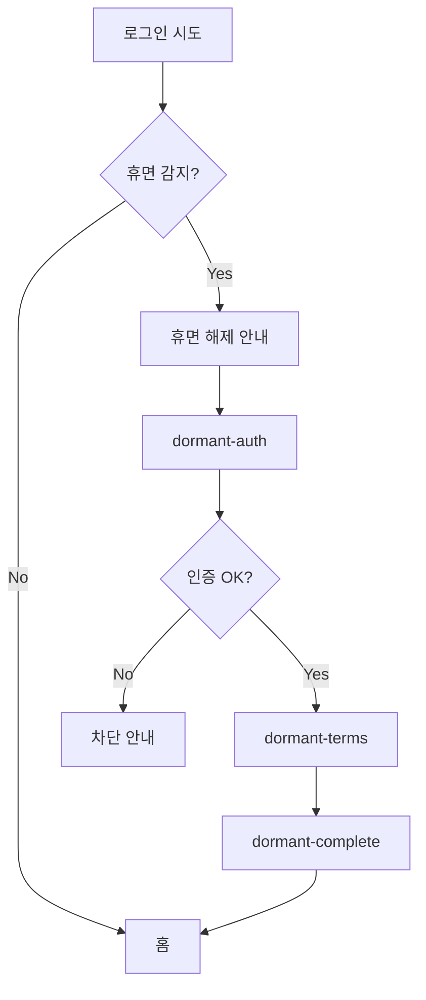

# User Flow Template — 사용자 동선 양식

> Use Case 단위로 **사용자 동선** (화면 흐름 / 분기 / 진입·출구 / 에지 케이스) 을 정의한다.
> 정책서·기획서 → 화면별 SPEC_INPUT 으로 분해되기 **전 단계**.
>
> **이 문서가 풀어야 할 질문**:
> - 사용자가 어떤 트리거로 이 동선에 들어오나?
> - 정상 path 의 화면 순서는?
> - 어디서 분기·차단·에러가 일어나나?
> - 어디서 어떻게 빠져나가나?

---

## 사용 시점

- 정책서 / 기획서 분석 직후 (POLICY_REPORT 의 § 1 화면 후보 도출 단계와 짝꿍)
- Use Case 단위로 1 파일 작성
- 결과는 `mockup/specs-flow/<MODULE>-<usecase>.md` 에 보관
- 그 후 화면별로 `SPEC_INPUT_TEMPLATE` 으로 분해 (각 화면에 컨텍스트 6필드 포함)

---

## UX 거버넌스 와 짝꿍

각 화면을 [governance/INDEX.md 7단계](../../governance/INDEX.md) 중 하나로 분류 — 동선 시퀀스 표의 `UX 단계` 컬럼.
한 동선이 여러 단계에 걸치는 게 자연스러움 (예: 회원 가입 = 5 실행 위주 + 6 완료 마무리).

---

## 입력 템플릿 (복사해서 채우기)

````markdown
# {Use Case 한글명} 동선 (User Flow)

## 0. Use Case 메타

- **Use Case ID**: UC-XXX-NNN (or US-XXX)
- **이름**: {회원 가입 / 회원 탈퇴 / 휴면 해제 / 재가입 / ...}
- **모듈**: {MBR | PRDD | MYBEN | ...}
- **출처**: {정책서 ID + 버전 / 기획서 / Notion DB URL}
- **UX 단계 분류** (governance/INDEX.md 7단계):
  - 주 단계: {예: 5 실행/구매}
  - 부가 단계: {예: 6 완료 — complete 화면}

---

## 1. 진입 / 출구

- **진입 트리거**: {어떤 행위 / 상황이 이 동선을 시작시키는가}
  - 예: "비로그인 사용자가 [가입] 버튼 클릭"
  - 예: "휴면 회원이 로그인 시도 후 자동 분기"
- **진입점 (시작 화면)**: {page/MOD/screen-name}
- **출구 (성공)**: {도달 화면 / 외부 redirect}
  - 예: "page/MBR/signup-complete → 홈 자동 이동"
- **출구 (이탈 / 차단 / 사용자 취소)**: {어디로 가나}
  - 예: "가입 차단 → 안내 화면 → 비로그인 홈"

---

## 2. 화면 시퀀스 (정상 path)

| Step | screen-id (kebab) | 화면 한글 | 사용자 task (한 줄) | UX 단계 | 다음 (정상) |
|---|---|---|---|---|---|
| 1 | `signup-terms` | 약관 동의 | 필수 약관 동의 | 5 실행 | `signup-info` |
| 2 | `signup-info` | 정보 입력 | 회원정보 입력·검증 | 5 실행 | `signup-auth` |
| 3 | `signup-auth` | 본인인증 | 인증수단 선택·완료 | 5 실행 | (백엔드 검증) → `signup-complete` |
| 4 | `signup-complete` | 가입 완료 | 결과 확인·후속 액션 선택 | 6 완료 | (홈 redirect) |

---

## 3. 분기 케이스

| 트리거 조건 | 발생 화면 | 분기 형태 (page / BottomSheet / Toast) | 분기 화면 / 시트 | 처리 후 복귀 |
|---|---|---|---|---|
| 만 14세 미만 | `signup-terms` 진입 시 | BottomSheet 또는 별도 page | 법정대리인 동의 시트 | 본 흐름 step 2 진입 |
| 휴면 회원 감지 | `login` 후 | 자동 분기 | `dormant` use case 진입 | 휴면 use case 종료 후 원 목적지 |
| 재가입 제한 대상 | `rejoin-auth` 후 | BottomSheet | 제한 안내 시트 | 흐름 종료 (이탈) |
| 인증 실패 (단발) | `signup-auth` | Toast / inline 에러 | (같은 화면) | 재시도 |
| 인증 실패 한도 초과 | `signup-auth` | Page 또는 BottomSheet | 차단 안내 | 흐름 종료 |

---

## 4. 에지 케이스 / 에러

정상·분기 외 시스템 / 환경 상황. 화면 추가 또는 inline 처리 결정의 근거.

- **외부 인증 SDK 오류**: 대체 인증수단 안내
- **네트워크 끊김 / 타임아웃**: 재시도 안내 (snack-bar)
- **약관 버전 변경 (진행 중 갱신)**: 약관 화면 재진입 요청
- **세션 만료**: 진입점 재이동
- **데이터 복원 실패** (휴면 해제 등): 처리 보류 + 안내
- **중복 요청**: 기존 결과 반환 / 진입 차단

---

## 5. 화면 전환 트리거 (자동 vs 사용자 액션)

| 전환 | 트리거 |
|---|---|
| `signup-info` → `signup-auth` | 사용자 [다음] 클릭 (모든 검증 통과 시) |
| `signup-auth` → `signup-complete` | 백엔드 가입 처리 자동 완료 → 자동 redirect |
| `signup-complete` → 홈 | N초 후 자동 / 또는 사용자 [홈으로] 클릭 |
| BottomSheet 닫기 | 사용자 dismiss 또는 [확인] 클릭 |

자동 전환 (사용자 입력 없이 다음 화면 도달) 은 명시 — UX 의도 상 "백엔드 처리 중" 화면이 필요할 수도 있음.

---

## 6. 화면 시각화 (mermaid 또는 ASCII)

선택 — 분기 많으면 시각화. 단순 시퀀스면 § 2 표만.



---

## 7. 다음 단계 (분해 → SPEC_INPUT)

§ 2 의 화면 N개를 → 각자 `SPEC_INPUT_TEMPLATE` 양식으로 분해.
각 SPEC_INPUT 의 **# 컨텍스트** 섹션은 본 동선에서 도출 가능:
- UX 단계: § 2 표의 컬럼
- 사용자 상황: 진입 트리거 + 이전 단계
- 사용자 task: § 2 표의 컬럼
- 가능 케이스: § 3 분기 케이스 + § 4 에지 케이스 중 해당 화면 항목
- 정보 위계: 사용자 task 에서 도출 (가장 중요한 것 먼저)
- 톤: governance/UXL_*.html 단계 가이드의 핵심 원칙에서 도출

````

---

## 입력 예시 (회원 가입 use case 일부)

````markdown
# 회원 가입 동선 (User Flow)

## 0. Use Case 메타
- Use Case ID: US-MBR-CS-001
- 이름: 회원 가입
- 모듈: MBR
- 출처: NC 회원가입·탈퇴 정책서 v1.0
- UX 단계: 주 5 실행/구매 + 부가 6 완료

## 1. 진입 / 출구
- 진입 트리거: 비로그인 사용자가 [가입] 버튼 클릭 / 또는 가입 안 된 외부 진입 (딥링크 등)
- 진입점: signup-terms
- 출구 (성공): signup-complete → 홈 자동 redirect (3초)
- 출구 (이탈): 미성년 동의 거부 / 가입 차단 → 비로그인 홈

## 2. 화면 시퀀스
| Step | screen-id | 화면 한글 | 사용자 task | UX 단계 | 다음 |
|---|---|---|---|---|---|
| 1 | signup-terms | 약관 동의 | 필수 약관 동의 | 5 실행 | signup-info |
| 2 | signup-info | 정보 입력 | 이름·아이디·비밀번호·이메일·연락처 입력 | 5 실행 | signup-auth |
| 3 | signup-auth | 본인인증 | 휴대폰 / PASS 인증 | 5 실행 | (자동) signup-complete |
| 4 | signup-complete | 가입 완료 | 가입 결과 확인 + 후속 액션 | 6 완료 | (자동) 홈 |

## 3. 분기 케이스
| 조건 | 발생 화면 | 분기 형태 | 분기 화면 | 처리 |
|---|---|---|---|---|
| 만 14세 미만 | signup-terms 동의 후 | BottomSheet | 법정대리인 동의 시트 | 동의 → step 2 |
| 기존 가입자 감지 | signup-info 입력 시 | BottomSheet | 로그인 안내 시트 | 흐름 종료 |
| 휴면 회원 감지 | signup-info | BottomSheet | 휴면 해제 안내 | dormant use case 진입 |

## 4. 에지 케이스
- 인증 SDK 오류: 대체 수단 BottomSheet 안내
- 약관 버전 갱신: 진행 중이면 step 1 재진입
- 가입 완료 알림 발송 실패: 화면 안내는 정상 + 백그라운드 재시도

## 5. 전환 트리거
- step 1→2: 사용자 [다음] (모든 필수 동의 시)
- step 3→4: 백엔드 자동 (인증 결과 + 가입 처리 완료)
- step 4 → 홈: 자동 (3초) or 사용자 [홈으로]
````

---

## 산출물 위치

```
mockup/specs-flow/MBR-signup.md          ← Use Case 단위 동선
mockup/specs-input/MBR-signup.md         ← 화면별 SPEC_INPUT (위 동선에서 분해)
mockup/specs-report/MBR-signup.md        ← 카탈로그 분석 보고
```

`specs-flow/` 가 `specs-input/` 의 상위 단계. 같은 use case 는 동일 파일명 prefix.

---

## 참고

- 단계 분류 source: `governance/INDEX.md` (단계별 상세 가이드: `governance/UXL_*.html`)
- 정책서 입력일 때 동선 도출: `POLICY_REPORT_TEMPLATE.md` § 1.5
- 화면 단위 입력: `SPEC_INPUT_TEMPLATE.md` (각 화면에 컨텍스트 6필드 포함)
- 워크플로우 위치: `WORKFLOWS.md`
